# 10.1实验 BurpSuit 字典使用

#实验环境

phpstudy

#使用工具

BurpSuit

#实验步骤

- 登陆网站用BurpSuit抓包

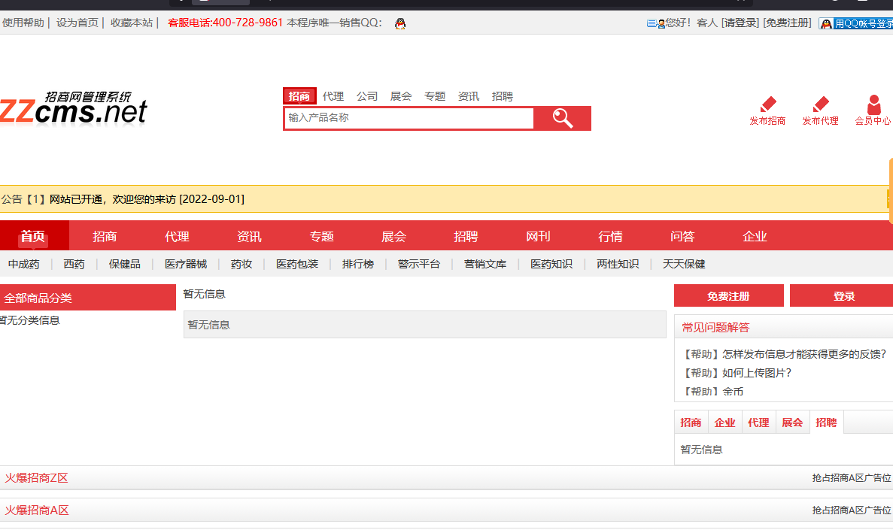

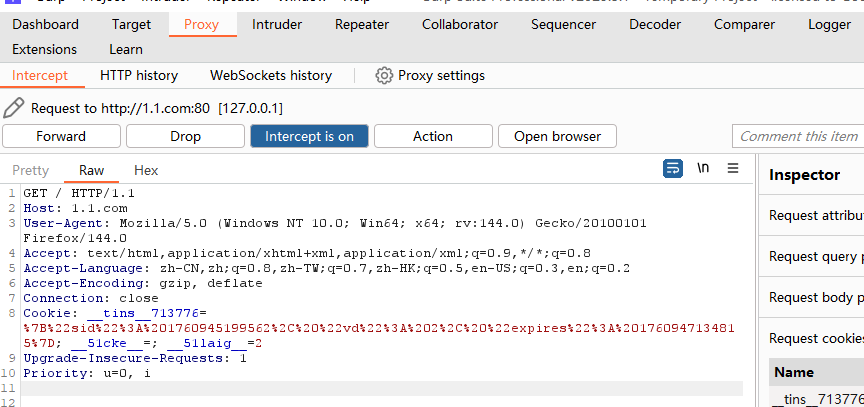

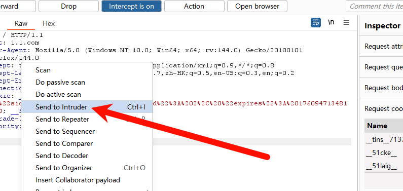

- 添加ADD

- 设置字典`可以添加字典这里是简单例子，也可以用.text添加更多字典内容`

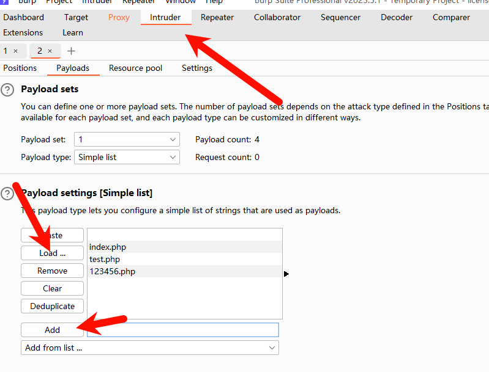

- 点击抓包

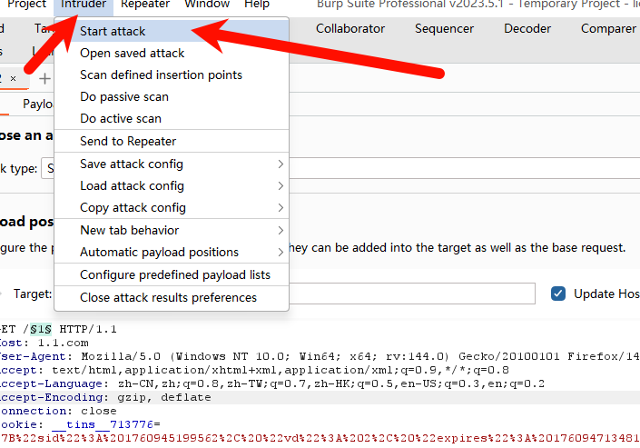

- 200 OK：客户端请求成功  404 NotFound：请求的资源不存在，例如，输入了错误的URL；

​	`更多Response状态码含义打开笔记==HTTP数据包&Postman构造&请求方法&请求头修改&状态码判==查看`

- 如果出现自动编码可以关掉这个 

`为什么会被编码

1. Burp 在插入 payload 时为了“安全 / 合法”会对某些位置做**URL 编码**，避免生成非法请求。
2. 典型场景：你在路径里插入时把**payload 带上了前导 `/` 或 `.`**，而 Burp 认为插入的位置已包含路径分隔符或点，会把这些字符当作需要编码的 payload 字符。
3. 或者你的 Intruder/Scanner 的 **“URL-encode payloads”** 或者 Payload Processing 里有自动的编码处理器。

`

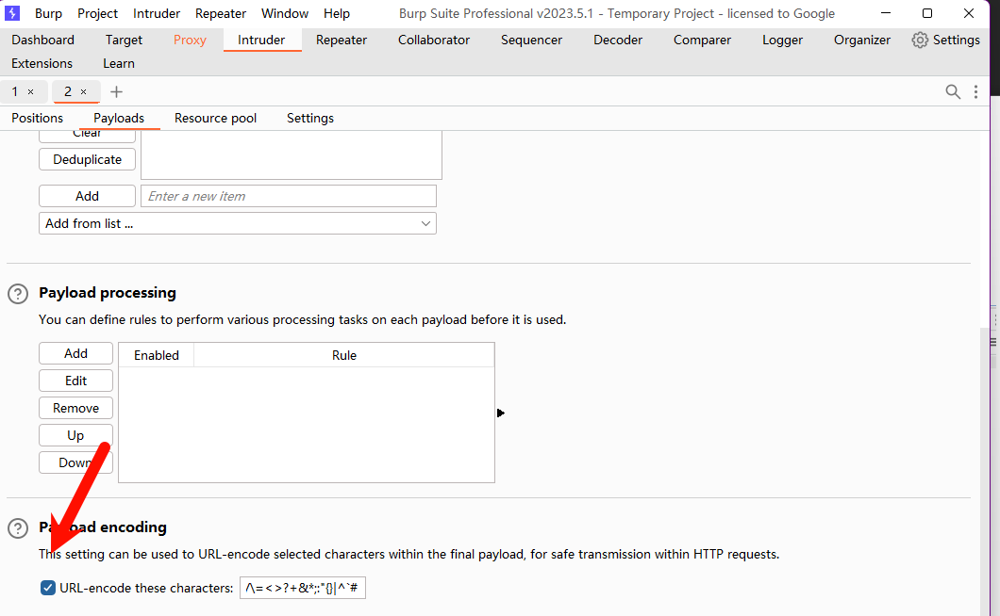

- 登陆网站后台输入错误密码抓包

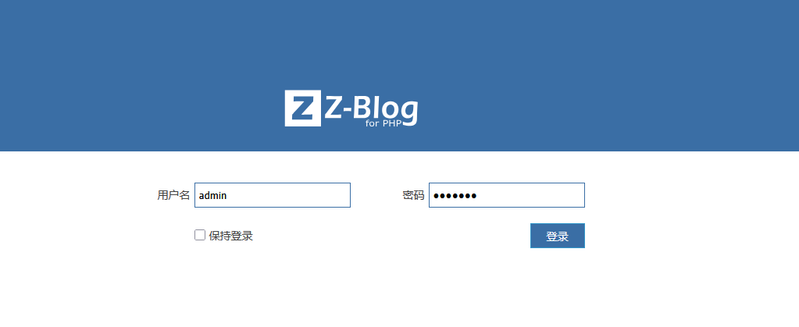

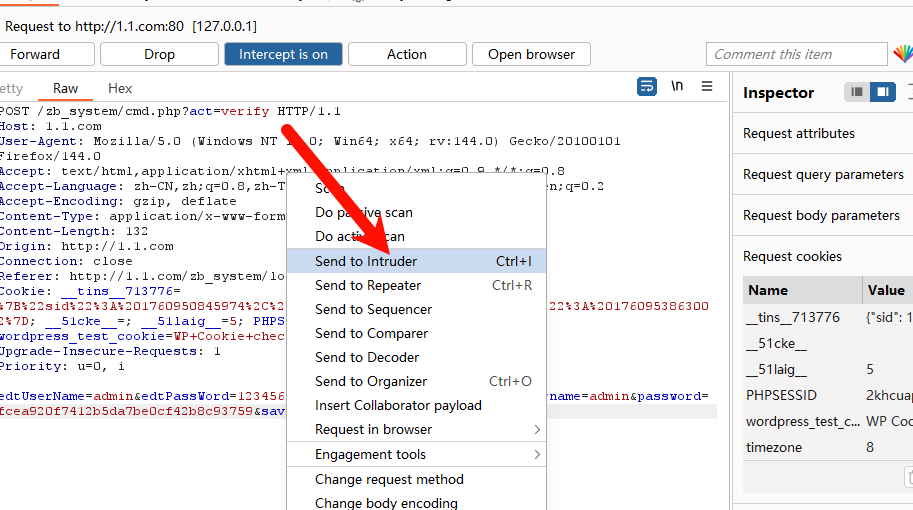

- 设置明文和密文的字典

- 设置自定义模式 分别为添加字典

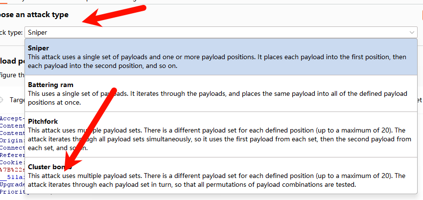

- 判单加密模式 为md5

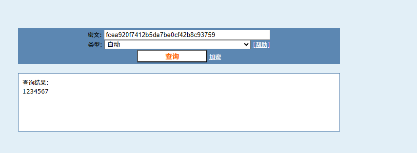

- 设置第二个规则

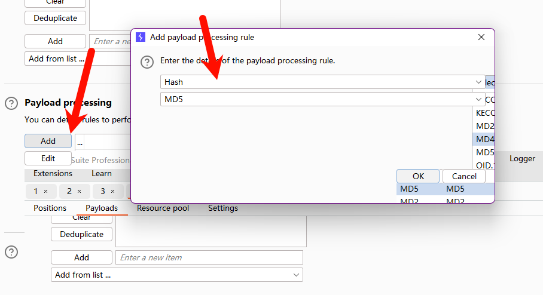

- 观察状态码 

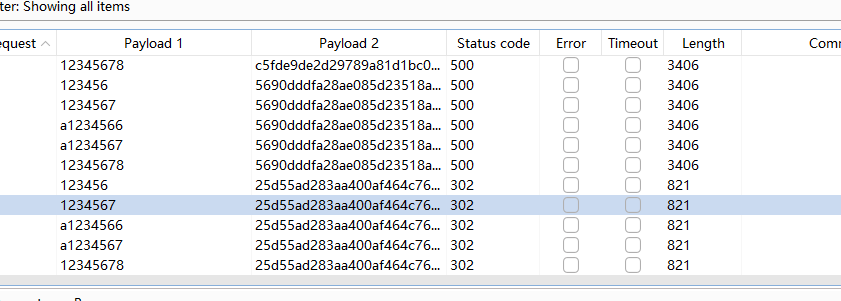

- 成功获取到密码  `这里说明参数一的结果不重要，只要参数二密码的密文正确就可以正确进入`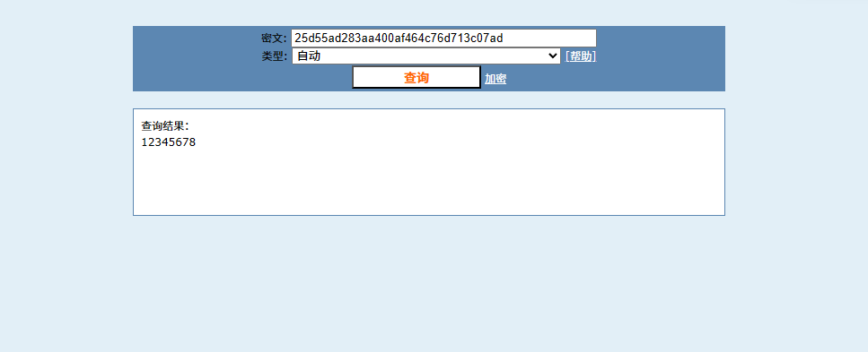
