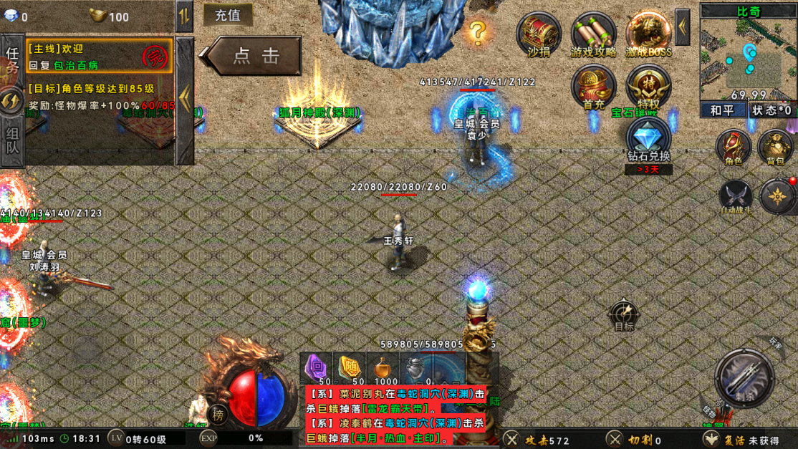
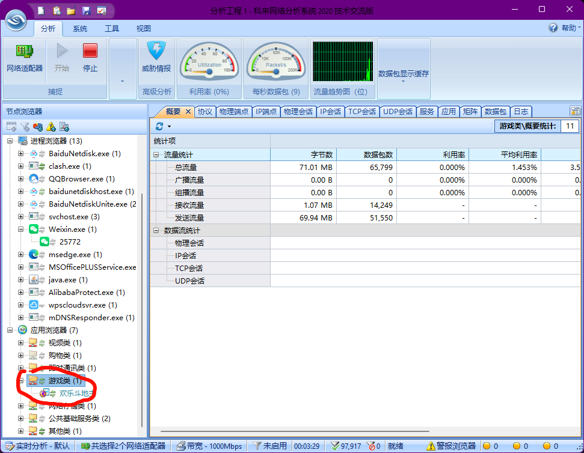

7.1实验 各类情况的抓包

---

#实验环境 ：

夜深模拟器 安卓7（方便放入证书）[夜神安卓模拟器-安卓模拟器电脑版下载_安卓手游模拟器_手机模拟器_官网](https://www.yeshen.com/)

windows

#使用工具：

科来网络分析系统

封包监听工具

BurpSuite

Charles

#实验步骤

1.安卓应用抓包

- 通过 将证书放到模拟器目录-设置-安全-从SD卡安装-安装证书

- 设置监听地址

  

  

- 在安装模拟器中设置代理

  

- ==由于市面上模拟器改版Wi-Fi 设置界面被阉割或锁死，需要用 adb 命令强制设置全局代理，过程过于繁琐先暂停实验==

- 利用封包监听工具抓安卓app ==不需要设置代理==  打开随便打开游戏抓包，点击游戏移动

  

  

- 暂停抓包然后重新开启 选择传送 人物会传送到 这里点击的是回血npc   观察抓情况

  

- 发现长度不一样的数据包

  

- 点击发送

  

- 成功回到了回血npc处

  

- 获取到游戏服务器地址

  

- 在网站中搜集信息

  

  

2.抓微信小程序

- 使用科来网络分析系统

  

3.抓取Windows应用

- 选择后 协议-点击数据-右键-发送数据包生成器  ==实测很麻烦不建议用这种方式==

- 

