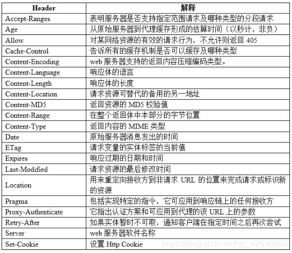

# HTTP数据包&Postman构造&请求方法&请求头修改&状态码判断

\#数据-方法&头部&状态码

-方法

1、常规请求-Get

2、用户登录-Post

•get：向特定资源发出请求（请求指定页面信息，并返回实体主体）；

•post：向指定资源提交数据进行处理请求（提交表单、上传文件），又可能导致新的资源的建立或原有资源的修改；

•head：与服务器索与get请求一致的相应，响应体不会返回，获取包含在小消息头中的原信息（与get请求类

似，返回的响应中没有具体内容，用于获取报头）；

•put：向指定资源位置上上传其最新内容（从客户端向服务器传送的数据取代指定文档的内容），与post的区别是put为幂等，post为非幂等；

•trace：回显服务器收到的请求，用于测试和诊断。trace是http8种请求方式之中最安全的l

•delete：请求服务器删除request-URL所标示的资源*（请求服务器删除页面）

•option：返回服务器针对特定资源所支持的HTML请求方法 或web服务器发送*测试服务器功能（允许客户 端查看服务器性能）；

•connect ： HTTP/1.1协议中能够将连接改为管道方式的代理服务器

 

-参数

演示：

1、UA头-设备平台

2、Cookie-身份替换

见上图

 

-Response状态码

1、数据是否正常

2、文件是否存在

3、地址自动跳转

4、服务提供错误

注：容错处理识别

•-1xx:指示信息—表示请求已接收，继续处理。

•-2xx:成功—表示请求已经被成功接收、理解、接受。

•-3xx:重定向—要完成请求必须进行更进一步的操作。

•-4xx:客户端错误—请求有语法错误或请求无法实现。

•-5xx:服务器端错误—服务器未能实现合法的请求。

•200 OK：客户端请求成功

•301 redirect：页面永久性移走，服务器进行重定向跳转；

•302 redirect：页面暂时性移走，服务器进行重定向跳转，具有被劫持的安全风险；

•400 BadRequest：由于客户端请求有语法错误，不能被服务器所理解；

•401 Unauthonzed：请求未经授权。

•403 Forbidden：服务器收到请求，但是拒绝提供服务。

•404 NotFound：请求的资源不存在，例如，输入了错误的URL；

•500 InternalServerError：服务器发生不可预期的错误，无法完成客户端的请求；

•503 ServiceUnavailable：服务器当前不能够处理客户端的请求

 

\#案例-文件探针&登录爆破

-实验：

1、页面正常访问

2、网站文件探针

3、后台登录爆破

 

\#工具-Postman自构造使用

https://zhuanlan.zhihu.com/p/551703621