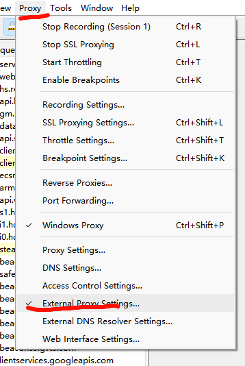

# 抓包技术&HTTPS协议&APP&小程序&PC应用&WEB&转发联动

准备工作：

1、浏览器安装证书：解决本地抓HTTPS

2、模拟器安装证书：解决模拟器抓HTTPS

 

实现目的：

0、掌握几种抓包工具证书安装操作

1、掌握几种HTTP/S抓包工具的使用

2、学会Web,APP,小程序,PC应用等抓包

3、了解此课抓包是针对那些目标什么协议

 

Fiddler：

https://www.telerik.com/fiddler

是一个http协议调试代理工具，它能够记录并检查所有你的电脑和互联网之间的http通讯，设置断点，查看所有的“进出”Fiddler的数据（指cookie,html,js,css等文件）。 Fiddler 要比其他的网络调试器要更加简单，因为它不仅仅暴露http通讯还提供了一个用户友好的格式。

Fiddler的使用

- 获取证书

 

Charles：

https://www.charlesproxy.com/

是一个HTTP代理服务器,HTTP监视器,反转代理服务器，当浏览器连接Charles的代理访问互联网时，Charles可以监控浏览器发送和接收的所有数据。它允许一个开发者查看所有连接互联网的HTTP通信，这些包括request, response和HTTP headers （包含cookies与caching信息）。

Charles的使用：

- 生成证书

 

TCPDump：是可以将网络中传送的数据包完全截获下来提供分析。它支持针对网络层、协议、主机、网络或端口的过滤，并提供and、or、not等逻辑语句来帮助你去掉无用的信息。

 

BurpSuite：是用于攻击web 应用程序的集成平台，包含了许多工具。Burp Suite为这些工具设计了许多接口，以加快攻击应用程序的过程。所有工具都共享一个请求，并能处理对应的HTTP 消息、持久性、认证、代理、日志、警报。

BurpSuite的使用

- 生成证书

  设置代理才能使用

  

  筛选数据包

  

  利

  用Charles做代理到BurpSuite

  

  

  

  利用poxifier代理

  

  

  设置代理规则 `*表示任意字符`

  
  
  

Wireshark：

https://www.wireshark.org/

是一个网络封包分析软件。网络封包分析软件的功能是截取网络封包，并尽可能显示出最为详细的网络封包资料。Wireshark使用WinPCAP作为接口，直接与网卡进行数据报文交换。

 

科来网络分析系统：

https://www.colasoft.com.cn/

是一款由科来软件全自主研发，并拥有全部知识产品的网络分析产品。该系统具有行业领先的专家分析技术，通过捕获并分析网络中传输的底层数据包，对网络故障、网络安全以及网络性能进行全面分析，从而快速排查网络中出现或潜在的故障、安全及性能问题。

 

WPE&封包分析：是强大的网络封包编辑器，wpe可以截取网络上的信息，修改封包数据，是外挂制作的常用工具。一般在安全测试中可用来调试数据通讯地址。