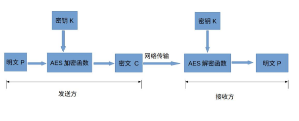
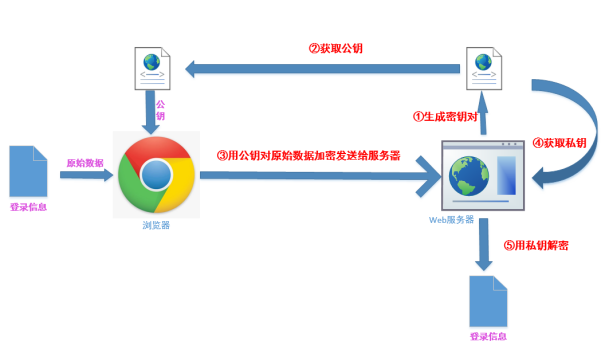
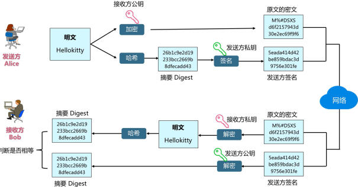

# 算法逆向&散列对称非对称&JS源码逆向&AES&DES&RSA&SHA

安全测试中：

密文-有源码直接看源码分析算法（后端必须要有源码才能彻底知道）

密文-没有源码1、猜识别 2、看前端JS（加密逻辑是不是在前端）

\#算法加密-概念&分类&类型

1. 单向散列加密  ==MD5==

单向散列加密算法的优点有(以MD5为例)：

方便存储，损耗低：加密/加密对于性能的损耗微乎其微。

单向散列加密的缺点就是存在暴力破解的可能性，最好通过加盐值的方式提高安全性，此外可能存在散列冲突。我们都知道MD5加密也是可以破解的。

常见的单向散列加密算法有：

MD5 SHA MAC CRC

 

2. 对称加密 -AES

对称加密优点是算法公开、计算量小、加密速度快、加密效率高。

缺点是发送方和接收方必须商定好密钥，然后使双方都能保存好密钥，密钥管理成为双方的负担。

常见的对称加密算法有：

DES AES RC4

 

3. 非对称加密 -RSA

非对称加密的优点是与对称加密相比，安全性更好，加解密需要不同的密钥，公钥和私钥都可进行相互的加解密。

缺点是加密和解密花费时间长、速度慢，只适合对少量数据进行加密。

常见的非对称加密算法：

RSA RSA2 PKCS

 

\#加密解密-识别特征&解密条件

MD5密文特点：

1、由数字“0-9”和字母“a-f”所组成的字符串

2、固定的位数 16 和 32位

解密需求：密文即可，但复杂明文可能解不出 

 

BASE64编码特点：

0、大小写区分，通过数字和字母的组合

1、一般情况下密文尾部都会有两个等号，明文很少的时候则没有

2、明文越长密文越长，一般不会出现"/""+"在密文中

 

AES、DES密文特点：

同BASE64基本类似，但一般会出现"/"和"+"在密文中

解密需求：密文，模式，加密Key，偏移量，条件满足才可解出

对方用公钥加密 可以用私钥解密

对方用私钥加密 可以用公钥解密        

 

RSA密文特点：

特征同AES,DES相似，但是长度较长

解密需求：密文，公钥或私钥即可解出

 

其他密文特点见：

1.30余种加密编码类型的密文特征分析（建议收藏）

https://mp.weixin.qq.com/s?__biz=MzAwNDcxMjI2MA==&mid=2247484455&idx=1&sn=e1b4324ddcf7d6123be30d9a5613e17b&chksm=9b26f60cac517f1a920cf3b73b3212a645aeef78882c47957b9f3c2135cb7ce051c73fe77bb2&mpshare=1&scene=23&srcid=1111auAYWmr1N0NAs9Wp2hGz&sharer_sharetime=1605145141579&sharer_shareid=5051b3eddbbe2cb698aedf9452370026#rd

 

2.CTF中常见密码题解密网站总结（建议收藏）

https://blog.csdn.net/qq_41638851/article/details/100526839

 

3.CTF密码学常见加密解密总结（建议收藏）

https://blog.csdn.net/qq_40837276/article/details/83080460

 

\#解密实例-密文存储&数据传输

1、密码存储（后端处理）

X3.2-md5&salt

DZ对应代码段-/uc_server/model/user.php

 function add_user() {

  $password = md5(md5($password).$salt);

  }

  

<?PHP

$h = 'd7192407bb4bfc83d28f374b6812fbcd';

$hash=md5(md5('123456').'3946d5');

if($h==$hash){

 echo 'ok';

}else{

 echo 'no';

}

?>

 

X3.5-hash

DZ对应代码段-/uc_server/model/user.php

 function add_user() {

  $salt = '';

  $password = $this->generate_password($password);

  }

 

 function generate_password($password) {

  $algo = $this->get_passwordalgo();

  $options = $this->get_passwordoptions();

  $hash = password_hash($password, $algo, $options);

 }

 

<?PHP

$hash = '$2y$10$KA.7VYVheqod8F3X65tWjO3ZXfozNA2fC4oIZoDSu/TbfgKmiw7xO';

if (password_verify('123456', $hash)) {

  echo 'ok';

} else {

  echo 'error';

}

?>

 

2、数据通讯

-博客登录-zblog（前端处理）

$("#btnPost").click(function(){

  var strPassWord=$("#edtPassWord").val();

  $("form").attr("action","cmd.php?act=verify");

  $("#password").val(MD5(strPassWord));

 

-墨者靶场-（后端处理）

-1 union select 1,database(),user(),4_mozhe

xgd58ipTrnx8VzSBJicqCibZxIRsZKgXOYUrNQP8fCCtx9JZ+6K1hHt7RKkzV305

eGdkNThpcFRybng4VnpTQkppY3FDaWJaeElSc1pLZ1hPWVVyTlFQOGZDQ3R4OUpaKzZLMWhIdDdSS2t6VjMwNQ==