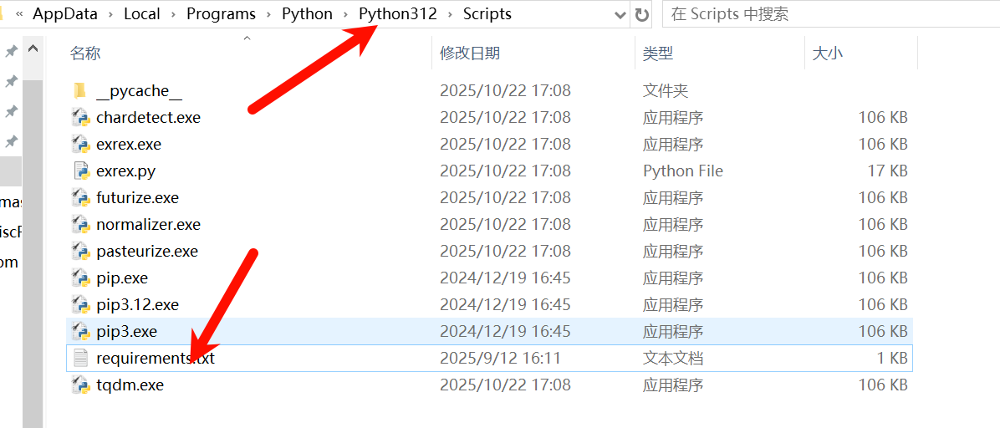
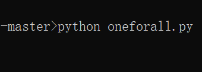
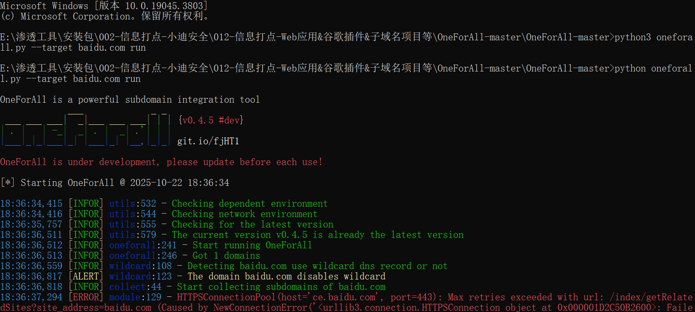
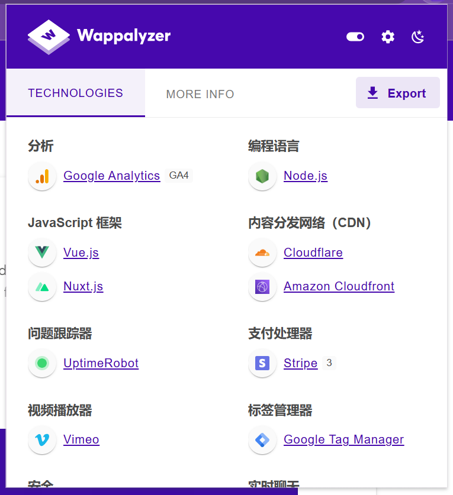

12实验 OneForAll

-  安装 OneForAll 运行cmd 



```
pip install -r requirements.txt -i https://mirrors.aliyun.com/pypi/simple/
```

- 在目录下运行 




- 输入命令 以百度为例子

```
python oneforall.py --target baidu.com run
```



- 识别到的所有子域名


- wappalyzer浏览器插件  `由于是国外插件所以支持的国内源码不多`

