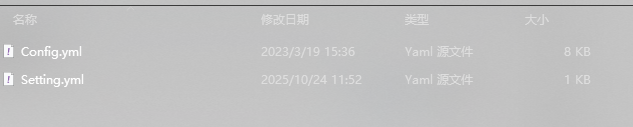

# 14 实验  JS信息收集 提取价值信息

## :sailboat:在Burp Suite中安装官方JS插件


## :seat:添加非官方插件


## :rabbit:更新目录

```C:\Users\Yennefer\.config\HaE``` 路径下替换 `Config.yum` 然后在bs中点击`Reload`载入



这样就可以看见规则了

（基于BurpSuite插件JavaAPI开发的请求高亮标记与信息提取的辅助型插件。该插件可以通过自定义正则的方式匹配响应报文或请求报文，可以自行决定符合该自定义正则匹配的相应请求是否需要高亮标记、信息提取。）


识别到不同内容用不同颜色来区分


## :squid:利用浏览器插件 FindSomething&Wappalyzer信息收集

登陆网址


查看网址框架


自动盘对js里面涉及到的域名 算法等


## :yum:ffuf-FUZZ爆破找到更多的js文件分析更多的信息

（[Assetnote 单词列表](https://wordlists.assetnote.io/)）获取js字典


在`cmd`中进行字典爆破

```CMD
ffuf.exe -w httparchive_jsp_jspa_do_action_2025_09_27.txt -u http://yrz.rongyiht.com/#/login?redirect=%2Fdashboard/FUZZ -mc 200
```


## :dancers:Packer-Fuzzer-针对JS框架开发打包器Webpack检测

打开网站 Webpack打包器


第一使用需要安装库

```cmd
pip install -r requirements.txt
```

运行PackerFuzzer.py

```
python PackerFuzzer.py
```

如果遇见报错可能是依赖旧版本库重新卸载并安装库

```cmd
pip uninstall python-docx -y
pip install python-docx==0.8.11
```

使用命令

```cmd
python PackerFuzzer.py -u 目标地址
```


成功生成报告

