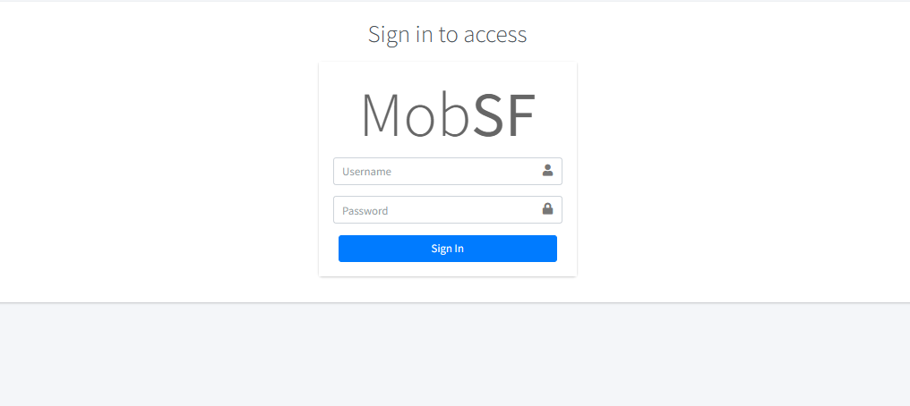
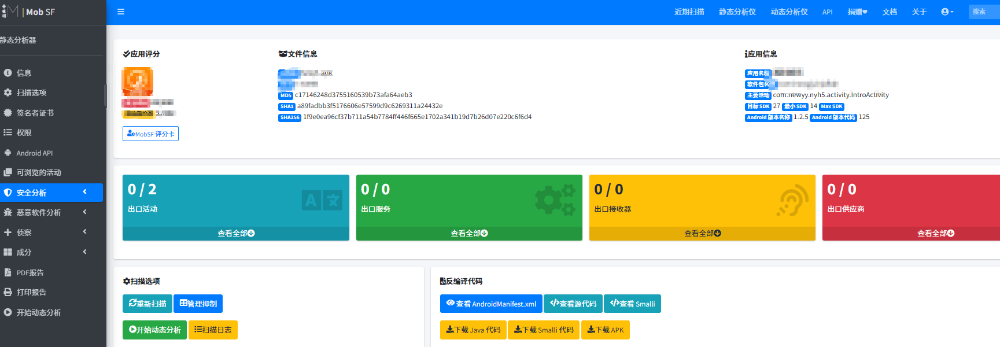
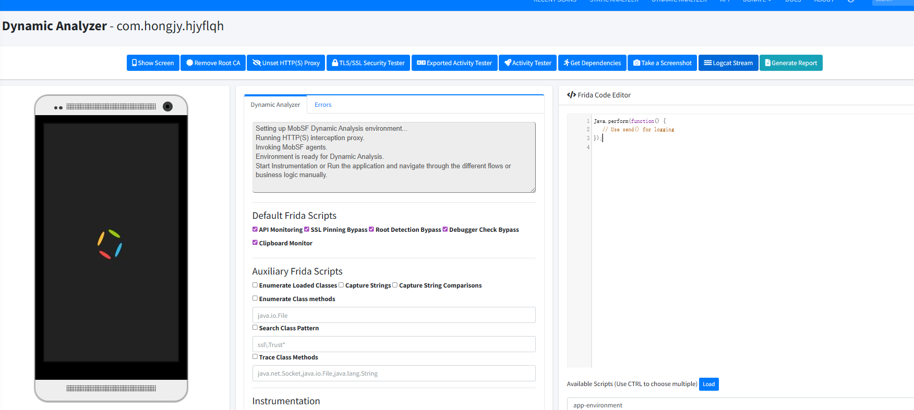

# 18实验 Mobile-Security使用

下载地址：（https://github.com/MobSF/Mobile-Security-Framework-MobSF?tab=readme-ov-file）

安装教程:（[移动安全测试框架-MobSF环境搭建-CSDN博客](https://blog.csdn.net/ljh824144294/article/details/119181803/)）

## :factory:简单使用  ==具体内容之后会使用==

```cmd
./run.bat 0.0.0.0:8000
```

浏览器访问http://localhost:8000/ 默认密码和账号都是`mobsf`



静态分析



动态分析  需要配合模拟器

