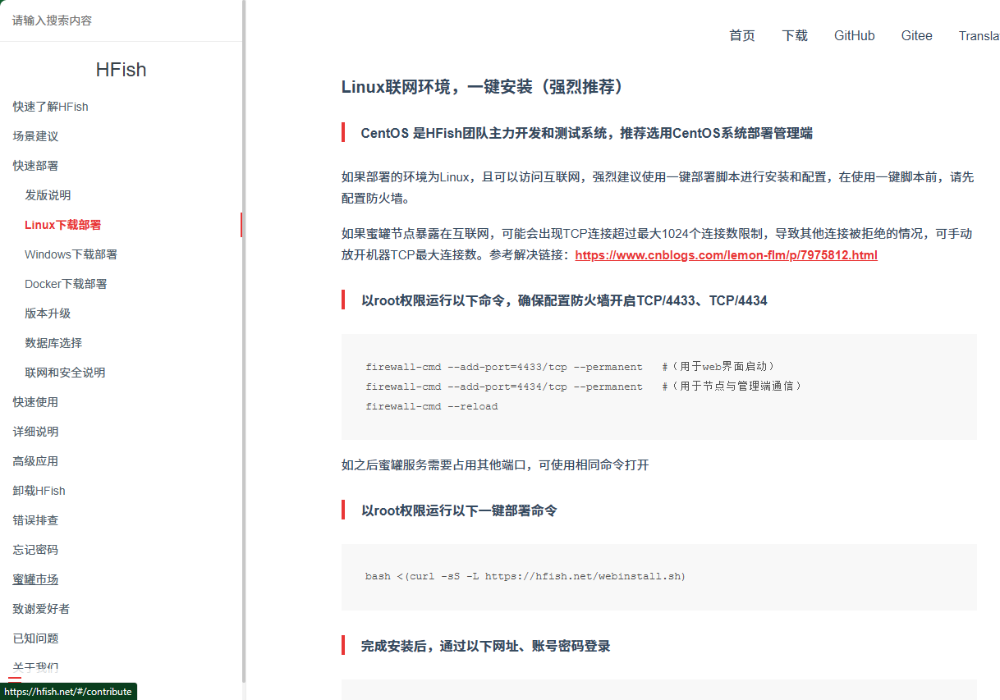
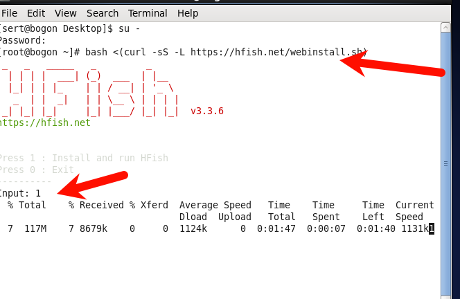
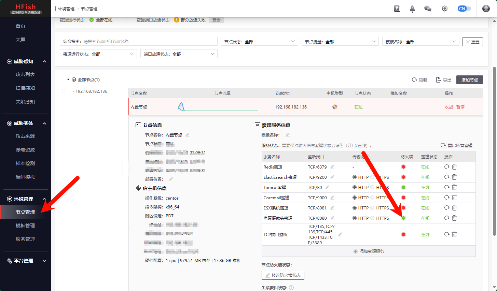
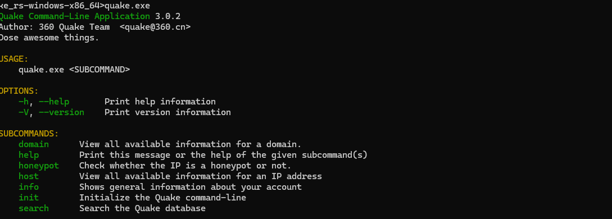
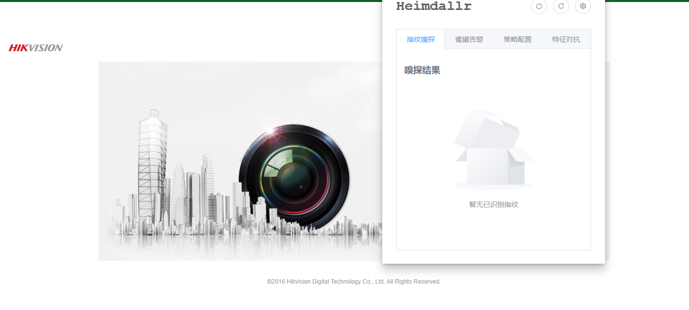

# 实验 15 蜜罐

## :slot_machine:实验环境

- CentOS 6

## :space_invader:实验步骤

- 安装（[Linux下载部署](https://hfish.net/#/linux)）

登陆进入后台

- 开放端口

- 以8080端口为例 输入账号和密码

- 提示密码错误

- 在攻击列表中查看

## :taco: 蜜罐识别

- 使用quake 需要key

- 浏览器插件识别 Heimdallr 不准确 

