# 16信息打点-CDN绕过&业务部署&漏洞回链&接口探针&全网扫描&反向邮件

\#前置知识：

1.传统访问：用户访问域名–>解析服务器IP–>访问目标主机

2.普通CDN：用户访问域名–>CDN节点–>真实服务器IP–>访问目标主机

3.带WAF的CDN：用户访问域名–>CDN节点（WAF）–>真实服务器IP–>访问目标主机

 

国内服务商：

阿里云  百度云  七牛云 

又拍云 腾讯云  Ucloud

360  网宿科技 ChinaCache

 

国外服务商

CloudFlare StackPath Fastly

Akamai CloudFront Edgecast

CDNetworks Google Cloud CDN

CacheFly Keycdn Udomain CDN77

 

\#CDN配置：

配置1：加速域名-需要启用加速的域名

配置2：加速区域-需要启用加速的地区

配置3：加速类型-需要启用加速的资源

 

\#参考知识：

超级Ping：http://www.17ce.com/

超级Ping：https://ping.chinaz.com/

接口查询：https://get-site-ip.com/

接口查询：https://fofa.info/extensions/source

国外请求：https://tools.ipip.net/cdn.php

国外请求：https://boce.aliyun.com/detect/

IP社区库：https://www.cz88.net/geo-public

全网扫描：https://github.com/Tai7sy/fuckcdn

全网扫描：https://github.com/boy-hack/w8fuckcdn

全网扫描：https://github.com/Pluto-123/Bypass_cdn

 

https://mp.weixin.qq.com/s/zxEH-HMqKukmq7qXfrdnQQ

常见方法：

子域名，邮件系统，国外访问，证书查询，APP抓包，网络空间

通过漏洞或泄露获取，扫全网，以量打量，第三方接口查询等

 

\#前置后置-CDN服务-识别&绑定访问

超级Ping：http://17ce.com/

超级Ping：https://ping.chinaz.com/

各地ping（出现多个IP即启用CDN服务）

后置：绑定HOST访问解析（参考基础课CDN安全影响）

 `如果真是IP正确才能访问`

## :nail_care: 某应用-CDN绕过-主动漏洞&遗留文件

配置加速选项中==只加速主域名==，导致==其他子域名未加速==（解析IP可能同IP也可能C段）

接口查询：https://get-site-ip.com/

接口查询：https://fofa.info/extensions/source

使用网络空间&第三方功能集合查询判断

 `例子中加速了www.xxx.com，但是xxx.com没有加速会暴露真是ip`

`用网站判断不同地区都有对应最近的服务器就可能是CDN`

## :sake:某应用-CDN绕过-主动漏洞&遗留文件

1、漏洞如：==SSRF RCE==等

利用漏洞让对方真实==服务器==主动出网连接，判断来源IP即真实IP

（构建服务器）

`利用python起一个web端，会在你IP8000端口上建立`

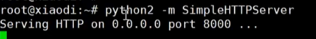

`远程加载资源`

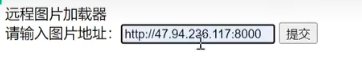

`这样就会监听到是哪个IP请求过`

2、==遗留文件==：==phpinfo==类似功能

通过访问类似PHPINFO类似代码函数获取本地IP造成的地址泄漏

 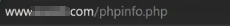

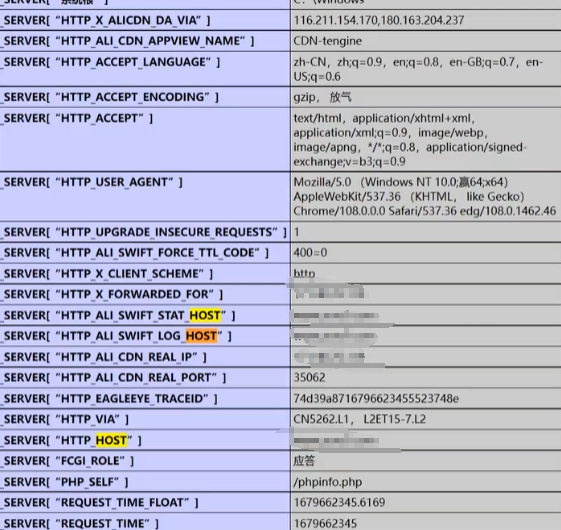

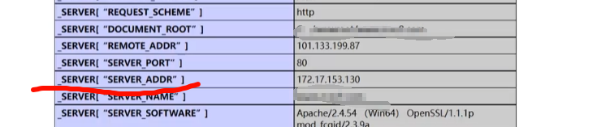

## :hamburger:某应用-CDN绕过-邮件系统

判断条件：发信人是当前域名邮件用户名

:telephone_receiver:==让他主动给你发==：

部署架设的邮件服务器如果向外部用户发送邮件的话，

那么邮件头部的源码中会包含此邮件服务器的真实IP地址。

==常见的邮件触发点有：==

1、RSS订阅

2、邮箱注册、激活处

3、邮箱找回密码处

4、产品更新的邮件推送

5、某业务执行后发送的邮件通知

6、员工邮箱、邮件管理平台等入口处的忘记密码

==必须是发件人是自己搭建在域名上==，发信人是当前域名邮件用户名

 

暴露出真实ip

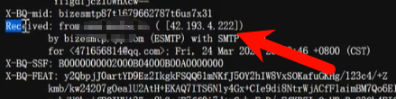

:school:==你给他发==： 

你给未知邮箱发：（需要自己的邮件服务器不能第三方）

通过发送邮件给一个不存在的邮箱地址，因为该用户邮箱不存在，所以发送将失败，

并且还会收到一个包含发送该电子邮件给你的服务器的真实IP通知。

## :racing_car:某应用-CDN绕过-全网扫描

1、判断加速厂商

2、IP库筛地址段

3、配置范围扫描

先从IP段去扫描符合开放端口，再从IP去访问看看关键字，将符合结果进行保存！

厂商查询：

https://tools.ipip.net/cdn.php

工具项目：

https://www.cz88.net/geo-public

https://github.com/Tai7sy/fuckcdn

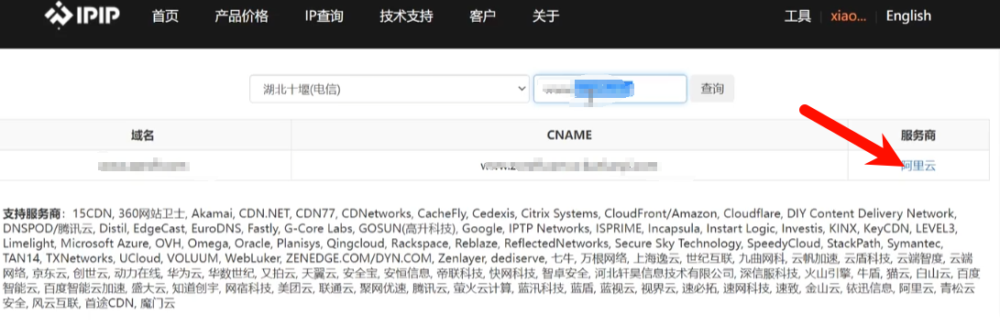

确认cdn厂商

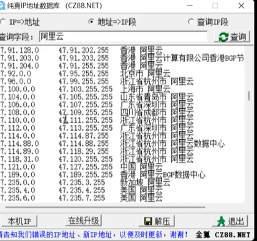

fuckcdn-master

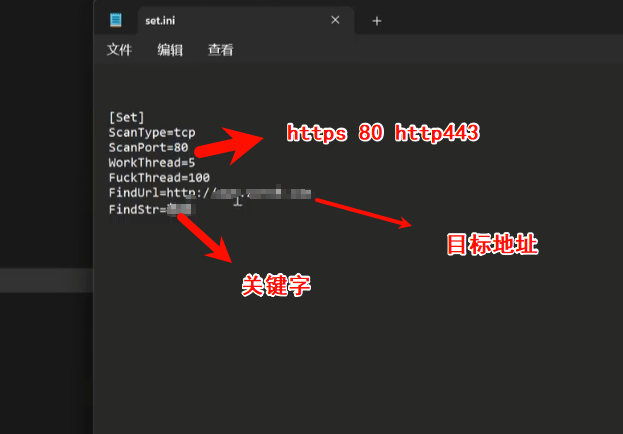

修改ip段

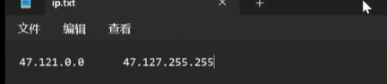

ping目标地址找到解析地址

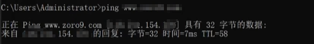

输入解析地址

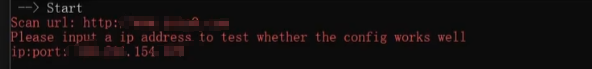

结果最终在文件里

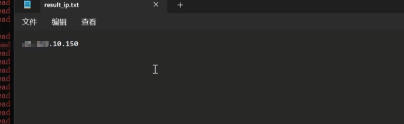