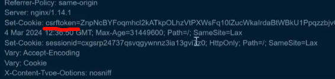
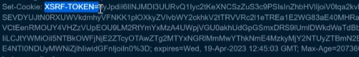

# 17信息打点-语言框架&开发组件&FastJson&Shiro&Log4j&SpringBoot等

后端：

CMS：一般PHP开发居多源码程序

（利用源码程序名去搜漏洞情况，源码去下载进行后期的代码审计）

前端

js 框架（爬取更多的js从里面筛选URL或敏感泄漏key等） 

也是可以通过对js代码逻辑进行代码审计

 

组件：java居多，

常见有过安全漏洞组件（shiro solr log4j sprintboot等）

 

框架：php java python都有

 

 

 

框架：简单代码的一个整合库，如果使用框架就只需要学习使用框架调用即可

如：文件上传功能是需要很多代码来实现的，框架把这个代码进行封封装，调用即可

影响：如果采用框架开发，代码的安全性是取决于框架的过滤机制

 

组件：第三方的功能模块（日志记录，数据监控，数据转换等）

 

## :skull:Web架构：

1、最简单最入门的开发模型（功能代码全部手写）

最容易出现漏洞，程序员水平不一，没有第三方或团队的检测，单纯的自己写

 

2、结合开发框架的开发模型（以框架为核心实现功能）

第三方或团队的开发的封装代码框架，一般内置的过滤机制（框架漏洞）

 

3、结合开发框架外加组件模型（以框架为核心，组件为辅实现功能）

第三方或团队的开发的封装代码框架，一般内置的过滤机制（框架和组件漏洞）

 

指纹识别-本地工具-GotoScan（CMSEEK）

1、在线平台见前面课程，本地工具适用于不出网环境

https://github.com/newbe3three/gotoscan

2、网络空间：Fofa Quake Hunter

3、网络空间：IO图标关系

 

\#Python-开发框架-Django&Flask

Django

1、识别插件

2、Set-Cookie:expires= ==一般会出现这个==

 

Flask

1、识别插件

2、Set-Cookie:expires=

 

\#PHP-开发框架-ThinkPHP&Laravel&Yii

ThinkPHP：

0、识别插件

1、X-Powered-By: ThinkPHP

2、CMS识别到源码体系TP开发

 

Laravel：

1、识别插件

2、Set-Cookie中特征的格式 `cooki的安全设置`

 

Yii:

1、识别插件

2、Set-Cookie中特征的格式

 

\#Java-框架组件-Fastjson&Shiro&Solr&Spring

52类110个主流Java组件和框架介绍：

https://blog.csdn.net/agonie201218/article/details/125300729

 

Fastjson/Jackson

在提交JSON数据包中修改测试：

-Fastjson组件会把01解析成1

-Jackson组件在解析01时会抛出异常

https://forum.butian.net/share/1679

https://www.iculture.cc/forum-post/24115.html

  

Shiro

请求包的cookie中存在rememberMe字段。

返回包中存在set-Cookie：remeberMe=deleteMe。

请求包中存在rememberMe=x时，响应包中存在rememberMe=deleteMe。

有时候服务器不会主动返回remeberMe=deleteMe，直接发包即可，将Cookie内容改为remember Me=1，若相应包有rememberMe=deleteMe，则基本可以确定网站apache shiro搭建的。

 

Struts2

一般使用struts2框架后缀带do或action，可以尝试进行利用

 

Springboot

1、通过web应用程序网页标签的小绿叶图标

2、通过springboot框架默认报错页面

 

Solr识别 

一般开放8983端口,访问页面也可以探针到