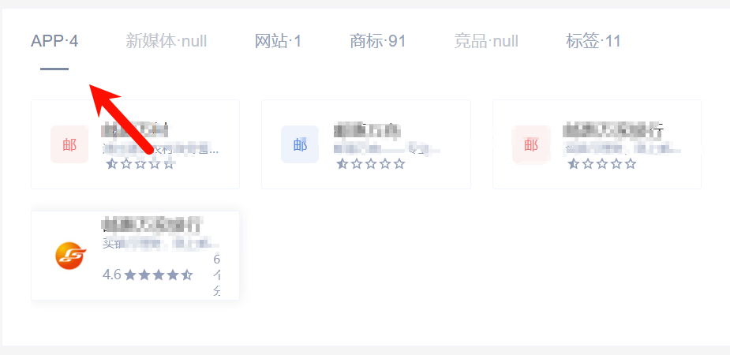
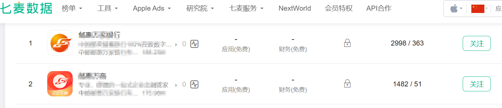
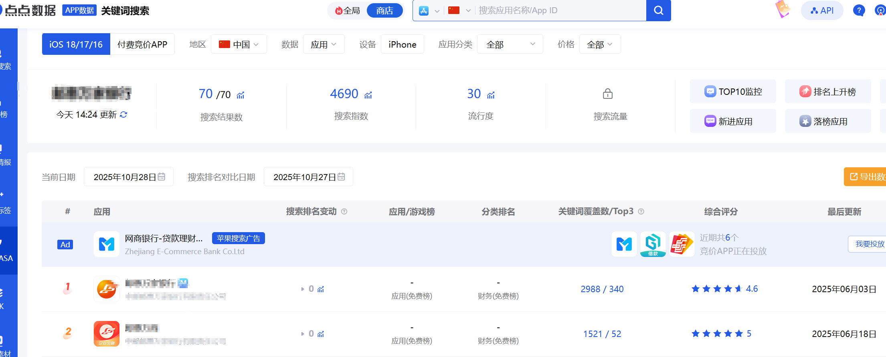
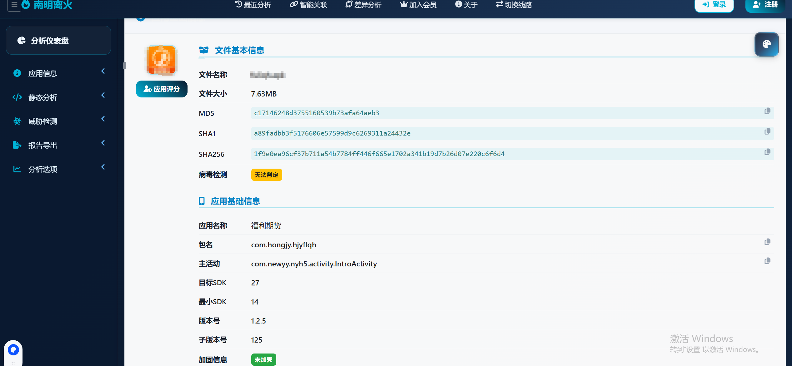
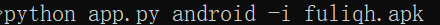

# 18信息打点-APP资产&知识产权&应用监控&静态提取&动态抓包&动态调试

案例1：名称获取APP信息（爱企查/小蓝本/七麦/点点）`不推荐`

1、小蓝本查询知识产权（https://www.xiaolanben.com/）

2、七麦&点点查名称

https://aiqicha.baidu.com/

https://www.qimai.cn/

https://app.diandian.com/

 

案例2：URL网站备案查APP

1、查备案信息在搜

2、网站上有APP下载

3、市场直接搜单位名称

 

通过获取App配置、数据包，去获取url、api、osskey、js等敏感信息。

1、资产信息-IP 域名 网站 -转到对应Web测试 接口测试 服务测试 

2、泄露信息-配置key 资源文件 - key（osskey利用，邮件配置等）

3、代码信息-java代码安全问题- 逆向相关

## :umbrella:APP中收集资产

1、抓包-动态表现

2、提取-静态表现&动态调试

3、搜索-静态表现

 

1、抓包抓表现出来的数据

优点：没有误报

缺点：无法做到完整

2、反编译从源码中提取数据

优点：数据较为完整

缺点：有很多无用的资产

3、动态调试从表现中提取数据

优点：没有误报，解决不能抓包不能代理等情况

优点；搞逆向的人能看到实时的app调用链等

缺点：无法做到完整

案例：==某APP打开无数据包，登录有数据包==（反编译后未找到目标资产，抓包住到了）

原因：那个登录界面是APP打包的资源，并没有对外发送数据

 

案例3：APP提取信息-静态分析

1、MobSF

2、AppInfoScanner

3、两个在线平台

https://mogua.co/

https://www.zhihuaspace.cn:8888/

https://github.com/kelvinBen/AppInfoScanner

https://github.com/MobSF/Mobile-Security-Framework-MobSF

### :yum:AppInfoScanner使用

Windows - MobSF安装参考：

https://www.cnblogs.com/B-hai/p/15696948.html

https://blog.csdn.net/ljh824144294/article/details/119181803

 

案例3：APP提取信息-动态抓包

-前期部分抓包技术

 

案例3：APP提取信息-动态调试

-MobSF+模拟器