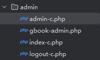
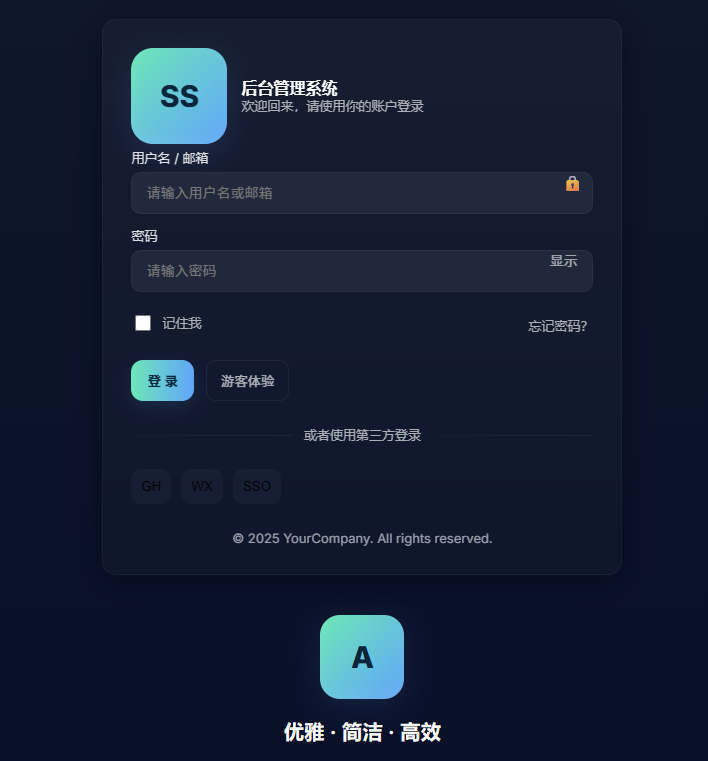
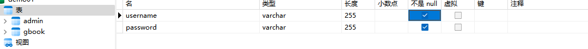
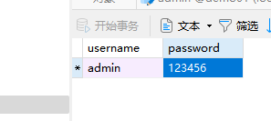
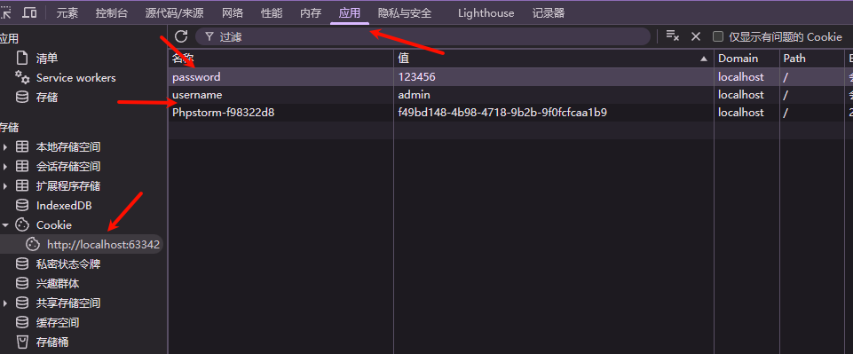
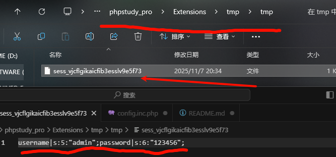
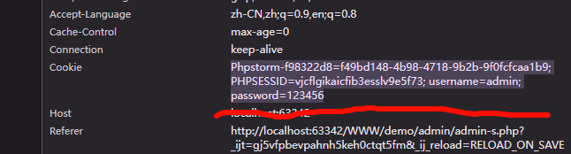

# 23php&后台模块&Session&Cookie&Token&身份验证&唯一性

## 在admin目录下创建



分别实现登陆文件、首页文件、登出文件

## 用ai生成一个简单美观的html后台管理登陆界面



## 在数据库中创建一个表，并填写一个用户数据

==如果真实的情况会添加加密值==





## 接收账号密码

```
$user=$_POST['user'];
$pass=$_POST['pass'];
```

## 判断密码账号的正确性与设置cookie

```
//连接数据库 进行数据库查询将数据进行比对
$sql="select * from admin where username='$user' and password='$pass';";
//echo $sql;
$date=mysqli_query($con,$sql);
if(mysqli_num_rows($date)>0) {
    // 登录成功后（不安全示例，学习用）
    setcookie("username", $user, time()+3600, "/");
    setcookie("password", $pass, time()+3600, "/");
//    echo '<script>alert("登陆成功");</script>';
    header('Location:index-c.php');
    exit();
}else{
    echo '<script>alert("登陆失败");</script>';
}
```

==不安全仅作学习测试使用==

```
<?php
//首页文件
if (isset($_COOKIE['username']) && isset($_COOKIE['password'])) {
    $user = $_COOKIE['username'];
    $pass = $_COOKIE['password'];

} else {
    // 未登录
}
echo $user;
```

手动添加Cookie ，可以识别到账号和密码




## session用法

```
$_SESSION['username']=$user;
$_SESSION['password']=$pass;
```

在用户输入内容后





## token用法

```
<?php
session_start();

// 如果还没有 token，就生成一个新的
if (!isset($_SESSION['token'])) {
    $_SESSION['token'] = bin2hex(random_bytes(16));
    setcookie("token", $_SESSION['token'], time() + 3600, '/');
}
?>
```

```
<?php
session_start();

$token_cookie = $_COOKIE['token'] ?? '';
$token_session = $_SESSION['token'] ?? '';

if (isset($_POST['user'], $_POST['pass']) && $token_cookie && $token_cookie === $token_session) {
    $username = $_POST['user'];
    $password = $_POST['pass'];

    // 这里可以做数据库验证，这里示例用固定用户名密码
    if ($username === 'admin' && $password === '123456') {
        echo "✅ 登录成功";
    } else {
        echo "❌ 用户名或密码错误";
    }
} else {
    echo "⚠️ 登录失败（token 无效或 session 丢失）";
}
?>
```