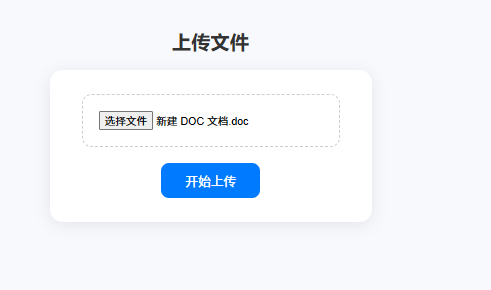
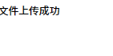
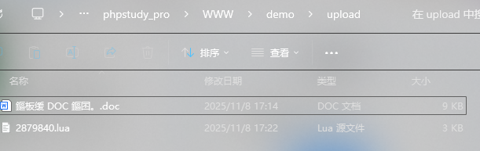
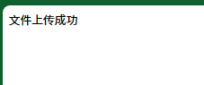
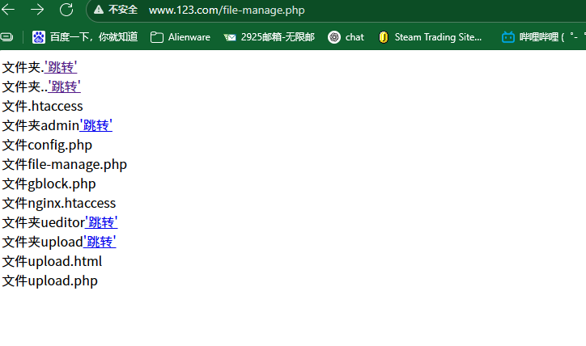
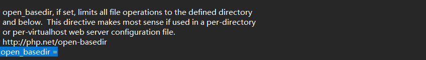

# PHP文件上传

在目录下创建upload.html &upload.php

html文件上传

```
<form action="upload.php" method="post" enctype="multipart/form-data">
    <input type="file" name="file"><br>
    <input type="submit" value="开始上传">
```

php代码

```
<?php

$name=$_FILES["file"]["name"];
$type=$_FILES["file"]["type"];
$size=$_FILES["file"]["size"];
$tmp_name=$_FILES["file"]["tmp_name"];
$error=$_FILES["file"]["error"];

echo $name."<br>";
echo $type."<br>";
echo $size."<br>";
echo $tmp_name."<br>";
echo $error."<br>";
?>
```

在目录下窗口给upload目录

```
if(move_uploaded_file($_FILES["file"]["tmp_name"],"upload/".$name)){
    echo "文件上传成功";
}
```

上传文件







黑名单

```
$black_list=array("php","asp","aspx","js");
$fenge = explode(".",$name);
$exts= end($fenge);
if(in_array($exts,$black_list)){
    echo "非法后缀文件".$exts;
}else{
    move_uploaded_file($_FILES["file"]["tmp_name"],"upload/".$name);
    echo "文件上传成功";
}
```

上传php文件后输出提示信息


白名单 上传png

```
$allow=array('image/gif','image/jpeg','image/png','image/pjpeg','image/x-png');
if(in_array($type,$allow)){
    move_uploaded_file($_FILES["file"]["tmp_name"],"upload/".$name);
    echo "文件上传成功";
}else{
    echo "非法后缀文件";}
```



==安全隐患 用burp 抓包修改成白名单支持的文件后上传==


访问控制

```
<?php
$dir = $_GET['path'] ?? './';

function show_file($dir) {
    $d = opendir($dir);

    while (($file = readdir($d)) !== false) {
        $fullPath = $dir . '/' . $file;

        if (is_dir($fullPath)) {
            echo "文件夹" . $file . "<a href='?path=$file'>'跳转'</a><br>";
        } else {
            echo "文件" . $file . "<br>";
        }
    }
}

show_file($dir);
?>
```



修改path会进入到主机目录


在php中 php.ini修改参数可以限制访问目录

