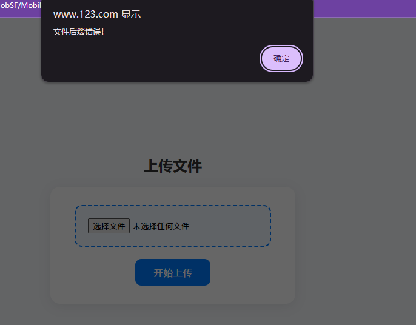
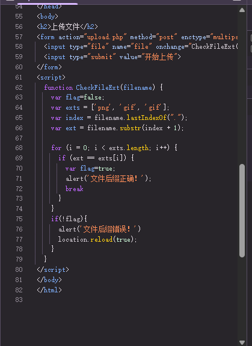
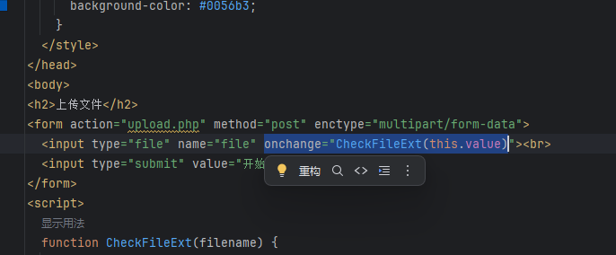
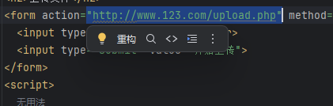
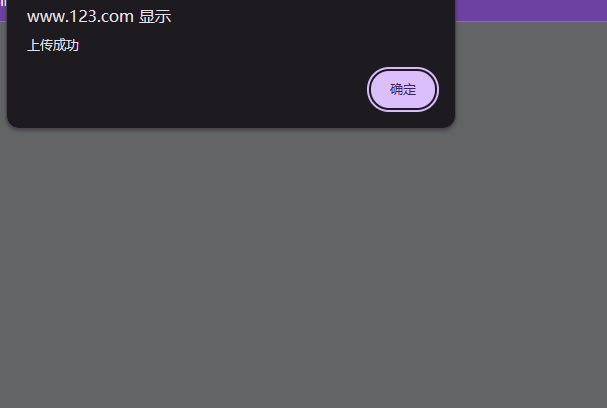

# JS应用&原生开发&JQuery库&Ajax技术&前端后端&安全验证处理

文件过滤

```
<script>
  function CheckFileExt(filename) {
    var flag=false;
    var exts = ['png', 'gif', 'gif'];
    var index = filename.lastIndexOf(".");
    var ext = filename.substr(index + 1);

    for (i = 0; i < exts.length; i++) {
      if (ext == exts[i]) {
        var flag=true;
        alert('文件后缀正确！');
        break
      }
    }
    if(!flag){
      alert('文件后缀错误！')
      location.reload(true);
    }
  }
</script>
```

文件接收

```
<?php
$name=$_FILES["file"]["name"];
$type=$_FILES["file"]["type"];
$size=$_FILES["file"]["size"];
$tmp_name=$_FILES["file"]["tmp_name"];
$error=$_FILES["file"]["error"];

if(move_uploaded_file($tmp_name,"upload/".$name)){
    echo "<script>alert('上传成功');</script>";
};
```

选择被过滤的文件，会出现“文件后缀错误提示”不能上传



浏览器F12可以看到过滤源码



复制源码删除`onchange="CheckFileExt(this.value)"`



修改`action`为网站路径`upload.php`地址



上传过滤的文件，可以成功上传



导入Ajax

