## HasMap 基础链

### 分析

按住Ctrl可以来到这个类，来源于jkd内部自带

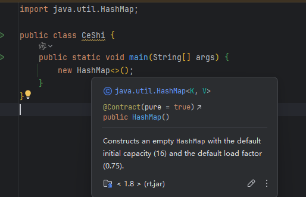

new Has先序列化HashMap，再反序列化HashMap会执行Hashmap.readObject（不知道有没有得找）

点击结构，寻找readObject

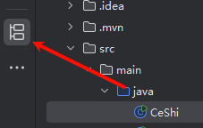

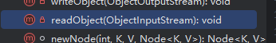

找了readObject

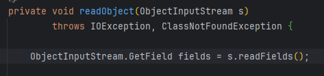

寻找触发利用的地方（主要是学习写链不是找链这里是已知的）

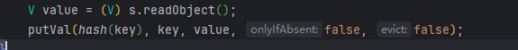

点击putVal  在上面找到了一个调用putVal的

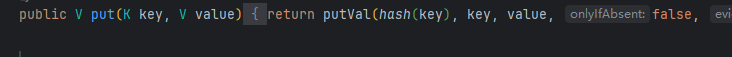

点进去hash  key是参数  key.hashCode() 如果传入参数 key变成url就会变成urlcode

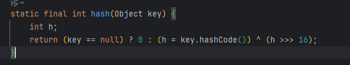

点hashCode  找url（为什么找url呢因为网上的人找到的，现在只负责学习写链，不负责找链哦）

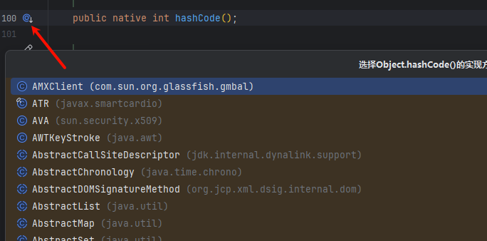

点击url 这是jdk自带的,  hashCode = -1 时 调用 hanler.hashCode

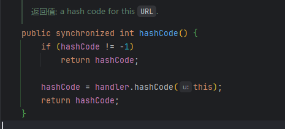

点击 handler

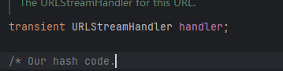

点进hashCode

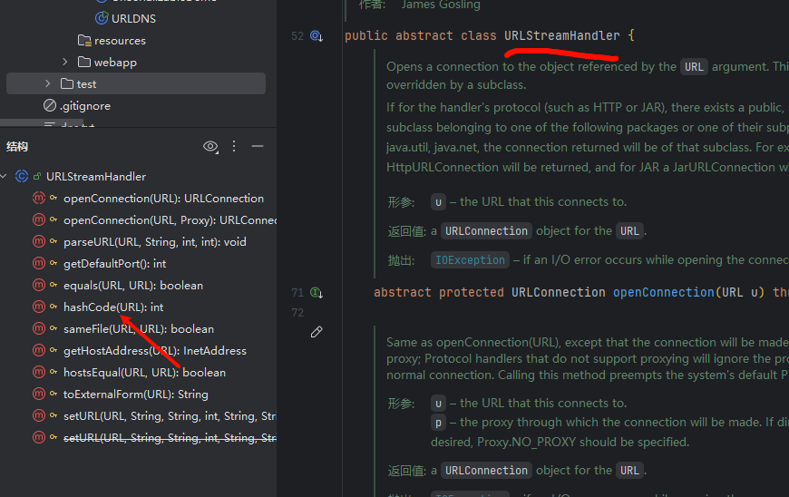

传进去 u  触发 getHostAddress（）

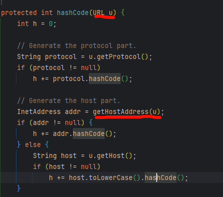

new hashmap 创建对象反序列化过程中->会调用hashmap.readObject方法

->在方法中会调用putVal(hash(key))->点进hash->key是参数 key.hashCode()->需要传参数key变成url.hashCode->hashCode=-1  ->hanler.hashCode=URLStreamHandler.hashCode

->URLStreamHandler.hashCode.getHostAddress（u）

 `HashMap.readObject()` 中，为了重建键值对，会调用
 `putVal()`，进而调用 `hash(key)`。
 当 key 为 `URL` 对象且其 `hashCode` 为 `-1` 时，
 会触发 `URL.hashCode()`，该方法内部调用
 `URLStreamHandler.hashCode()`，最终在解析 host 时
 调用 `InetAddress.getByName()`，触发 DNS 请求。

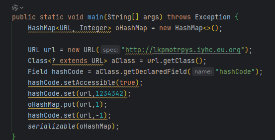

利用yakit 生成 反连域名

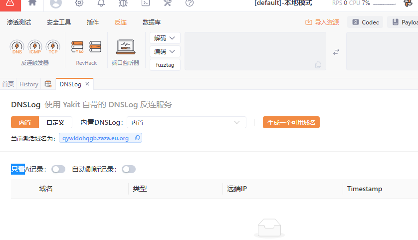

反序列化

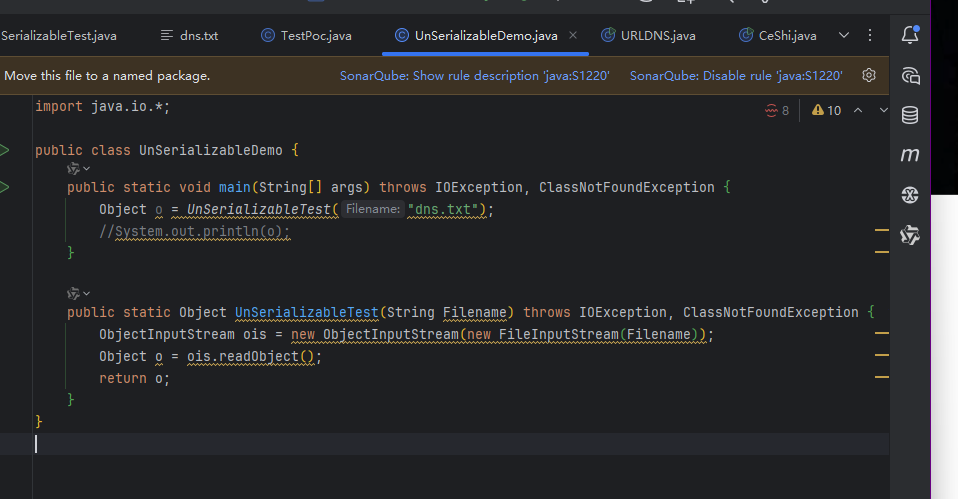

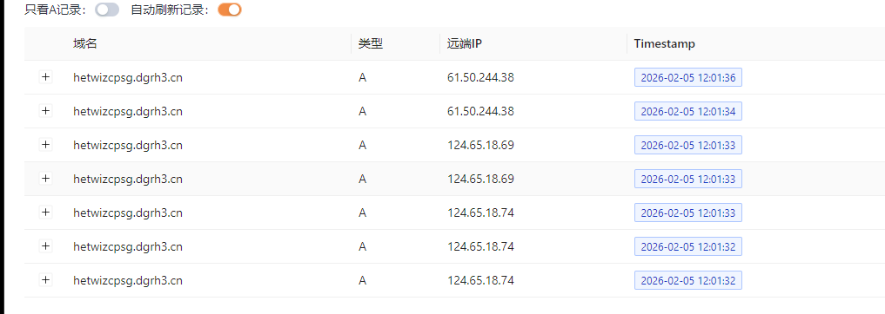