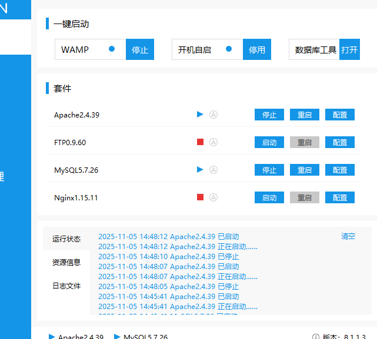
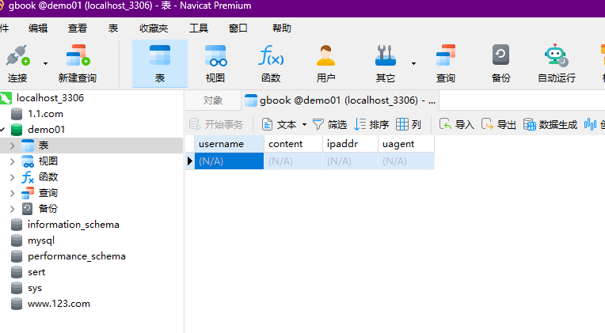
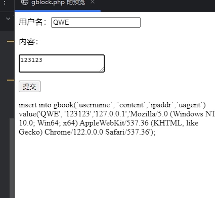
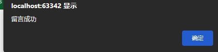

# 22PHP简单实验

创建服务器



连接数据库-设计一个表

连接数据库代码 如果成功输出`Connected successfully`

```php
$servername = "localhost";
$username = "root";
$password = "123456";
$dbname = "demo01";
$conn = mysqli_connect($servername, $username, $password, $dbname);
if (!$conn) {
    die("Connection failed: " . mysqli_connect_error());
}else{
    echo "Connected successfully";
}
```

增添内容 `insert into 表名(`列名1`, `列名2`) value('列1值1', '列2值2');`==要用反引号当作SQL的字段名或者表名==

```php
$sql="insert into demo01(`username`, `content`,`ipaddr`,`uagent`) value('$u', '$c','$i','$u');"
```

```php
$u=$_POST['username'];
$c=$_POST['content'];
$i=$_SERVER["REMOTE_ADDR"];
$ua=$_SERVER["HTTP_USER_AGENT"];
```

测试一下




给用户提示

```js
echo "<script>alert('留言成功');</script>";
```



当前目录结构


`config.php`

```
<?php


$servername = "localhost";
$username = "root";
$password = "123456";
$dbname = "demo01";
$con = mysqli_connect($servername, $username, $password, $dbname);

if (!$con) {
    die("Connection failed: " . mysqli_connect_error());
}else{
    echo "ok";
}
```

`gblock.php`和`gbook-admin.php`中分别包含目录

```
include 'config.php'; //包含同级目录
```

```
include '../config.php'; //包含上级目录
```

添加 函数

```
function add_gbook($con)
{
    $u = $_POST['username'];
    if($_SERVER["REQUEST_METHOD"] == "POST"){
        $c = $_POST['content'];
        $i = $_SERVER["REMOTE_ADDR"];
        $ua = $_SERVER["HTTP_USER_AGENT"];
        $sql = "insert into gbook(`username`, `content`,`ipaddr`,`uagent`) value('$u', '$c','$i','$ua');";
        if (mysqli_query($con, $sql)) {
            echo "<script>alert('留言成功');</script>";
        }
    }
}
```

显示函数  判断`$del=del 显示 删除按钮`

```
function show_gbook($con,$del)
{   $sql1="select * from gbook";
    $data=mysqli_query($con,$sql1);
    while ($row=mysqli_fetch_row($data))
    {   echo '<hr>';
        echo $row[0].'用户名'.'<br>';
        echo $row[1].'内容'.'<br>';
        echo $row[2].'ip地址'.'<br>';
        echo $row[3].'ua头'.'<br>';
        if($del=='del'){
            echo "<a href='gbook-admin.php?del=$row[0]'>删除</a>";
        }
    }
}
```

复制插件到目录


配置文件

```
<script src="/ueditor/ueditor.config.js">/*引入配置文件*/</script>
<script src="/ueditor/ueditor.all.js">/*引入源码文件*/</script>
```

```
<textarea id="content" rows="10" cols="70" name="content" style="border:1px solid #E5E5E5;">
</textarea>
<script type="text/javascript">
    UE.getEditor("content");

    //实例化编辑器传参,id为将要被替换的容器。
</script>
```

