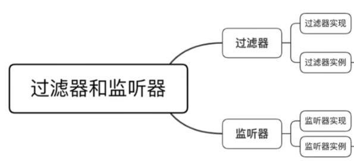
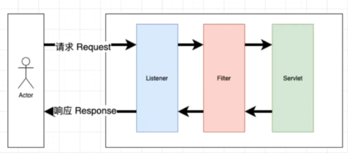
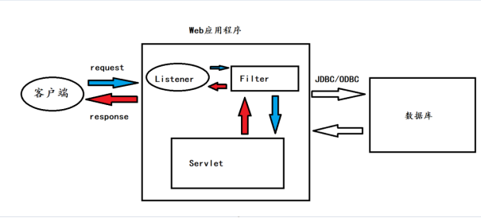

# JavaEE应用&SQL预编译&Filter过滤器&Listener监听器&访问控制

\#JavaEE-预编译-SQL

预编译SQL语句并执行,预防SQL注入问题

String safesql="select * from news where id=?";

PreparedStatement preparedStatement=connection.prepareStatement();

preparedStatement.setString(1,s);

ResultSet resultSet=preparedStatement.executeQuery();

 

\#JavaEE-过滤器-Filter

Filter被称为过滤器，过滤器实际上就是对Web资源进行拦截，做一些处理后再交给下一个过滤器或Servlet处理，通常都是用来拦截request进行处理的，也可以对返回的 response进行拦截处理。开发人员利用filter技术，可以实现对所有Web资源的管理，例如实现权限访问控制、过滤敏感词汇、压缩响应信息等一些高级功能。

1、创建过滤器

2、过滤器内置方法

init  doFilter destroy

3、过滤器触发流程

@WebFilter("/xss")

<filter>

  <filter-name>xssFilter</filter-name>

  <filter-class>com.example.filter.xssFilter</filter-class>

</filter>

<filter-mapping>

  <filter-name>xssFilter</filter-name>

  <url-pattern>/xss</url-pattern>

</filter-mapping>

4、过滤器安全场景

Payload检测，权限访问控制，红队内存马植入，蓝队清理内存马等

内存马参考：https://mp.weixin.qq.com/s/hev4G1FivLtqKjt0VhHKmw

 

\#JavaEE-监听器-Listen

参考：https://blog.csdn.net/qq_52797170/article/details/124023760

-监听ServletContext、HttpSession、ServletRequest等域对象创建和销毁事件

-监听域对象的属性发生修改的事件

-监听在事件发生前、发生后做一些必要的处理

1、创建监听器

2、监听器内置方法

3、监听器触发流程

@WebListener

<listener>

  .......

</listener>

4、监听器安全场景

代码审计中分析执行逻辑触发操作，红队内存马植入，蓝队清理内存马等