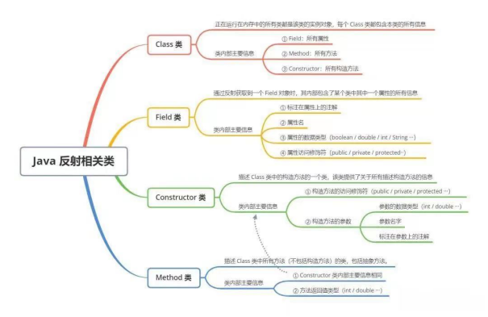
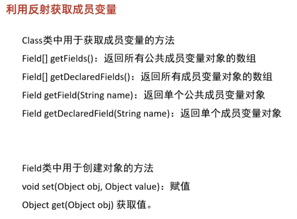
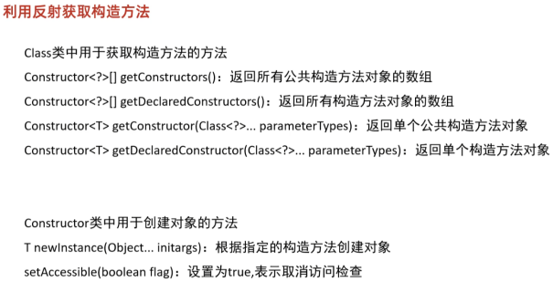
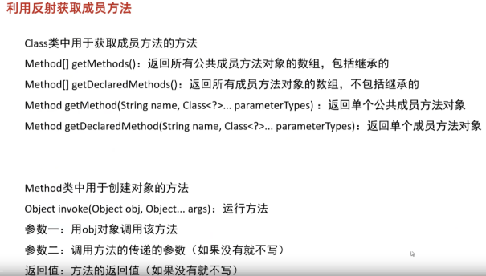

# JavaEE应用&反射机制&攻击链&类对象&成员变量方法&构造方法

1、什么是Java反射

参考：https://xz.aliyun.com/t/9117

Java提供了一套反射API，该API由Class类与java.lang.reflect类库组成。

该类库包含了Field、Method、Constructor等类。

对成员变量，成员方法和构造方法的信息进行的编程操作可以理解为反射机制。

 

2、为什么要用到反射

参考：https://xz.aliyun.com/t/9117

其实从官方定义中就能找到其存在的价值，在运行时获得程序或程序集中每一个类型的成员和成员的信息，从而动态的创建、修改、调用、获取其属性，而不需要事先知道运行的对象是谁。划重点：在运行时而不是编译时。（不改变原有代码逻辑，自行运行的时候动态创建和编译即可）

 

3、反射机制应用

开发应用场景：

Spring框架的IOC基于反射创建对象和设置依赖属性。

SpringMVC的请求调用对应方法，也是通过反射。

JDBC的Class#forName(String className)方法，也是使用反射。

 

安全应用场景：

构造利用链，触发命令执行

反序列化中的利用链构造

动态获取或执行任意类中的属性或方法

动态代理的底层原理是反射技术

rmi反序列化也涉及到反射操作

 

\#Java-反射-Class对象类获取

//1、根据类名：类名.class

Class userClass = User.class;

//2、根据对象：对象.getClass()

User user = new User();

Class aClass = user.getClass();

//3、根据全限定类名：Class.forName("全路径类名")

Class aClass1 = Class.forName("com.example.reflectdemo.User");

//4、通过类加载器获得Class对象：//ClassLoader.getSystemClassLoader().loadClass("全路径类名");

ClassLoader clsload=ClassLoader.getSystemClassLoader();

Class aClass2 = clsload.loadClass("com.example.reflectdemo.User");

 

\#Java-反射-Field成员变量类获取

//Class aClass = Class.forName("com.example.reflectdemo.User");

​    //获取公共成员变量对象

//     Field[] fields=aClass.getFields();

//     for(Field f:fields){

//       System.out.println(f);

//     }

 

​    //获取所有成员变量对象

//     Field[] fields=aClass.getDeclaredFields();

//     for(Field f:fields){

//       System.out.println(f);

//     }

 

​    //获取公共，私有单个成员变量对象

//     Field field=aClass.getField("age");

//     Field field=aClass.getDeclaredField("gender");

//     System.out.println(field);

 

​    //城边变量值获取和赋值

//     User u = new User();

//     Field field=aClass.getField("age");

//     field.set(u,30);

//     Object a=field.get(u);

//     System.out.println(a);

 

\#Java-反射-Method成员方法类获取

//Class aClass = Class.forName("com.example.reflectdemo.User");

 

​    //返回所有公共成员方法对象的数组，包括继承的

//     Method[] methods = aClass.getMethods();

//     for (Method me:methods){

//       System.out.println(me);

//     }

 

​    //返回所有成员方法对象的数组，不包括继承的

//     Method[] methods = aClass.getDeclaredMethods();

//     for (Method me:methods){

//       System.out.println(me);

//     }

 

​    //返回单个公共成员方法对象

//     Method methods = aClass.getMethod("getName");

//     System.out.println(methods);

 

//     Method methods = aClass.getMethod("setName", String.class);

//     System.out.println(methods);

 

​    //返回单个成员方法对象

//     Method methods = aClass.getDeclaredMethod("UserInfo", String.class, int.class, String.class);

//     System.out.println(methods);

 

​    //运行方法invoke

//     Method methods = aClass.getDeclaredMethod("UserInfo", String.class, int.class, String.class);

//     User u = new User();

//     //私有需要开启临时

//     methods.setAccessible(true);

//     methods.invoke(u,"xiaodi",18,"man");

 

 

\#Java-反射-Constructor构造方法类获取

//Class aClass = Class.forName("com.example.reflectdemo.User");

​    //返回所有公共构造方法对象的数组

//     Constructor[] constructors = aClass.getConstructors();

//     for(Constructor con:constructors){

//       System.out.println(con);

//     }

 

​    //返回所有构造方法对象的数组

//     Constructor[] constructors = aClass.getDeclaredConstructors();

//     for(Constructor con:constructors){

//       System.out.println(con);

//     }

 

​    //返回单个公共构造方法对象

//     Constructor con1=aClass.getConstructor();

//     Constructor con1=aClass.getConstructor(String.class);

//     System.out.println(con1);

 

​    //返回单个构造方法对象

//     Constructor con2=aClass.getDeclaredConstructor(int.class);

​    //Constructor con2=aClass.getDeclaredConstructor(String.class,int.class, String.class);

//     System.out.println(con2);

 

//     Constructor con2=aClass.getDeclaredConstructor(int.class);

//     con2.setAccessible(true);

//     User uu=(User) con2.newInstance("xiaodi",30,"man");

//     System.out.println(uu);

 

\#Java-反射-不安全命令执行&反序列化链构造

1、反射实现-命令执行

-原型：

Runtime.getRuntime().exec("calc");

-反射：

Class aClass = Class.forName("java.lang.Runtime");

Method[] methods = aClass.getMethods();

for (Method me:methods){

  System.out.println(me);

}

Method exec = aClass.getMethod("exec", String.class);

Method getRuntimeMethod = aClass.getMethod("getRuntime");

Object runtime = getRuntimeMethod.invoke(aClass);

exec.invoke(runtime, "calc.exe");

 

Class c1= Class.forName("java.lang.Runtime");

Constructor m = c1.getDeclaredConstructor();

m.setAccessible(true);

c1.getMethod("exec", String.class).invoke(m.newInstance(), "calc");

 

2、不安全的反射对象

指应用程序使用具有反射功能的外部输入来选择要使用的类或代码，

可能被攻击者利用而输入或选择不正确的类。绕过身份验证或访问控制检查

参考分析：https://zhuanlan.zhihu.com/p/165273855

利用结合：https://xz.aliyun.com/t/7031（反序列化利用链）