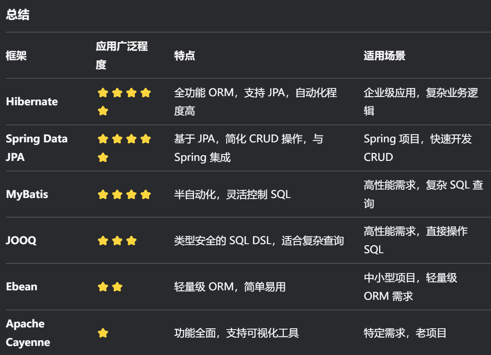

# JavaEE应用&ORM框架&SQL预编译&JDBC&MyBatis&Hibernate&Maven



```java
#Maven配置
参考：https://blog.csdn.net/cxy2002cxy/article/details/144809310

#JDBC
参考：https://www.jianshu.com/p/ed1a59750127
1、引用依赖（pom.xml）
https://mvnrepository.com/
2、注册数据库驱动
Class.forName("com.mysql.jdbc.Driver");
3、建立数据库连接
String url ="jdbc:mysql://localhost:3306/phpstudy";
Connection connection=DriverManager.getConnection(url,"root","123456");
4、创建Statement执行SQL
Statement statement= connection.createStatement();
ResultSet resultSet = statement.executeQuery(sql);
5、结果ResultSet进行提取
while (resultSet.next()){
    int id = resultSet.getInt("id");
    String page_title = resultSet.getString("page_title");
    .......
}

安全注入例子：
预编译：PreparedStatement
安全写法(预编译)： "select * from admin where id=?"
不安全写法(拼接)： "select * from admin where id="+id

#Hibernate
1、引用依赖（pom.xml）
https://mvnrepository.com/
hibernate-core，mysql-connector-java
2、Hibernate配置文件
src/main/resources/hibernate.cfg.xml
<?xml version='1.0' encoding='utf-8'?>
<!DOCTYPE hibernate-configuration PUBLIC
        "-//Hibernate/Hibernate Configuration DTD 3.0//EN"
        "http://www.hibernate.org/dtd/hibernate-configuration-3.0.dtd">
<hibernate-configuration>
    <session-factory>
        <!-- 数据库连接配置 -->
        <property name="hibernate.connection.driver_class">com.mysql.cj.jdbc.Driver</property>
        <property name="hibernate.connection.url">jdbc:mysql://localhost:3306/phpstudy?useUnicode=true&characterEncoding=UTF-8&serverTimezone=UTC</property>
        <property name="hibernate.connection.username">root</property>
        <property name="hibernate.connection.password">123456</property>

        <!-- 数据库方言 -->
        <property name="hibernate.dialect">org.hibernate.dialect.MySQL8Dialect</property>

        <!-- 显示 SQL 语句 -->
        <property name="hibernate.show_sql">true</property>

        <!-- 自动更新数据库表结构 -->
        <property name="hibernate.hbm2ddl.auto">update</property>

        <!-- 映射实体类 -->
        <mapping class="com.example.entity.User"/>
    </session-factory>
</hibernate-configuration>
3、映射实体类开发
用来存储获取数据：
src/main/java/com/example/entityUser.java
4、Hibernate工具类
用来Hibernate使用：
src/main/java/com/example/util/HibernateUtil.java
5、Servlet开发接受：
src/main/java/com/example/servlet/UserQueryServlet.java

安全注入例子：
安全写法：String hql = "FROM User WHERE username=:username";
不安全写法：String hql = "FROM User WHERE username='"+username+"'";

#MyBatis
1、引用依赖（pom.xml）
mybatis，mysql-connector-java
2、MyBatis配置文件
src/main/resources/mybatis-config.xml
<?xml version="1.0" encoding="UTF-8" ?>
<!DOCTYPE configuration
        PUBLIC "-//mybatis.org//DTD Config 3.0//EN"
        "http://mybatis.org/dtd/mybatis-3-config.dtd">
<configuration>
    <environments default="development">
        <environment id="development">
            <transactionManager type="JDBC"/>
            <dataSource type="POOLED">
                <property name="driver" value="com.mysql.cj.jdbc.Driver"/>
                <property name="url" value="jdbc:mysql://localhost:3306/phpstudy?serverTimezone=UTC"/>
                <property name="username" value="root"/>
                <property name="password" value="123456"/>
            </dataSource>
        </environment>
    </environments>
    <mappers>
        <mapper resource="AdminMapper.xml"/>
    </mappers>
</configuration>
3、AdminMapper.xml创建
src/main/resources/mybatis-config.xml
<?xml version="1.0" encoding="UTF-8" ?>
<!DOCTYPE mapper
        PUBLIC "-//mybatis.org//DTD Mapper 3.0//EN"
        "http://mybatis.org/dtd/mybatis-3-mapper.dtd">
<mapper namespace="com.example.jdbcdemo43.mapper.AdminMapper">
    <select id="selectAdminById" resultType="com.example.jdbcdemo43.model.Admin">
        SELECT * FROM admin WHERE id = #{id}
    </select>
</mapper>
4、创建数据实体类
com/example/mybatisdemo43/model/User.java
5、创建mapper实体类
com/example/mybatisdemo43/mapper/AdminMapper.java
6、创建servlet接受类
com/example/mybatisdemo43/servlet/SelectServlet.java
// 加载 MyBatis 配置文件
String resource = "mybatis-config.xml";
InputStream inputStream = Resources.getResourceAsStream(resource);
SqlSessionFactory sqlSessionFactory = new SqlSessionFactoryBuilder().build(inputStream);
// 获取 SqlSession
try (SqlSession session = sqlSessionFactory.openSession()) {
    // 获取 Mapper 接口
    AdminMapper mapper = session.getMapper(AdminMapper.class);
    // 执行查询
    Admin admin = mapper.selectAdminById(Integer.parseInt(id));
    // 输出结果

安全注入例子：
1、安全写法： select * from admin where id = #{id}
2、不安全写法：select * from admin where id = ${id}

#Spring JPA
由于涉及到开发框架，后续讲到，安全基本和Hibernate相似

```

