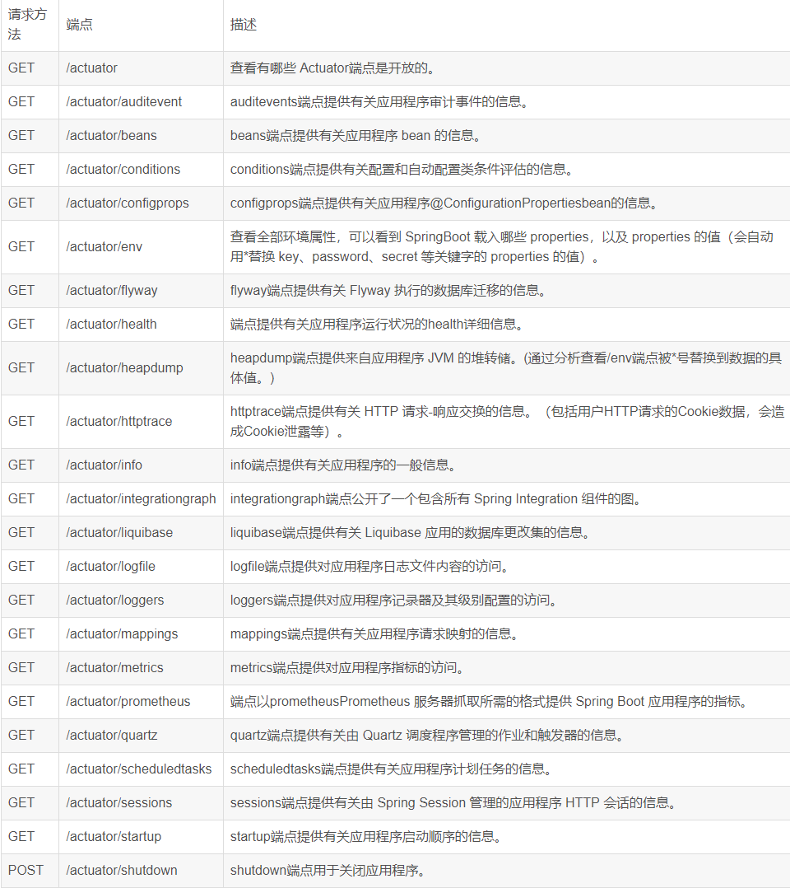

# Web开发-JavaEE应用&SpringBoot栈&Actuator&Swagger&HeapDump&提取自动化



```JAVA
#开发框架-SpringBoot
参考：https://springdoc.cn/spring-boot/

#SpringBoot-监控依赖-Actuator
SpringBoot Actuator模块提供了生产级别的功能，比如健康检查，审计，指标收集，HTTP跟踪等，帮助我们监控和管理Spring Boot应用。
-开发使用：
1、引入依赖
<dependency>
        <groupId>org.springframework.boot</groupId>
        <artifactId>spring-boot-starter-actuator</artifactId>
</dependency>
2、配置监控
#暴露
#基于application.properties
management.endpoints.web.exposure.include=*

#基于application.yml
management:
  endpoints:
    web:
      exposure:
        include: '*'

#安全配置：
#application.properties
management.endpoint.env.enabled=false
management.endpoint.heapdump.enabled=false

#application.yml
management:
    endpoint:
        heapdump:
            enabled: false #启用接口关闭
    env:
        enabled: false #启用接口关闭

2、1 图像化Server&Client端界面
Server：引入Server依赖-开启（@EnableAdminServer）
Client：引入Client依赖-配置（连接目标，显示配置等）

3、安全问题
-heapdump泄漏
jvisualvm分析器（自带）
JDumpSpider提取器：https://github.com/whwlsfb/JDumpSpider
heapdump_tool提取器：https://github.com/wyzxxz/heapdump_tool
分析提取出敏感信息（配置帐号密码，接口信息 数据库 短信 云应用等配置）

4、额外安全：
https://github.com/LandGrey/SpringBootVulExploit
https://github.com/wh1t3zer/SpringBootVul-GUI
例子：SpringCloud Gateway RCE（CVE-2022-22947）
->创建SpringCloud Gateway+Actuator项目
->更改项目版本及漏洞Gateway依赖版本
<spring-boot.version>2.5.2</spring-boot.version>
<spring-cloud.version>2020.0.3</spring-cloud.version>
<dependency>
    <groupId>org.springframework.cloud</groupId>
    <artifactId>spring-cloud-starter-gateway</artifactId>
    <version>3.1.0</version>
</dependency>
->启动项目进行测试
参考：https://www.cnblogs.com/qgg4588/p/18104875

#SpringBoot-接口依赖-Swagger
Swagger是当下比较流行的实时接口文文档生成工具。接口文档是当前前后端分离项目中必不可少的工具，在前后端开发之前，后端要先出接口文档，前端根据接口文档来进行项目的开发，双方开发结束后在进行联调测试。
参考：https://blog.csdn.net/lsqingfeng/article/details/123678701
-开发使用
1、引入依赖
<--2.9.2版本-->
<dependency>
    <groupId>io.springfox</groupId>
    <artifactId>springfox-swagger2</artifactId>
    <version>2.9.2</version>
</dependency>
<dependency>
    <groupId>io.springfox</groupId>
    <artifactId>springfox-swagger-ui</artifactId>
    <version>2.9.2</version>
</dependency>

<--3.0.0版本-->
<dependency>
  <groupId>io.springfox</groupId>
  <artifactId>springfox-boot-starter</artifactId>
  <version>3.0.0</version>
</dependency>

2、配置访问
#application.properties
spring.mvc.pathmatch.matching-strategy=ant-path-matcher

#application.yml
spring
  mvc:
    pathmatch:
      matching-strategy: ant_path_matcher
      
2.X版本启动需要注释@EnableSwagger2
3.X版本不需注释，写的话是@EnableOpenApi
2.X访问路径：http://ip:port/swagger-ui.html
3.X访问路径：http://ip:port/swagger-ui/index.html

3、安全问题
自动化测试：Apifox Reqable Postman
泄漏应用接口：用户登录，信息显示，上传文件等
可用于对未授权访问，信息泄漏，文件上传等安全漏洞的测试.

```

