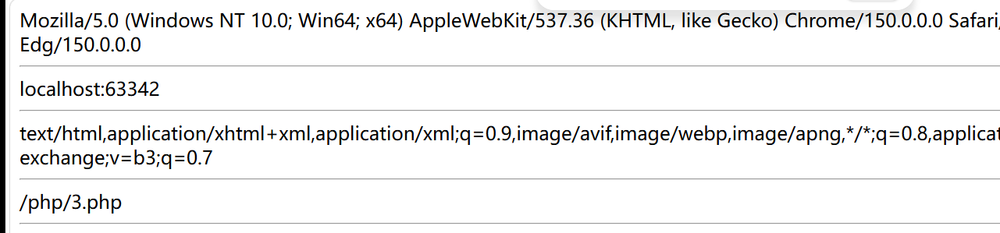

# 变量覆盖安全

$GLOBALS：这种全局变量用于在PHP脚本中的==任意位置访问全局变量==

数据接收安全：

$_REQUEST：$_REQUEST 用于收集 HTML 表单提交的数据。==可以接受任意方式传参==

$_POST：广泛用于收集提交method="post" 的HTML表单后的表单数据。

$_GET：收集URL中的发送的数据。也可用于提交表单数据(method="get") 

$_ENV：是一个包含服务器端环境变量的数组。

`$_SERVER`：这种超全局变量保存关于报头、路径和脚本位置的信息。

```
echo $_SERVER['HTTP_USER_AGENT'].'<hr>';
echo $_SERVER['HTTP_HOST'].'<hr>';
echo $_SERVER['HTTP_ACCEPT'].'<hr>';
echo $_SERVER['PHP_SELF'].'<hr>';
```



文件上传

```php
<form action="" method="post" enctype="multipart/form-data">
    选择文件：<input type="file" name="file_upload">
    <input type="submit" value="上传">
</form>

<?php
//获取表单名为file_upload提交的文件名
$filename=@$_FILES['file_upload']['name'];
$filetype=@$_FILES['file_upload']['type'];
$filesize=@$_FILES['file_upload']['size'];
$filetmp_name=@$_FILES['file_upload']['tmp_name'];

echo "文件名:".$filename."<hr>";
echo "文件格式:".$filetype."<hr>";
echo "文件大小:".$filesize."<hr>";
echo "文件临时名:".$filetmp_name."<hr>";
```

