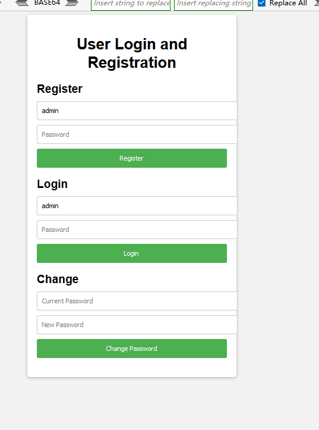
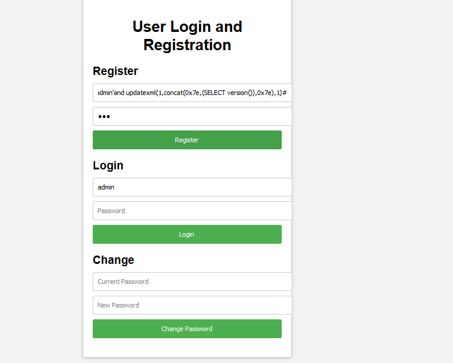
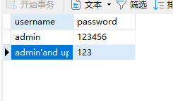
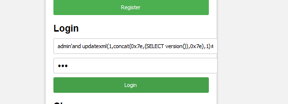
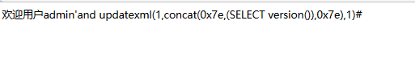
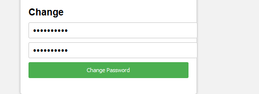
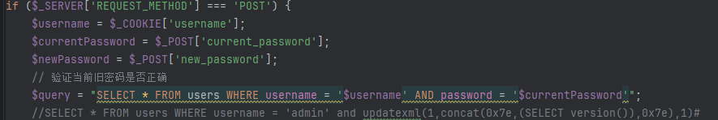
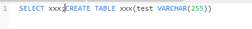

# PHP应用&SQL二次注入&堆叠执行

## SQL二次注入

网站功能正常,实现用户注册登录和修改密码



因为没有回显,只能用报错注入或者延时注入

注册账户

```
admin'and updatexml(1,concat(0x7e,(SELECT version()),0x7e),1)#
```



注册成功



测试登录



登录成功



在修改密码的地方随便输入内容



注入成功


原理在修改密码时会验证密码是否正确




`addslashes`会把接收的数据`(点) 变成加上/(反斜杠)

但是存储到数据库时会变成原本的数据,没有/(反斜杠)


## 堆叠执行



==mysqli_multi_query==函数 只能执行一条sql命令