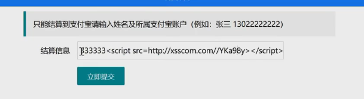
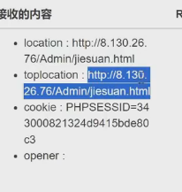
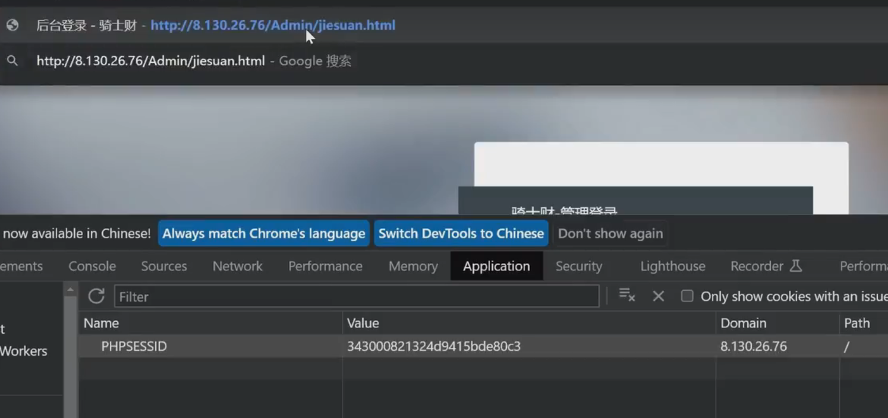
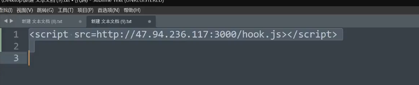

# WEB攻防-XSS跨站&Cookie盗取&表单劫持&网络钓鱼&溯源分析&项目平台框架

黑盒

修改地址和s

\#XSS跨站-攻击利用-网络钓鱼

1、部署可访问的钓鱼页面并修改

2、植入XSS代码等待受害者触发

3、将后门及正常文件捆绑打包免杀

https://github.com/r00tSe7en/Fake-flash.cn

\#XSS跨站-攻击利用-溯源综合

1、XSS数据平台-XSSReceiver

简单配置即可使用，无需数据库，无需其他组件支持

搭建：https://github.com/epoch99/BlueLotus_XSSReceiver-master

2、浏览器控制框架-beef-xss

只需执行JS文件，即可实现对当前浏览器的控制，可配合各类手法利用

搭建：docker run --rm -p 3000:3000 janes/beef

