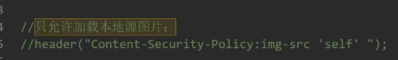
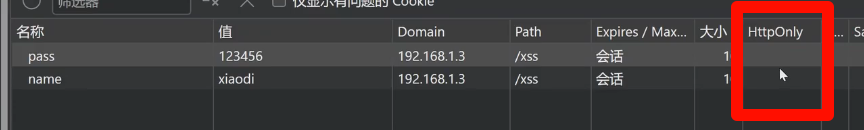
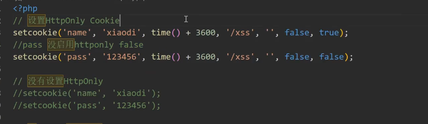
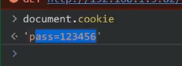
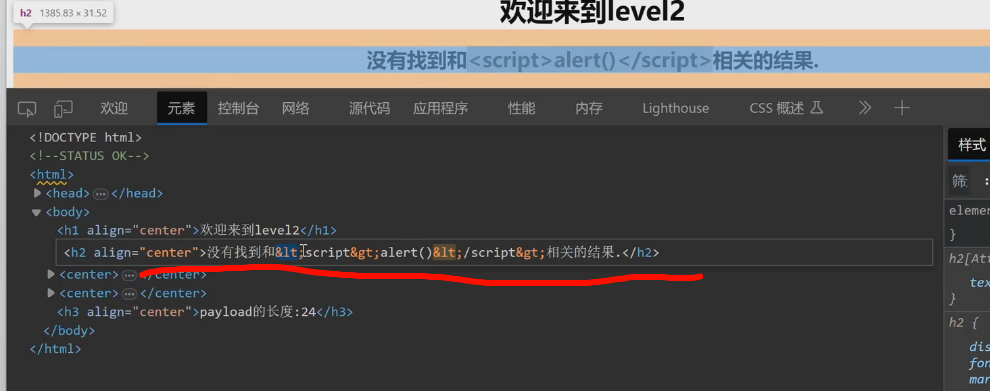
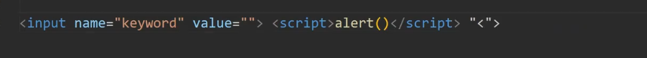
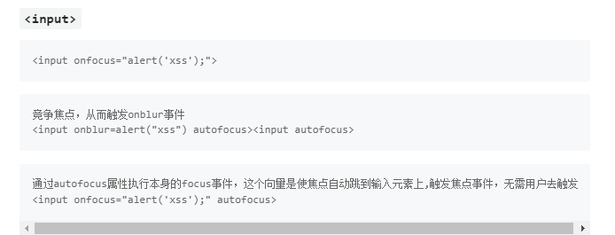

# WEB攻防-XSS跨站&CSP策略&HttpOnly属性&Filter过滤器&标签闭合&事件触发

CSP策略

禁止加载外域代码，防止复杂的攻击逻辑。

禁止外域提交，网站被攻击后，用户的数据不会泄露到外域。

禁止内联脚本执行（规则较严格，目前发现 GitHub 使用）。

禁止未授权的脚本执行（新特性，Google Map 移动版在使用

HttpOnly,这里为空就是没启用

设置HttpOnly

https://xz.aliyun.com/news/3699 常见标签

黑盒XSS手工分析：

1、页面中显示的数据找可控的（有些隐藏的）

2、利用可控地方发送JS代码去看执行加载情况

3、成功执行即XSS，不能成功就看语句输出的地方显示（过滤）

4、根据显示分析为什么不能执行（实体化，符号括起来，关键字被删除等）