# WEB攻防-XSS跨站&CSP策略&HttpOnly属性&Filter过滤器&标签闭合&事件触发

CSP策略

禁止加载外域代码，防止复杂的攻击逻辑。

禁止外域提交，网站被攻击后，用户的数据不会泄露到外域。

禁止内联脚本执行（规则较严格，目前发现 GitHub 使用）。

禁止未授权的脚本执行（新特性，Google Map 移动版在使用

https://xz.aliyun.com/news/11816 ==根据这个连接判断对方开启了什么策略==

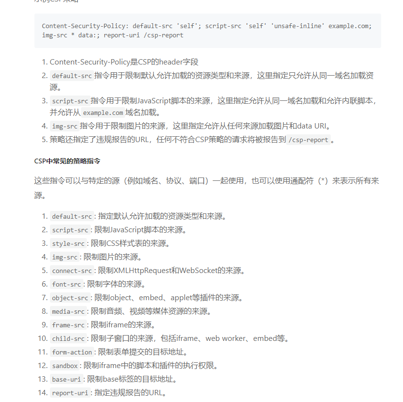

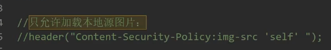

1、设置任何域JS加载 无需绕过

2、设置本地域JS加载  (只能在同一网段下)

绕过利用条件：文件上传JS绕过

3、设置本地域JS外加限制目录 (条件苛刻)

绕过利用条件1：目录有302跳转绕过    利用对方有错误网站重定向

绕过利用条件2：文件上传JS（指定目录）  利用../来上传js绕过


HttpOnly,这里为空就是没启用 

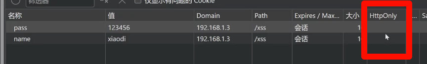

设置HttpOnly

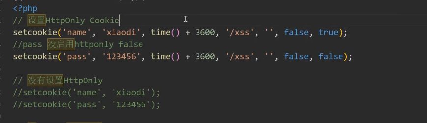

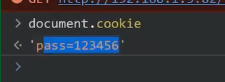

绕过：有但鸡肋

(1) CVE-2012-0053

(2) PHPINFO页面

(3) Flash/Java

blog.csdn.net/weixin_42478365/article/details/116597222

思路：一般可不采用获取Cookie利用，采用方式（钓鱼，浏览器攻击框架等）

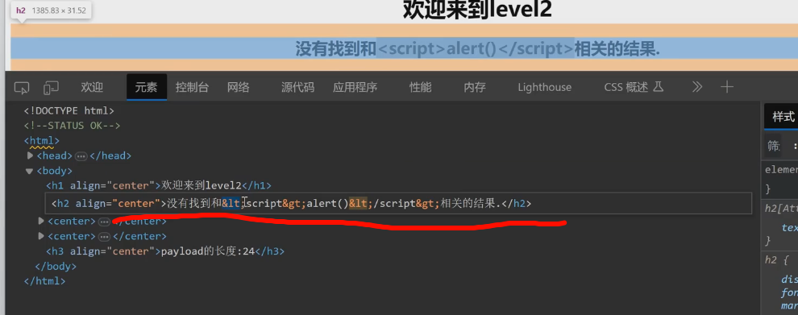

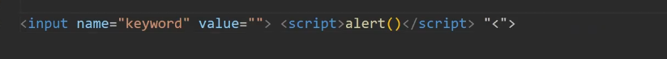

https://xz.aliyun.com/news/3699 常见标签

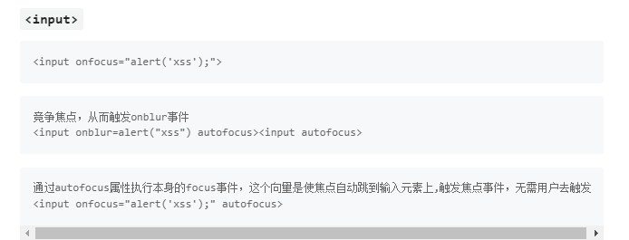

黑盒XSS手工分析：

1、页面中显示的数据找可控的（有些隐藏的）

2、利用可控地方发送JS代码去看执行加载情况

3、成功执行即XSS，不能成功就看语句输出的地方显示（过滤）

4、根据显示分析为什么不能执行（实体化，符号括起来，关键字被删除等）

## 使用插件ai自动化

需要配置大模型api

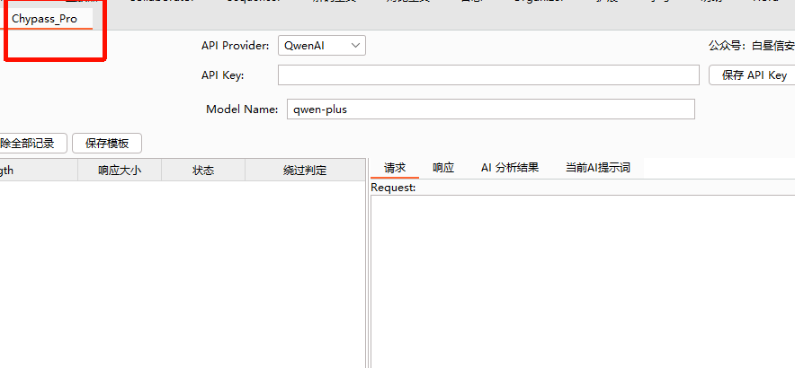

设置payload位置  点击保存模板 然后开始

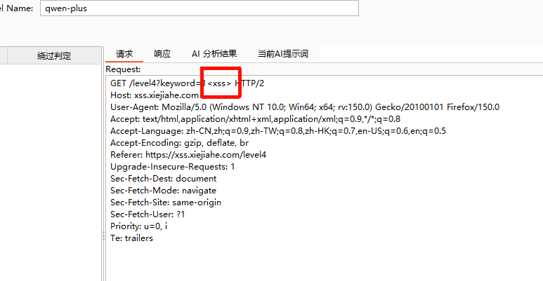

## XSStrike自动化工具

```
E:\python3.8\python.exe .\xsstrike.py -u "网址"
```

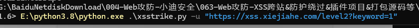

payload

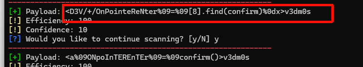