# WEB攻防-CSRF请求伪造&Referer同源&置空&配合XSS&Token值校验&复用删除

## :scissors:CSRF-无检测防护-检测&生成&利用

cloudflared的使用

```
.\cloudflared.exe tunnel --url http://127.0.0.1:80 --http-host-header www.123.com
```


进入到后台添加管理员用bp抓包

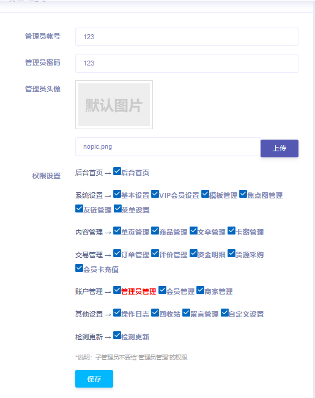

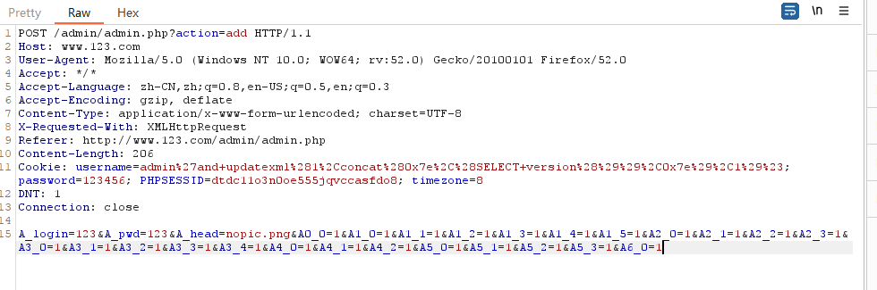

点击BurpSuite->Engagement tools->Generate CSRF Poc

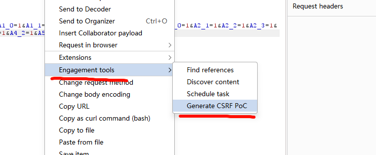

这里需要勾选，默认已经是打开，自动点击脚本，不需要制作出按钮

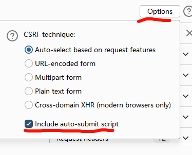

新建HTML

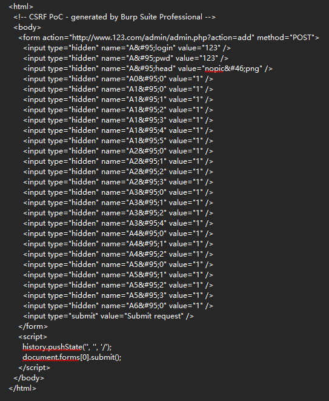

将html代码上传到服务器上

```
.\cloudflared.exe tunnel --url http://127.0.0.1:80
```

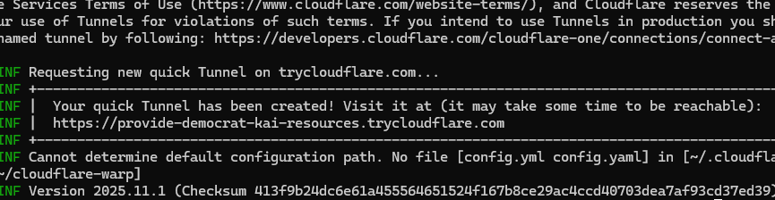

点击访问==必须是登录过后台的浏览器才行==

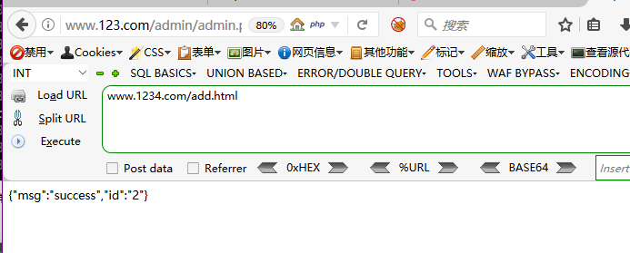

成功添加管理员123

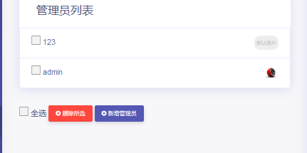

第二个例子 创建管理员


抓包

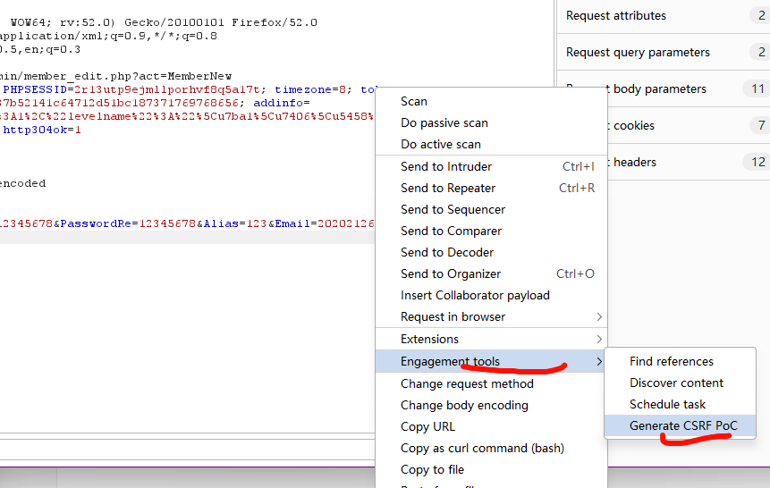

复制html

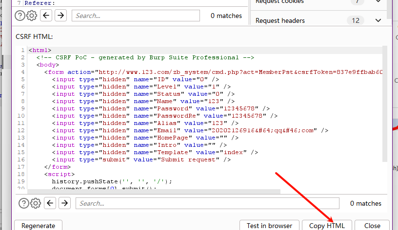

修改`name`放入服务器

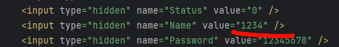

在同一个浏览器中登录网站，完成添加

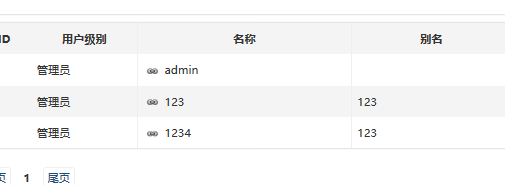

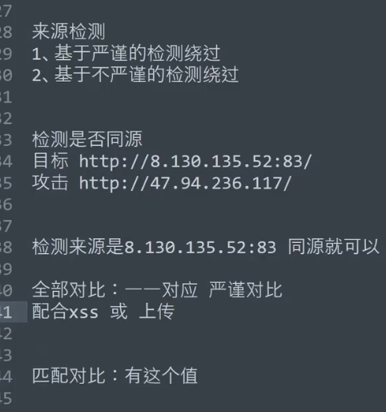

绕过0：规则匹配绕过问题（代码逻辑不严谨）

1、<meta name="referrer" content="no-referrer">       ==空来源绕过==

2、http://xx.xx.xx.xx/http://xx.xx.xx.xx

绕过1：配合文件上传绕过（严谨使用同源绕过）

绕过2：配合存储XSS绕过（严谨使用同源绕过）