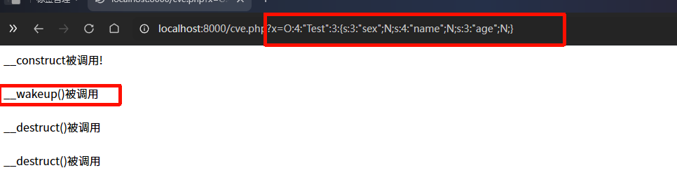
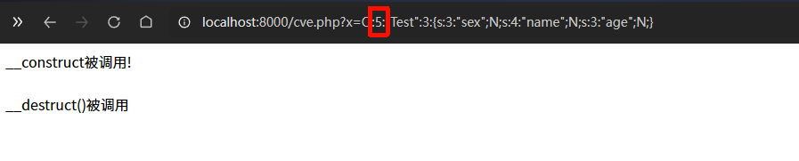
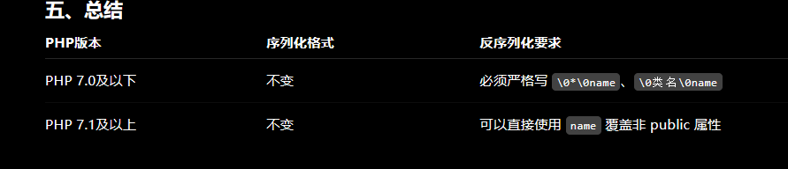
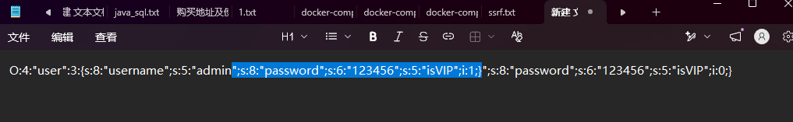
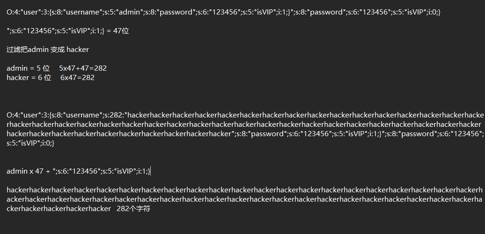
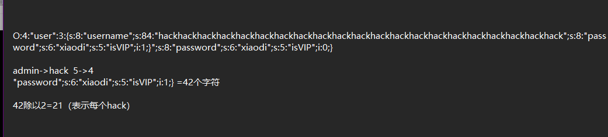

## #PHP版本绕过漏洞

CVE-2016-7124（__wakeup绕过）
漏洞编号：CVE-2016-7124
影响版本：==PHP 5<5.6.25; PHP 7<7.0.10==
漏洞危害：如存在__wakeup方法，调用unserilize()方法前则先调用==__wakeup方法，但序列化字符串中表示对象属性个数的值大于真实属性个数时会跳过__wakeup执行==
Demo：见CVE.PHP与版本切换演示

当数量正常是调用wakeup



从4改成了5 大于真实数量后 wakeup没有调用



## \#PHP版本绕过机制

影响版本：PHP7.1+

->变量属性不同序列化数据差异

*对象变量属性：

public(公共的):在本类内部、外部类、子类都可以访问

protect(保护的):只有本类或子类或父类中可以访问

private(私人的):只有本类内部可以使用

*序列化数据显示：

public属性序列化的时候格式是正常成员名

private属性序列化的时候格式是%00类名%00成员名

protect属性序列化的时候格式是%00*%00成员名



## 字符串逃逸

加法

```
O:4:"user":3:{s:8:"username";s:5:"admin";s:8:"password";s:6:"123456";s:5:"isVIP";i:1;}";s:8:"password";s:6:"123456";s:5:"isVIP";i:0;}
```

需要释放的地方是47位





==运算思路：字符个数多了1个==

==后续有47个就写47个覆盖后续==

做减法



poc的一半 等于 hack的数量