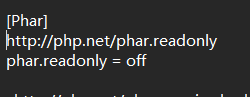
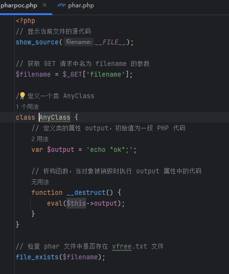
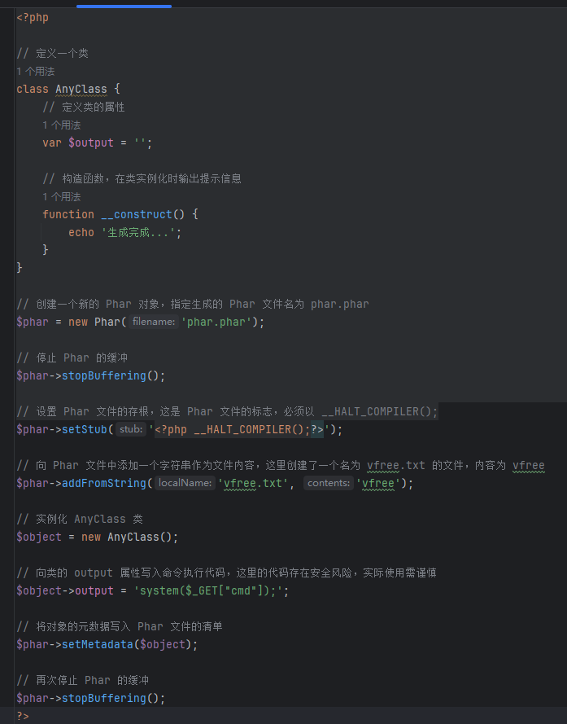
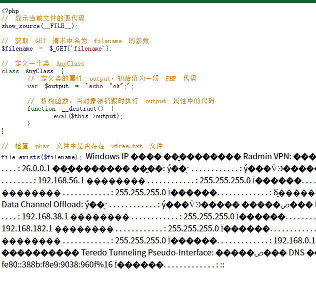
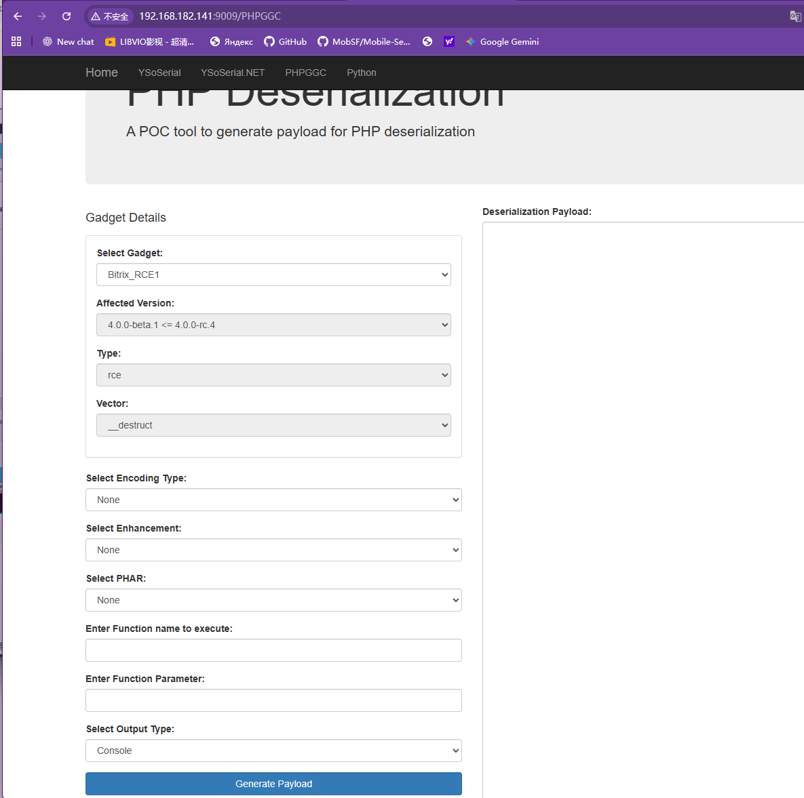

# Web攻防-PHP反序列化&Phar文件类&CLI框架类&PHPGGC生成器&TP&Yii&Laravel

## Phar文件类

解释：从PHP 5.3开始，引入了类似于JAR的一种打包文件机制。它可以把多个文件存放至同一个文件中，无需解压，PHP就可以进行访问并执行内部语句。

原理：PHP文件系统函数在通过伪协议解析phar文件时，都会将 meta-data进行反序列化操作，受影响的函数如上图；所以当这些函数接收到伪协议处理到 phar 文件的时候，Meta-data 里的序列化字符串就会被反序列化，实现不使用unserialize()函数实现反序列化操作。

利用条件
1.phar文件(任意后缀都可以)能上传至服务器。
2.存在受影响函数，存在可以利用的魔术方法。
生成Phar注意：
==php.ini中将Phar.readonly设置为off==





通用生成文件



```
http://127.0.0.1/pharpoc.php?filename=phar://phar.phar/vfree.txt&cmd=ipconfig
```



## 利用PHPGGC

先判断框架


防止消息不回显复制到文件中


或者借助百度搜索 对应框架反序列化 


框架反序列化工具

