# WEB攻防-JS应用&算法逆向&三重断点调试&调用堆栈&BP插件发包&安全结合

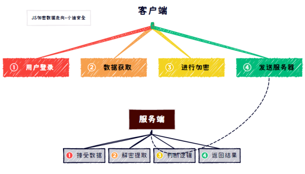

1、作用域：（本地&全局）

简单来说就是运行后相关的数据值

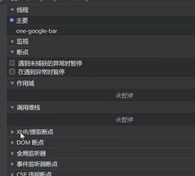

2、调用堆栈：（由下到上）

简单来说就是代码的执行逻辑顺序

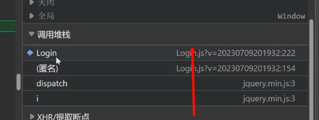

## 3、常见分析调试：

### -代码全局搜索

登录时的抓包

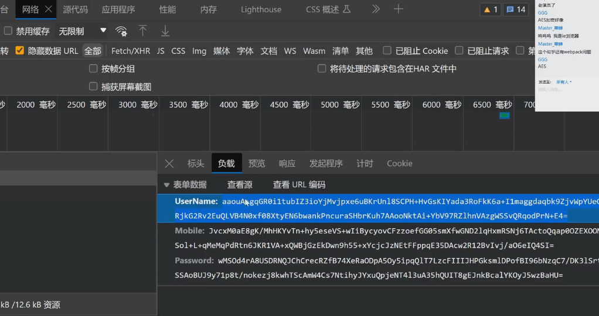

提交POST登录的地址

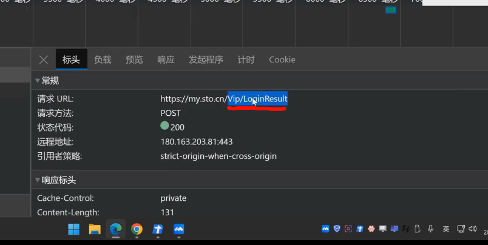

ctrl+shift+f 搜索

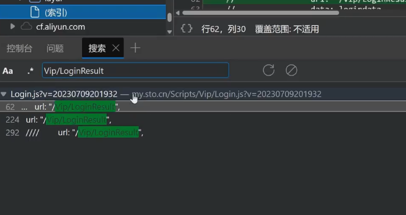

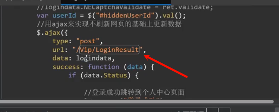

找到了加密代码

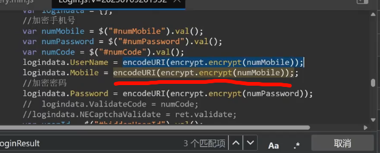

放入控制台中尝试（报错没有被声明）

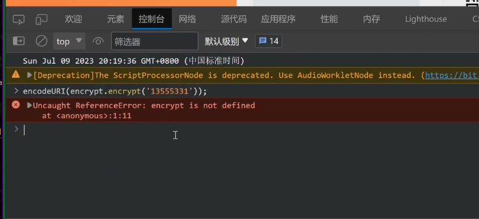

寻找声明参数

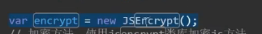

新创建对象 然后就可以运行加密代码

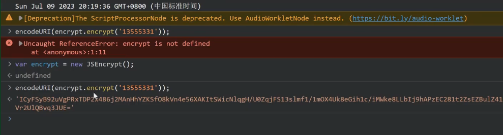

### -文件流程断点

在网络 中寻找数据包 （这个数据包就是刚才登录的数据包）

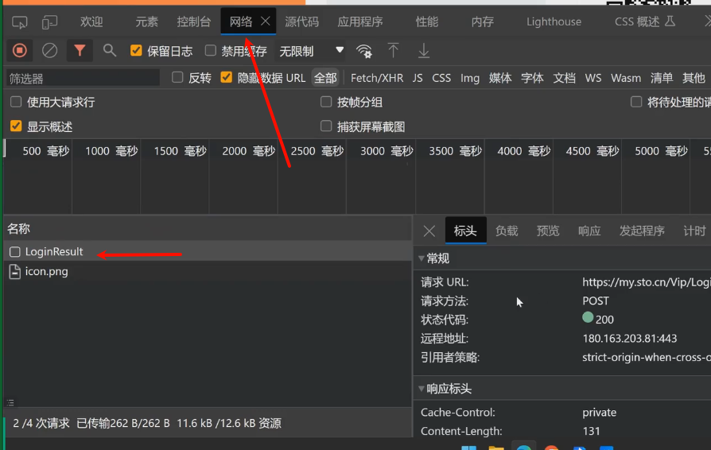

这个请求发送的时候有哪些JS文件参与，由下到上，==优先看中间部分，因为结尾内容已经加密完了==

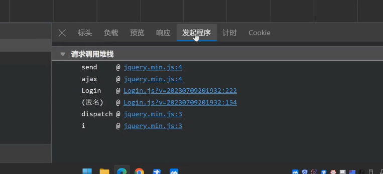

进入login 在可疑的地方设置断点

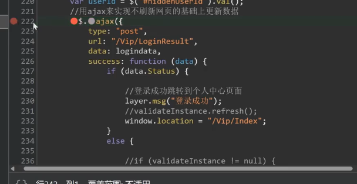

点击登录  把鼠标放在变量上 发现数值已经加密了

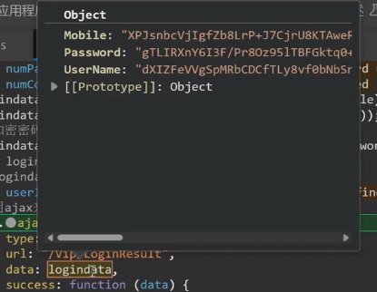

分别关系从下到上 加密情况（无加密）

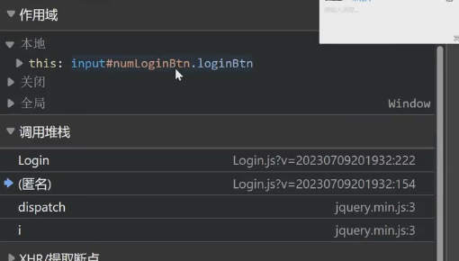

只有代码到Login显示加密成功了  那就说明加密过程在这里

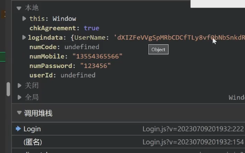

加密来源文件

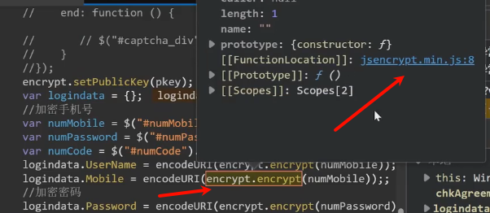

### 代码标签断点

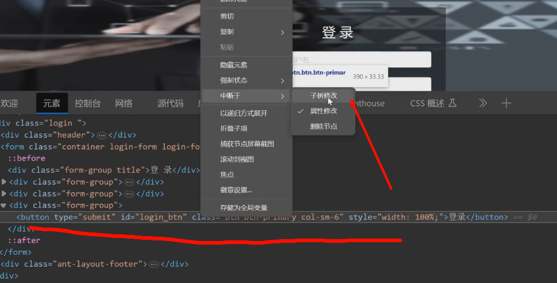

分析代码

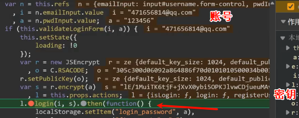

控制台测试

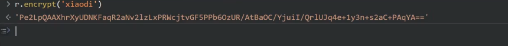

在线运行jS 输入密钥

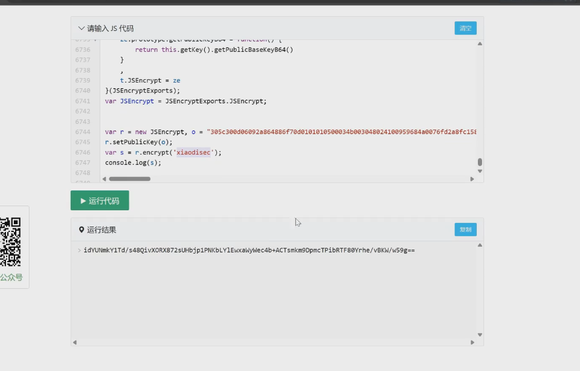

### XHR提交断点

抓包后判断时类型为`xhr`

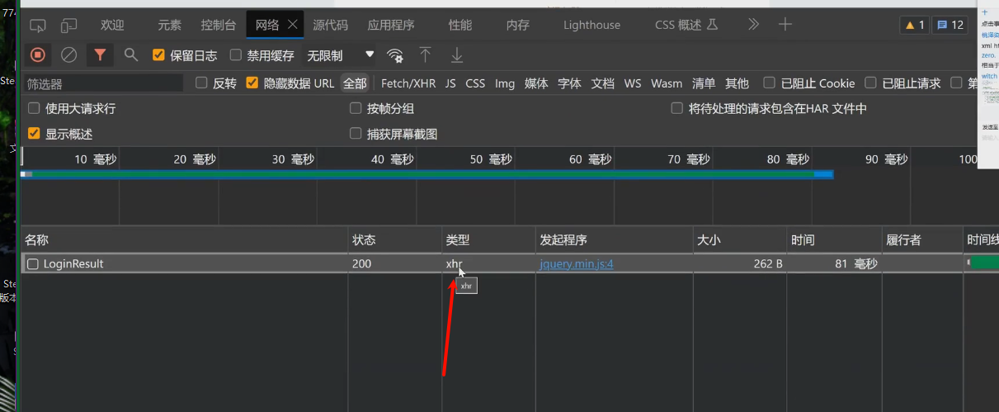

查看标头 选择具有代表性的地址

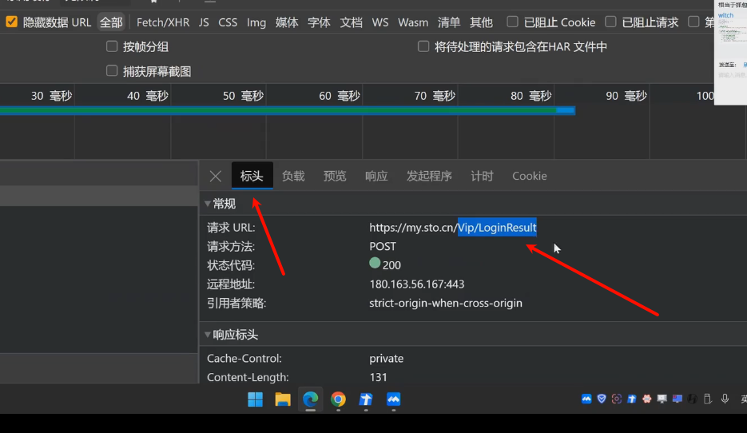

选择最上面 点击XHR/提取断点


点击登录 成功断下来

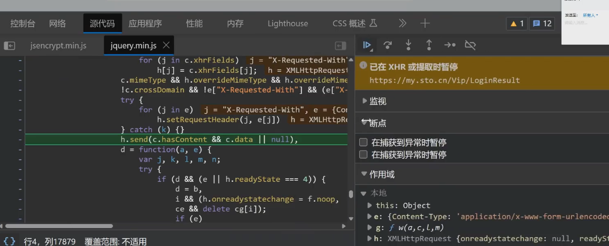

xhr断的是发送服务器和接收数据的中间

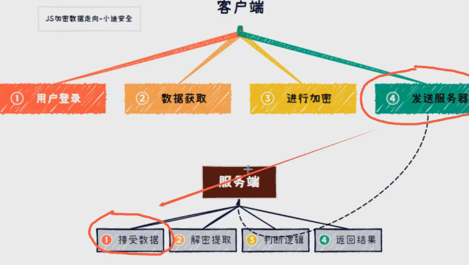

## js

把需要的js文件发到目录下

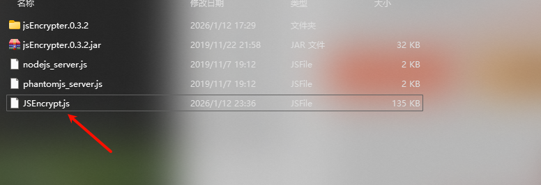

修改`phantomjs_server.js`

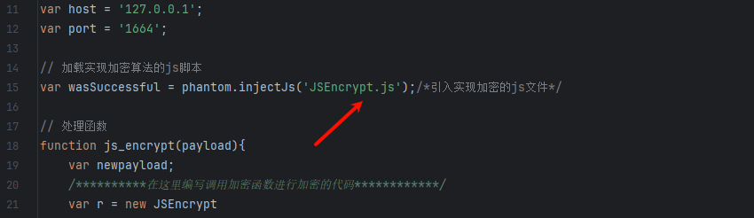

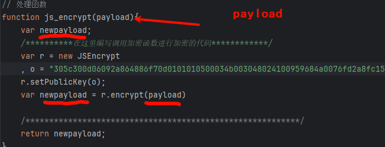

运行文件

```
phantomjs phantomjs_server.js
```

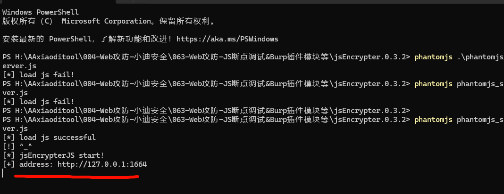

使用插件

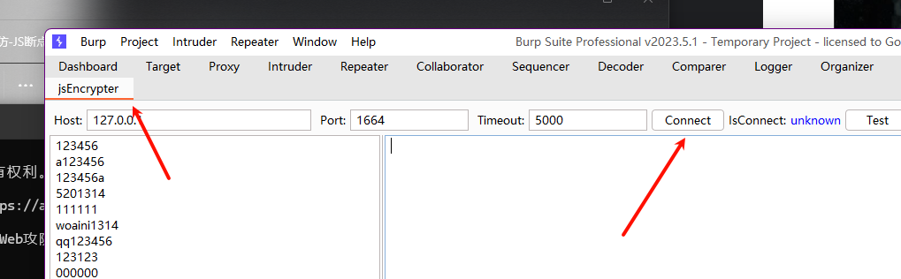

把字典里面的内容成功加密说明写对了

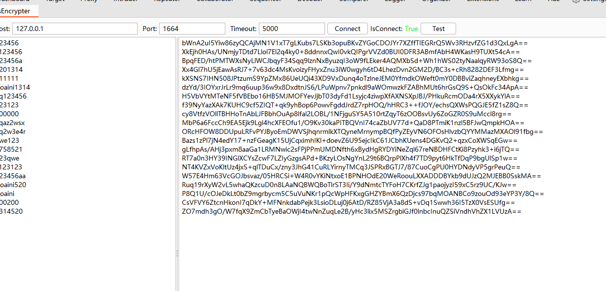

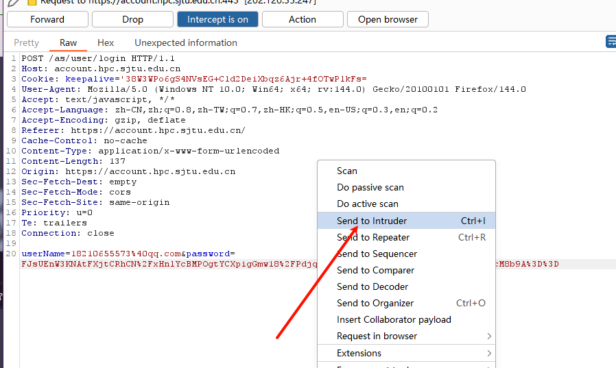

添加字典 47

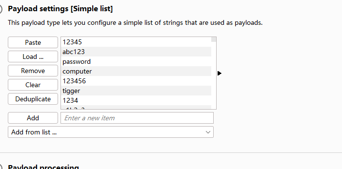

拓展插件

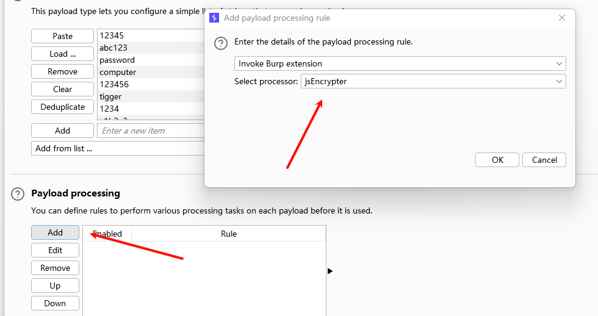