# WEB攻防-JS应用&反调试分析&代码混淆&AST加密还原&本地覆盖&断点条件

[toc]

## 常见绕过

### 禁用断点法

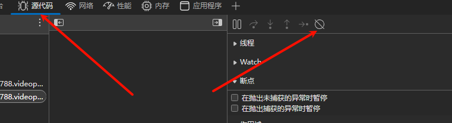

### 条件断点法

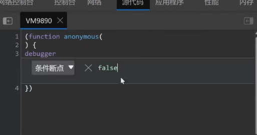

### 此处暂停法

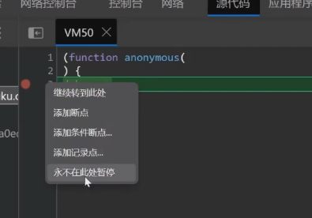

### 置空函数法

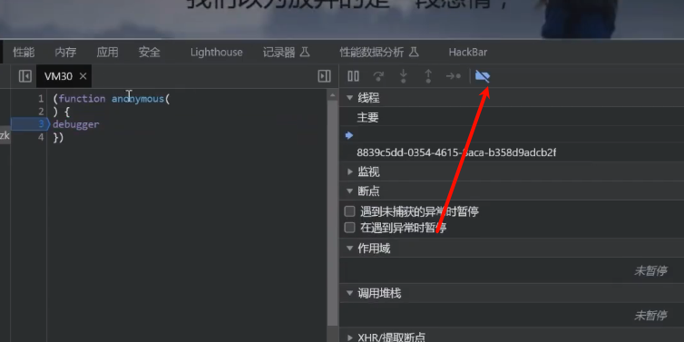

搜索函数 debug

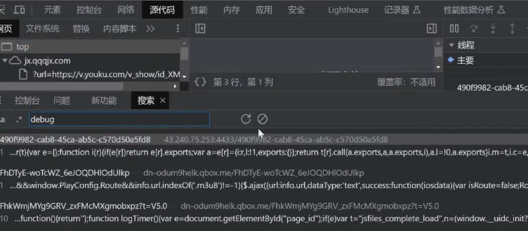

找到之后用控制台给他置空

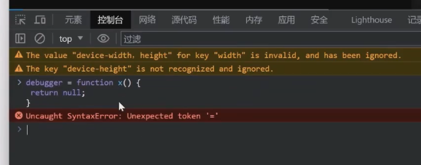

### 本地覆盖法

显示提示框`检测到非法调试`

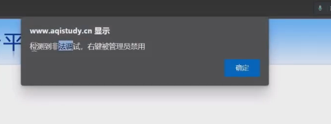

全局搜索

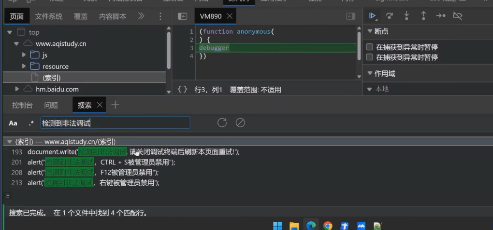

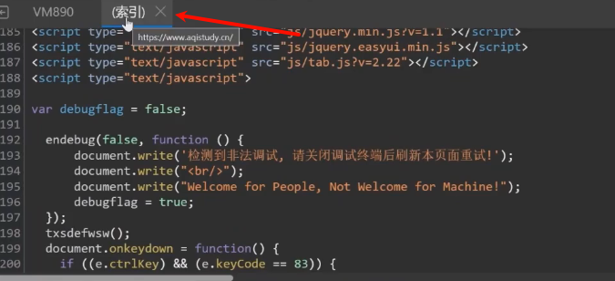

## \#JS逆向-混淆加密-识别&还原

代码混淆加密：

上述几种方法，已经达到了反调试的效果，但如果他人查看代码，也可能被找出检测功能并删去。为了防止反调试功能被剔除，我们可以对JS代码进行混淆加密。

1、开源代码混淆解密

JJEncode AAEncode JSFuck

https://www.sojson.com/

2、商业代码混淆解密

https://www.jsjiami.com/

https://jsdec.js.org/

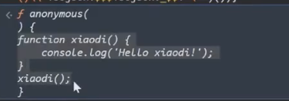

去掉最后的括号出源码

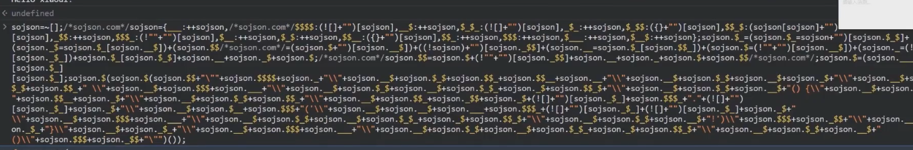