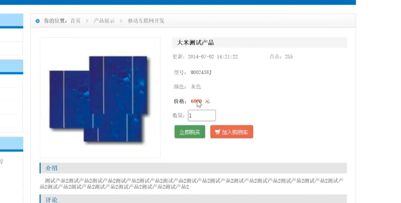
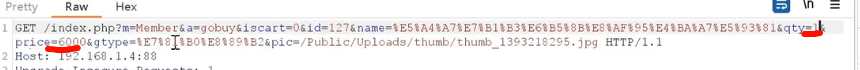
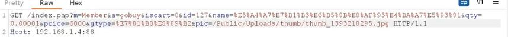
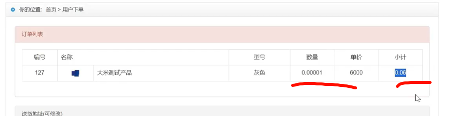
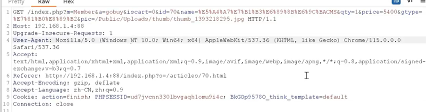
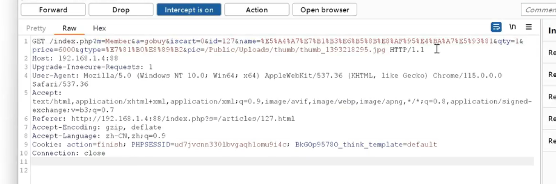
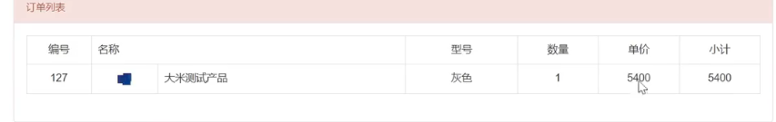
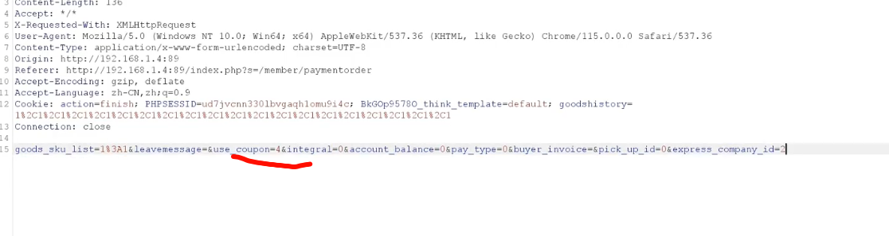
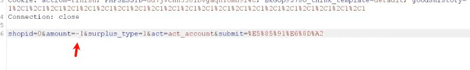

# WEB攻防-支付逻辑篇&篡改属性值&并发签约&越权盗用&算法溢出&替换对冲

## 案例

购买

6000块钱商品

pirce=6000 可能是金额 qty=1 可能是数量

对数量进行修改成0.000001

价格变成0.06

购买5400的手机 抓包

购买6000的手机抓包

购买6000的时候替换成5400 的产品包，就会触发购买5400产品 

替换优惠卷数据包

积分 修改包为-1 会增加积分

