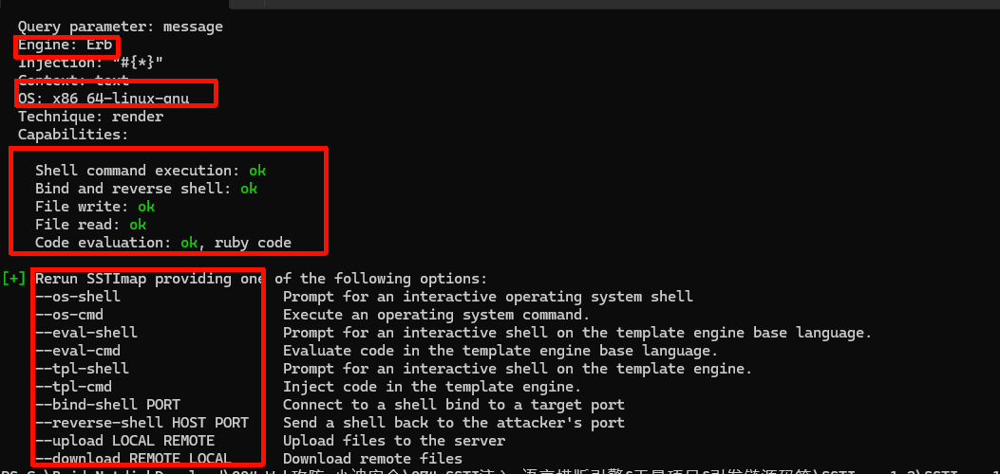
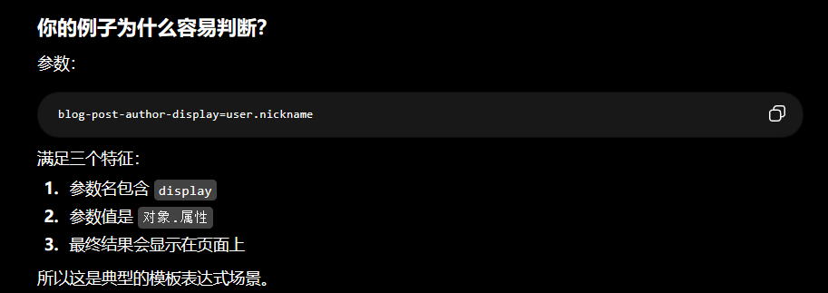
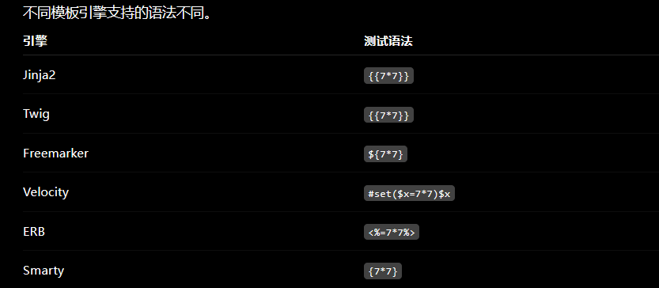

# Web攻防-SSTI服务端&模版注入&利用分类&语言引擎&数据渲染&项目工具&挖掘思路


```JAVA


```

## 利用工具sstimap   

安装库

```
 E:\python3.8\Scripts\pip.exe install -r .\requirements.txt
```

运行

```
E:\python3.8\python.exe .\sstimap.py
```

测试时需要关闭代理

```
E:\python3.8\python.exe .\sstimap.py -u "目标网址"
```

模板类型 系统 权限 命令



删除 morale.txt 完成目标

```
 E:\python3.8\python.exe .\sstimap.py -u "网址" --os-cmd "rm morale.txt"
```




